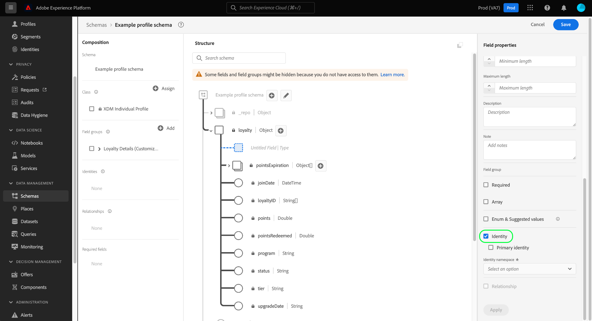

# Definire i campi di identità nell’interfaccia utente

In Experience Data Model (XDM), un campo di identità rappresenta un campo che può essere utilizzato per identificare una singola persona correlata a un record o a un evento di serie temporale. Questo documento illustra come definire un campo di identità nell’interfaccia utente di Adobe Experience Platform.

## Prerequisiti

I campi di identità sono un componente fondamentale della costruzione dei grafici di identità del cliente in Platform, che influisce in ultima analisi sul modo in cui Real-Time Customer Profile unisce frammenti di dati diversi per ottenere una visualizzazione completa del cliente. Prima di definire i campi di identità negli schemi, consulta la seguente documentazione per scoprire i servizi e i concetti chiave relativi ai campi di identità:

* [Servizio Adobe Experience Platform Identity](../../../identity-service/home.md): collega le identità tra dispositivi e sistemi, collegando i set di dati in base ai campi di identità definiti dagli schemi XDM a cui si conformano.
   * [Spazi dei nomi delle identità](../../../identity-service/namespaces.md): gli spazi dei nomi di identità definiscono i diversi tipi di informazioni di identità che possono riferirsi a una singola persona e sono un componente obbligatorio per ogni campo di identità.
* [Profilo cliente in tempo reale](../../../profile/home.md): sfrutta i grafici di identità del cliente per fornire un profilo di consumatore unificato basato su dati aggregati provenienti da più origini, aggiornati in tempo quasi reale.

## Definire un campo di identità {#define-a-identity-field}

>[!CONTEXTUALHELP]
>id="platform_schemas_identityField_primaryIdentityRestriction"
>title="Restrizioni all’identità primaria"
>abstract="Questo schema utilizza un gruppo di campi da utilizzare in una connessione di origine specifica. La connessione richiede che identityMap sia utilizzato come identità primaria e l’ha impostato automaticamente."

Quando [definizione di un nuovo campo](./overview.md#define) nell’interfaccia utente, puoi impostarla come campo di identità selezionando il **[!UICONTROL Identità]** nella barra a destra.

Dopo aver selezionato la casella di controllo vengono visualizzati controlli aggiuntivi. Se desideri che questo campo sia l’identità primaria dello schema, seleziona la **[!UICONTROL Identità primaria]** casella di controllo.

>[!NOTE]
>
>Un singolo schema può avere molti campi di identità definiti, ma può avere una sola identità primaria. Tutti i campi di identità (principale o di altro tipo) contribuiscono al grafico delle identità di un singolo cliente, ma il profilo cliente in tempo reale utilizza solo l’identità primaria come origine di verità quando si uniscono i frammenti di dati. Se desideri abilitare uno schema da utilizzare nel profilo, lo schema deve avere un’identità primaria definita.

Sotto **[!UICONTROL Spazio dei nomi dell’identità]**, utilizza il menu a discesa per selezionare lo spazio dei nomi appropriato per il campo di identità. Sono elencati gli spazi dei nomi standard forniti da Adobe, insieme a tutti gli spazi dei nomi personalizzati definiti dalla tua organizzazione.

Al termine, seleziona **[!UICONTROL Applica]** per applicare la modifica allo schema.

L&#39;area di lavoro si aggiorna per riflettere le modifiche, con il campo selezionato che ottiene un simbolo di impronta digitale () per designarla come identità. Nella barra a sinistra, il campo di identità è ora elencato sotto il nome della classe o del gruppo di campi dello schema che fornisce il campo allo schema.

Se il campo è stato impostato anche come identità primaria, verrà elencato anche in **[!UICONTROL Campi obbligatori]** nella barra a sinistra. Se il campo di identità è nidificato all’interno della struttura dello schema, verranno elencati come obbligatori anche tutti i campi principali.

Se hai definito un’identità primaria per lo schema, ora puoi procedere con [abilita lo schema per l’utilizzo in Real-Time Customer Profile](../resources/schemas.md#profile).

## Passaggi successivi

Questa guida illustra come definire un campo di identità nell’interfaccia utente. Man mano che i dati vengono acquisiti utilizzando questo schema, i grafici di identità del cliente si aggiorneranno per riflettere i campi di identità dello schema. Consulta la guida sulla [visualizzatore grafo identità](../../../identity-service/ui/identity-graph-viewer.md) per scoprire come esplorare il grafo privato della tua organizzazione nell’interfaccia utente.

Consulta la panoramica su [definizione dei campi nell’interfaccia utente](./overview.md#special) per scoprire come definire altri tipi di campi XDM in [!DNL Schema Editor].
