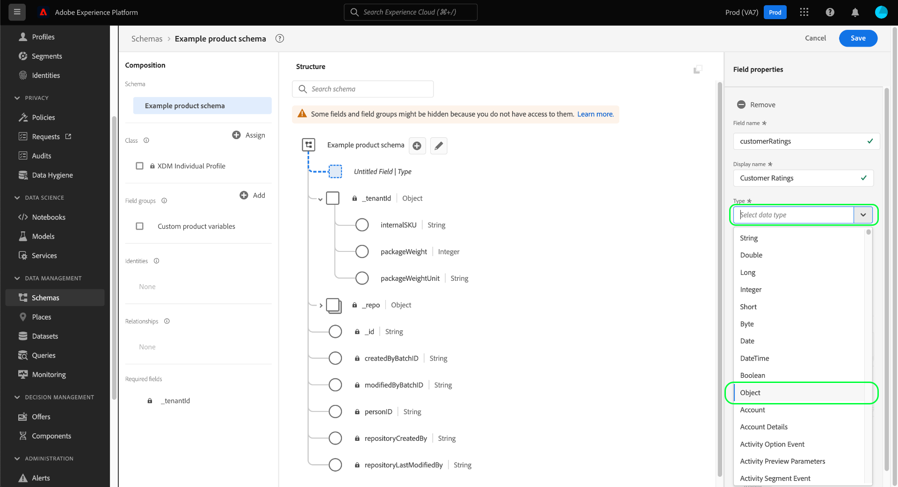
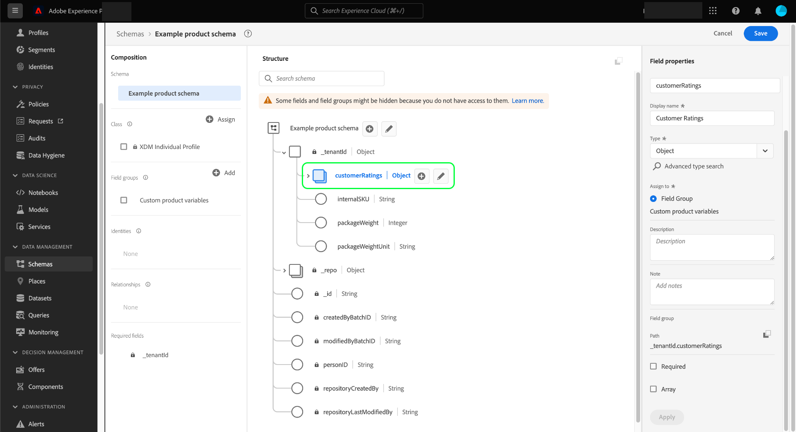

# Definire i campi oggetto nell’interfaccia utente

Adobe Experience Platform consente di personalizzare completamente la struttura delle classi XDM (Experience Data Model) personalizzate, dei gruppi di campi dello schema e dei tipi di dati. Per organizzare e nidificare i campi correlati nelle risorse XDM personalizzate, puoi definire campi di tipo oggetto che possono contenere ulteriori sottocampi.

Quando [definizione di un nuovo campo](./overview.md#define) nell’interfaccia utente di Adobe Experience Platform, utilizza **[!UICONTROL Tipo]** e seleziona &quot;[!UICONTROL Oggetto]&quot; dall’elenco.

Seleziona **[!UICONTROL Applica]** per aggiungere l&#39;oggetto allo schema. L’area di lavoro viene aggiornata per mostrare il nuovo campo con il [!UICONTROL Oggetto] tipo di dati applicato, inclusi i controlli per modificare e aggiungere sottocampi all&#39;oggetto.

Per aggiungere un sottocampo, seleziona la **più (+)** accanto al campo oggetto nell’area di lavoro. Sotto l’oggetto viene visualizzato un nuovo campo, con i controlli per configurare il sottocampo nella barra a destra.

Dopo aver configurato il sottocampo e selezionato **[!UICONTROL Applica]**, è possibile continuare ad aggiungere campi all’oggetto utilizzando lo stesso processo. È inoltre possibile aggiungere sottocampi che sono oggetti stessi, consentendo di nidificare i campi nel modo più profondo possibile.

Dopo aver completato la costruzione dell&#39;oggetto, è possibile che si desideri riutilizzarne la struttura in classi e gruppi di campi diversi. In questo caso, è possibile scegliere di convertire l&#39;oggetto in un tipo di dati. Consulta la sezione su [conversione di oggetti in tipi di dati](../resources/data-types.md#convert) per ulteriori informazioni, consulta la guida all’interfaccia utente per i tipi di dati.

## Passaggi successivi

Questa guida illustra come definire un campo oggetto nell’interfaccia utente. Consulta la panoramica su [definizione dei campi nell’interfaccia utente](./overview.md#special) per scoprire come definire altri tipi di campi XDM in [!DNL Schema Editor].
