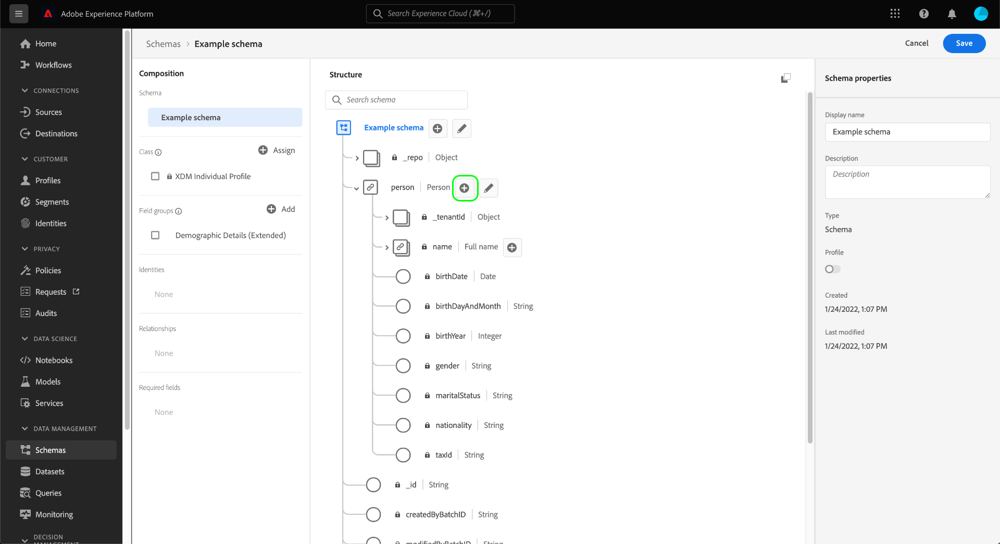

# Definire i campi XDM nell’interfaccia utente

Il [!DNL Schema Editor] Nell’interfaccia utente di Adobe Experience Platform puoi definire i tuoi campi all’interno delle classi e dei gruppi di campi dello schema personalizzati di Experience Data Model (XDM). Questa guida descrive i passaggi per definire i campi XDM nell’interfaccia utente di, incluse le opzioni di configurazione disponibili per ogni tipo di campo.

## Prerequisiti

Questa guida richiede una buona conoscenza del sistema XDM. Consulta la sezione [Panoramica di XDM](../../home.md) per un’introduzione al ruolo di XDM nell’ecosistema Experience Platform e [nozioni di base sulla composizione dello schema](../../schema/composition.md) per scoprire come le classi e i gruppi di campi contribuiscono ai campi degli schemi XDM.

Sebbene non sia necessario per questa guida, si consiglia di seguire l’esercitazione anche su [composizione di uno schema nell’interfaccia utente](../../tutorials/create-schema-ui.md) per acquisire familiarità con le varie funzionalità del [!DNL Schema Editor].

## Seleziona una risorsa a cui aggiungere campi {#select-resource}

Per definire nuovi campi XDM nell’interfaccia utente, devi prima aprire uno schema all’interno di [!DNL Schema Editor]. A seconda degli schemi attualmente disponibili in [!DNL Schema Library], è possibile scegliere di [crea un nuovo schema](../resources/schemas.md#create) o [seleziona uno schema esistente da modificare](../resources/schemas.md#edit).

Una volta ottenuta la [!DNL Schema Editor] apri, i controlli per aggiungere campi vengono visualizzati nell&#39;area di lavoro. Questi controlli vengono visualizzati accanto al nome dello schema, nonché nei campi di tipo oggetto definiti nella classe o nel gruppo di campi selezionato.

>[!WARNING]
>
>Se si tenta di aggiungere un campo a un oggetto fornito da un gruppo di campi standard, tale gruppo verrà convertito in un gruppo di campi personalizzato e il gruppo di campi originale non sarà più disponibile. Consulta la sezione su [aggiunta di campi a gruppi di campi standard](../resources/schemas.md#custom-fields-for-standard-groups) nella guida dell’interfaccia utente degli schemi per ulteriori informazioni.

Per aggiungere un nuovo campo alla risorsa, seleziona la **più (+)** accanto al nome dello schema nell’area di lavoro o accanto al campo di tipo oggetto in cui desideri definire il campo.

I passaggi necessari per aggiungere un campo variano a seconda che si stia aggiungendo un campo direttamente a uno schema o alla classe e ai gruppi di campi che lo costituiscono. Il resto di questo documento si concentra su come configurare le proprietà di un campo indipendentemente da dove questo campo viene visualizzato nello schema. Per ulteriori informazioni sui diversi modi in cui i campi possono essere aggiunti a uno schema, consulta le sezioni seguenti nella guida dell’interfaccia utente Schemi:

* [Aggiungere campi ai gruppi di campi](../resources/schemas.md#add-fields)
* [Aggiungere campi direttamente a uno schema](../resources/schemas.md#add-individual-fields)

## Definire le proprietà di un campo {#define}

Dopo aver selezionato **più (+)** icona, un **[!UICONTROL Campo senza titolo]** il segnaposto viene visualizzato nell’area di lavoro.

Nella barra a destra sotto **[!UICONTROL Proprietà campo]**, è possibile configurare i dettagli del nuovo campo. Per ogni campo sono necessarie le seguenti informazioni:

| Field, proprietà | Descrizione |
| --- | --- |
| [!UICONTROL Nome campo] | Nome univoco e descrittivo del campo. Tieni presente che il nome del campo non può essere modificato una volta salvato lo schema. Questo valore viene utilizzato per identificare e fare riferimento al campo nel codice e in altre applicazioni a valle  Il nome dovrebbe idealmente essere scritto in CamelCase. Può contenere caratteri alfanumerici, trattini o trattini bassi, ma **non può** inizia con un trattino basso.<ul><li>**Corretto**: `fieldName`</li><li>**Accettabile:** `field_name2`, `Field-Name`, `field-name_3`</li><li>**Errato**: `_fieldName`</li></ul> |
| [!UICONTROL Nome visualizzato] | Nome visualizzato per il campo. Questo è il nome che verrà utilizzato per rappresentare il campo nell’area di lavoro dell’Editor di schema. Il nome del campo può essere modificato in nome visualizzato utilizzando [interruttore nome visualizzato](../resources/schemas.md#display-name-toggle). |
| [!UICONTROL Tipo] | Tipo di dati che il campo conterrà. Da questo menu a discesa, puoi selezionare uno dei [tipi scalari standard](../../schema/field-constraints.md) supportato da XDM o da uno dei più campi [tipi di dati](../resources/data-types.md) che sono stati precedentemente definiti in [!DNL Schema Registry]. Nota: se si seleziona il tipo di dati Mappa, [!UICONTROL Tipo di valore mappa] viene visualizzata la proprietà.  Puoi anche selezionare **[!UICONTROL Ricerca avanzata dei tipi]** per cercare e filtrare i tipi di dati esistenti e individuare più facilmente il tipo desiderato. |
| [!UICONTROL Tipo di valore mappa] | Questo valore è necessario se selezioni [!UICONTROL Mappa] come tipo di dati per il campo. I valori disponibili per la mappa sono [!UICONTROL Stringa] e [!UICONTROL Intero]. Seleziona un valore dall’elenco a discesa delle opzioni disponibili. Per ulteriori informazioni su [proprietà del campo specifiche del tipo](#type-specific-properties), consulta la panoramica sulla definizione dei campi. |

{style="table-layout:auto"}

Puoi anche scegliere di fornire una descrizione e delle note per ciascun campo. Utilizza il **[!UICONTROL Descrizione]** per aggiungere contesto e descrivere la funzionalità del tipo di dati mappa. Ciò contribuisce alla manutenzione e alla leggibilità dell’implementazione. È inoltre possibile aggiungere note per completare la descrizione iniziale. Questo dovrebbe offrire informazioni più granulari e specifiche per aiutare gli sviluppatori a comprendere, mantenere e utilizzare efficacemente la mappa nel contesto della base di codice. |

>[!NOTE]
>
>A seconda della **[!UICONTROL Tipo]** se hai selezionato il campo, nella barra a destra potrebbero essere visualizzati ulteriori controlli di configurazione. Consulta la sezione su [proprietà del campo specifiche del tipo](#type-specific-properties) per ulteriori informazioni su questi controlli.
>
>La barra a destra fornisce anche delle caselle di controllo per designare tipi di campo speciali. Consulta la sezione su [tipi di campo speciali](#special) per ulteriori informazioni.

Al termine della configurazione del campo, seleziona **[!UICONTROL Applica]**.

![Il [!UICONTROL Proprietà campo] nell&#39;Editor di schema.](../../images/ui/fields/overview/field-details.png)

L’area di lavoro viene aggiornata per mostrare il campo appena aggiunto, che si trova all’interno di un oggetto con spazio dei nomi assegnato all’ID tenant univoco (visualizzato come `_tenantId` nell’esempio seguente). Tutti i campi personalizzati aggiunti a uno schema vengono automaticamente inseriti all’interno di questo spazio dei nomi per evitare conflitti con altri campi da classi e gruppi di campi forniti dall’Adobe. La barra a destra elenca ora il percorso del campo oltre alle altre proprietà.

![Un nuovo campo nel diagramma schema e il relativo percorso corrispondente nel [!UICONTROL Proprietà campo] viene evidenziata.](../../images/ui/fields/overview/field-added.png)

Puoi continuare a seguire i passaggi precedenti per aggiungere altri campi allo schema. Una volta salvato lo schema, anche la classe base e i gruppi di campi vengono salvati se sono state apportate modifiche.

>[!NOTE]
>
>Eventuali modifiche apportate ai gruppi di campi o alla classe di uno schema verranno applicate a tutti gli altri schemi che li utilizzano.

## Proprietà del campo specifiche del tipo {#type-specific-properties}

Quando definisci un nuovo campo, nella barra a destra possono essere visualizzate opzioni di configurazione aggiuntive a seconda della **[!UICONTROL Tipo]** scegli per il campo. La tabella seguente illustra queste proprietà di campo aggiuntive e i relativi tipi compatibili:

| Field, proprietà | Tipi compatibili | Descrizione |
| --- | --- | --- |
| [!UICONTROL Tipo di valore mappa] | [!UICONTROL Mappa] | Il [!UICONTROL Tipo di valore mappa] viene visualizzata nell&#39;interfaccia utente solo se selezioni il valore Mappa da [!UICONTROL Tipo] opzioni a discesa. Puoi scegliere tra i tipi di valore Stringa e Intero per la Mappa. {width="100" zoomable="yes"} Nota: qualsiasi tipo di dati mappa creato tramite l’API che non sia un tipo String o Integer viene visualizzato come &quot;[!UICONTROL Complesso]&#39; tipo di dati. Impossibile creare &#39;[!UICONTROL Complesso]&#39; tipi di dati tramite l&#39;interfaccia utente. |
| [!UICONTROL Valore predefinito] | [!UICONTROL Stringa], [!UICONTROL Doppio], [!UICONTROL Lungo], [!UICONTROL Intero], [!UICONTROL Breve], [!UICONTROL Byte], [!UICONTROL Booleano] | Valore predefinito assegnato a questo campo se non viene fornito alcun altro valore durante l’acquisizione. Questo valore deve essere conforme al tipo selezionato del campo.  I valori predefiniti non vengono salvati nel set di dati al momento dell’acquisizione, in quanto possono cambiare nel tempo. I valori predefiniti impostati nello schema vengono dedotti dai servizi e dalle applicazioni Platform a valle quando leggono i dati dal set di dati. Ad esempio, quando si esegue una query sui dati utilizzando Query Service, se l’attributo ha un valore NULL, ma il valore predefinito è impostato su `5` a livello di schema, è previsto che Query Service restituisca `5` invece di NULL. Tieni presente che al momento questo comportamento non è uniforme in tutti i servizi AEP. |
| [!UICONTROL Pattern] | [!UICONTROL Stringa] | A [espressione regolare](https://developer.mozilla.org/en-US/docs/Web/JavaScript/Guide/Regular_Expressions) che il valore di questo campo deve essere conforme a per essere accettato durante l’acquisizione. |
| [!UICONTROL Formato] | [!UICONTROL Stringa] | Seleziona da un elenco di formati predefiniti per le stringhe a cui il valore deve essere conforme. I formati disponibili includono: <ul><li>[[!UICONTROL data-ora]](https://tools.ietf.org/html/rfc3339)</li><li>[[!UICONTROL email]](https://tools.ietf.org/html/rfc2822)</li><li>[[!UICONTROL nome host]](https://tools.ietf.org/html/rfc1123#page-13)</li><li>[[!UICONTROL ipv4]](https://tools.ietf.org/html/rfc791)</li><li>[[!UICONTROL ipv6]](https://tools.ietf.org/html/rfc2460)</li><li>[[!UICONTROL uri]](https://tools.ietf.org/html/rfc3986)</li><li>[[!UICONTROL riferimento uri]](https://tools.ietf.org/html/rfc3986#section-4.1)</li><li>[[!UICONTROL modello url]](https://tools.ietf.org/html/rfc6570)</li><li>[[!UICONTROL puntatore json]](https://tools.ietf.org/html/rfc6901)</li></ul> |
| [!UICONTROL Lunghezza minima] | [!UICONTROL Stringa] | Numero minimo di caratteri che la stringa deve contenere per consentire l’accettazione del valore durante l’acquisizione. |
| [!UICONTROL Lunghezza massima] | [!UICONTROL Stringa] | Numero massimo di caratteri che la stringa deve contenere per consentire l’accettazione del valore durante l’acquisizione. |
| [!UICONTROL Valore minimo] | [!UICONTROL Doppio] | Il valore minimo per il valore Double da accettare durante l’acquisizione. Se il valore acquisito corrisponde esattamente a quello inserito qui, il valore viene accettato. Quando si utilizza questo vincolo, la proprietà &quot;[!UICONTROL Valore minimo esclusivo]Il vincolo &quot; deve essere lasciato vuoto. |
| [!UICONTROL Valore massimo] | [!UICONTROL Doppio] | Il valore massimo per il valore Double da accettare durante l’acquisizione. Se il valore acquisito corrisponde esattamente a quello inserito qui, il valore viene accettato. Quando si utilizza questo vincolo, la proprietà &quot;[!UICONTROL Valore massimo esclusivo]Il vincolo &quot; deve essere lasciato vuoto. |
| [!UICONTROL Valore minimo esclusivo] | [!UICONTROL Doppio] | Il valore massimo per il valore Double da accettare durante l’acquisizione. Se il valore acquisito corrisponde esattamente a quello inserito qui, il valore viene rifiutato. Quando si utilizza questo vincolo, la proprietà &quot;[!UICONTROL Valore minimo]&quot;Il vincolo (non esclusivo) deve essere lasciato vuoto. |
| [!UICONTROL Valore massimo esclusivo] | [!UICONTROL Doppio] | Il valore massimo per il valore Double da accettare durante l’acquisizione. Se il valore acquisito corrisponde esattamente a quello inserito qui, il valore viene rifiutato. Quando si utilizza questo vincolo, la proprietà &quot;[!UICONTROL Valore massimo]&quot;Il vincolo (non esclusivo) deve essere lasciato vuoto. |

{style="table-layout:auto"}

## Tipi di campo speciali {#special}

La barra a destra fornisce diverse caselle di controllo per designare ruoli speciali per il campo selezionato. I casi d’uso per alcune di queste opzioni richiedono considerazioni importanti sulla strategia di modellazione dei dati e su come intendi utilizzare i servizi Platform a valle.

Per ulteriori informazioni su questi tipi speciali, consulta la seguente documentazione:

* [Mappa](./map.md)
* [[!UICONTROL Obbligatorio]](./required.md)
* [[!UICONTROL Array]](./array.md)
* [[!UICONTROL Enum]](./enum.md)
* [[!UICONTROL Identità]](./identity.md) (Disponibile solo per i campi stringa)
* [[!UICONTROL Relazione]](./relationship.md) (Disponibile solo per i campi stringa)

Anche se tecnicamente non si tratta di un tipo di campo speciale, si consiglia di visitare la guida [definizione dei campi di tipo oggetto](./object.md) per ulteriori informazioni sulla definizione dei sottocampi nidificati, se le strutture dello schema sono configurate.

## Passaggi successivi

Questa guida fornisce una panoramica su come definire i campi XDM nell’interfaccia utente. Ricorda che i campi possono essere aggiunti agli schemi solo tramite l’utilizzo di classi e gruppi di campi. Per ulteriori informazioni su come gestire queste risorse nell’interfaccia utente, consulta le guide sulla creazione e la modifica di [classi](../resources/classes.md) e [gruppi di campi](../resources/field-groups.md).

Per ulteriori informazioni sulle funzionalità di [!UICONTROL Schemi] Workspace, consulta la sezione [[!UICONTROL Schemi] panoramica di workspace](../overview.md).
