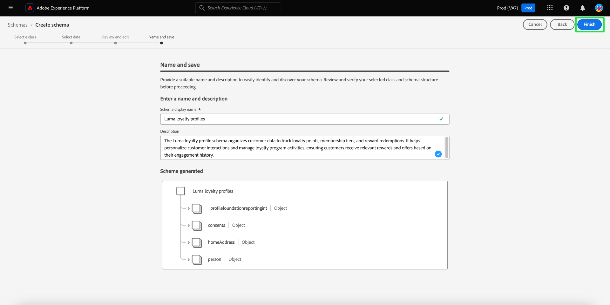

# Creazione di schemi assistiti da apprendimento automatico

>[!AVAILABILITY]
>
>* La creazione di schemi assistiti da apprendimento automatico è attualmente in versione beta. La documentazione e le funzionalità sono soggette a modifiche.

Utilizza gli algoritmi ML per generare uno schema dai dati di esempio. Questo processo consente di risparmiare tempo e migliorare la precisione durante la definizione della struttura, dei campi e dei tipi di dati per set di dati complessi di grandi dimensioni.

Con la generazione dello schema ML, puoi integrare rapidamente nuove origini dati e ridurre gli errori derivanti dalla creazione manuale. Gli utenti non tecnici possono utilizzarlo per generare schemi o gestire set di dati grandi e complessi senza alcun sforzo aggiuntivo. Questa assistenza velocizza il processo dal recupero dei dati all’ottenimento di informazioni approfondite, facilitando la combinazione di nuove origini dati ed eseguendo l’analisi dei dati.

## Introduzione

Questo tutorial richiede una buona conoscenza dei requisiti per la creazione dello schema. Prima di continuare con questa guida, leggere la [Guida dell&#39;interfaccia utente per creare e modificare schemi](./resources/schemas.md).

Questa guida spiega come creare schemi utilizzando algoritmi di apprendimento automatico (ML) per generare uno schema dai dati di esempio. Consulta la [guida manuale del flusso di lavoro per la creazione dello schema](https://experienceleague.adobe.com/en/docs/experience-platform/xdm/ui/resources/schemas#add-field-groups) per informazioni sulla creazione di schemi o il documento sui [flussi di lavoro basati sui campi nell&#39;Editor schema](https://experienceleague.adobe.com/en/docs/experience-platform/xdm/ui/field-based-workflows) per comprendere meglio il processo di creazione dello schema.

>[!NOTE]
>
>È inoltre possibile comporre uno schema utilizzando l&#39;API [!DNL Schema Registry]. Per creare uno schema manualmente utilizzando l&#39;API, leggere la [[!DNL Schema Registry] guida per gli sviluppatori](../api/getting-started.md) prima di provare l&#39;esercitazione per [creare uno schema utilizzando l&#39;API](../tutorials/create-schema-api.md).

## Passa al flusso di lavoro Crea schema {#navigate-to-schema-creation-workflow}

Nell&#39;area di navigazione a sinistra dell&#39;interfaccia utente di Platform, seleziona l&#39;area di lavoro **[!UICONTROL Schemi]**. Viene visualizzata l&#39;area di lavoro **[!UICONTROL Schemi]**. Seleziona **[!UICONTROL Crea schema]** per aggiungere un nuovo schema per avviare un flusso di lavoro di creazione schema.

## Crea uno schema {#create-a-schema}

Viene visualizzata la finestra di dialogo [!UICONTROL Crea schema]. Seleziona l&#39;opzione di creazione dello schema **[ML-Assisted]**, seguita da **[!UICONTROL Select]** per confermare la scelta.

![Finestra di dialogo [!UICONTROL Crea schema] con [!UICONTROL ML- Assisted] evidenziata.](../images/ui/ml-schema-creation/use-sample-csv.png)

### Seleziona una classe base {#select-base-class}

Viene visualizzato il flusso di lavoro [!UICONTROL Crea schema]. Seleziona una classe base per lo schema seguito da **[!UICONTROL Successivo]**.

### Caricare un file CSV {#upload-csv}

Viene visualizzata la fase **[!UICONTROL Seleziona dati]** del flusso di lavoro di creazione. Dalla sezione **[!UICONTROL Carica file]**, seleziona **[!UICONTROL Scegli file]** o la sezione **[!UICONTROL Trascina i file]**. Seleziona un file .csv dal computer per generare uno schema.

### Anteprima dati {#preview-data}

Nella sezione [!UICONTROL Carica file] viene visualizzato il nome del file CSV importato e nella sezione **[!UICONTROL Anteprima]** vengono visualizzate righe di dati di esempio dal file caricato. Seleziona **[!UICONTROL Avanti]** per continuare il flusso di lavoro.

### Rivedi e modifica schema {#review-schema}

Viene ora visualizzata la fase **[!UICONTROL Rivedi e modifica]** del flusso di lavoro di creazione, in cui viene visualizzato il **[!UICONTROL consiglio schema]** supportato dall&#39;apprendimento automatico in una visualizzazione tabulare. In questa fase, puoi modificare, aggiungere o rimuovere campi dallo schema consigliato generato dal modello di apprendimento automatico. La tabella contiene i campi riportati di seguito.

| Nome campo | Descrizione |
|------------------|---------------------------------------------------------|
| [!UICONTROL Tabella dati] | Il set di dati o il database da cui proviene il campo. |
| [!UICONTROL Campo Source] | Nome del campo originale del sistema di origine. |
| [!UICONTROL Campo di destinazione] | Il nome del campo nel sistema di destinazione in cui verranno mappati i dati. |
| [!UICONTROL Nome visualizzato] | Nome utilizzato per visualizzare il campo nell’interfaccia utente. Questo nome deve essere più descrittivo o descrittivo. |
| [!UICONTROL Tipo di dati] | Tipo di dati archiviati nel campo, ad esempio `String`, `Date`. |
| [!UICONTROL Gruppo di campi] | Una categorizzazione del campo in base al relativo utilizzo o contesto (ad esempio, [!UICONTROL Dettagli demografici], [!UICONTROL Dettagli Commerce]). |

#### Aggiungi un campo {#add-field}

Per aggiungere un campo allo schema, selezionare **[!UICONTROL Aggiungi nuovo campo]**.

Viene visualizzata la finestra di dialogo [!UICONTROL Seleziona campo]. La finestra di dialogo contiene un diagramma dello schema esistente. Selezionare il campo desiderato e selezionare **[Seleziona]** per aggiungere un nuovo campo allo schema. Seleziona **[Annulla]** per chiudere la finestra di dialogo, se necessario.

Nello schema consigliato viene visualizzata una nuova riga. Ora puoi modificare il campo.

#### Modificare un campo {#edit-field}

Per modificare un campo, seleziona l’icona a forma di matita della riga da modificare. A destra viene visualizzato un pannello dei dettagli che consente di modificare la mappatura dei campi personalizzati. Il pannello dei dettagli contiene il [!UICONTROL campo di destinazione], [!UICONTROL nome visualizzato], [!UICONTROL tipo di dati] e [!UICONTROL gruppo di campi]. Apporta le modifiche necessarie e seleziona **[!UICONTROL Applica]** per confermare. Seleziona nuovamente l’icona a forma di matita per chiudere il pannello dei dettagli.

#### Rimuovere un campo {#remove-field}

Per rimuovere un campo, selezionare l&#39;icona meno su una riga che si desidera eliminare.

>[!CAUTION]
>
>Quando si rimuove l&#39;elemento non viene visualizzata alcuna finestra di dialogo di conferma.

#### Approva lo schema consigliato {#approve}

Per approvare lo schema consigliato e continuare il flusso di lavoro **[!UICONTROL Crea schema]**, seleziona **[Successivo]**.

### Denomina e salva schema {#name-and-save}

Viene visualizzata la fase **[!UICONTROL Name and save]** del flusso di lavoro di creazione. Immettere il nome visualizzato dello schema **[]** e una descrizione facoltativa. La sezione **[Schema generato]** fornisce un diagramma dello schema generato da ML. Seleziona **[Fine]** per completare il flusso di lavoro di creazione dello schema.

### Visualizza nell’Editor di schema {#view-in-editor}

Viene visualizzato l’Editor di schema con lo schema appena creato visualizzato nell’area di lavoro. Seleziona **[!UICONTROL Salva]** per tornare all&#39;area di lavoro [!UICONTROL Schemi].

## Passaggi successivi

Dopo aver creato lo schema, puoi utilizzare l’Editor di schema per apportare ulteriori modifiche, se necessario. Il nuovo schema è ora pronto per essere integrato con le origini dati e utilizzato per l’analisi dei dati.

Per ulteriori informazioni sull&#39;utilizzo dell&#39;Editor di schema, vedere la [Guida alla modifica di uno schema esistente](https://experienceleague.adobe.com/en/docs/experience-platform/xdm/ui/resources/schemas#edit).
