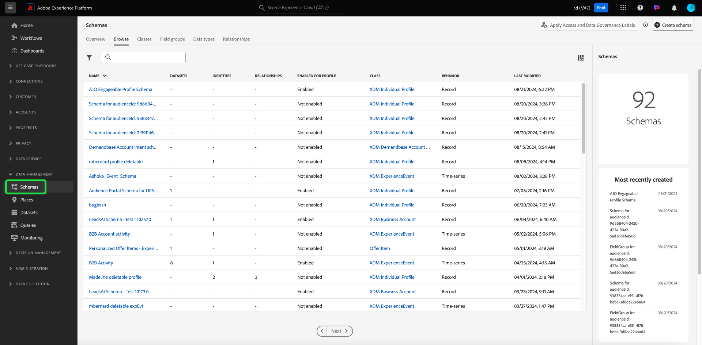

# [!UICONTROL Schemi] Panoramica dell’interfaccia utente

Il [!UICONTROL Schemi] Workspace nell’interfaccia utente di Adobe Experience Platform consente di gestire le risorse Experience Data Model (XDM), inclusi schemi, classi, gruppi di campi di schema e tipi di dati. Puoi visualizzare ed esplorare le risorse di base fornite da Adobe e creare risorse e schemi personalizzati per la tua organizzazione.

Per accedere all’area di lavoro nell’interfaccia utente di Platform, seleziona **[!UICONTROL Schemi]** nella barra a sinistra.

## Introduzione

Se utilizzi l’area di lavoro per la prima volta, inizia con la guida su [esplorazione delle risorse esistenti nell’interfaccia utente](./explore.md) per acquisire familiarità con le diverse schede e l’area di lavoro dello schema.

Si consiglia inoltre di seguire la [tutorial sulla creazione di schemi](../tutorials/create-schema-ui.md) per creare uno schema di esempio e ottenere una presentazione completa del [!DNL Schema Editor]delle funzionalità di nel processo.

## Creazione e gestione di risorse XDM

Il [!UICONTROL Schemi] Workspace offre potenti strumenti per la creazione e la personalizzazione delle risorse XDM della tua organizzazione. Per informazioni su come creare e modificare ciascun tipo di risorsa nell’interfaccia utente, consulta la seguente documentazione:

* [Schemi](./resources/schemas.md)
* [Classi](./resources/classes.md)
* [Gruppi di campi](./resources/field-groups.md)
* [Tipi di dati](./resources/data-types.md)

## Definizione dei campi XDM

Classi, gruppi di campi e tipi di dati sono tutti campi che contribuiscono a uno schema. È possibile scegliere da un elenco di tipi di campi standard quando si aggiungono campi a queste risorse e definire campi specializzati per determinati casi d’uso. Consulta la guida su [definizione dei campi XDM nell’interfaccia utente](./fields/overview.md) per ulteriori informazioni.

## Passaggi successivi

Questo documento fornisce un’introduzione alla [!UICONTROL Schemi] nell’interfaccia utente di Platform. Per ulteriori informazioni su come gestire gli schemi e altre risorse XDM, consulta la documentazione disponibile in questa panoramica.
