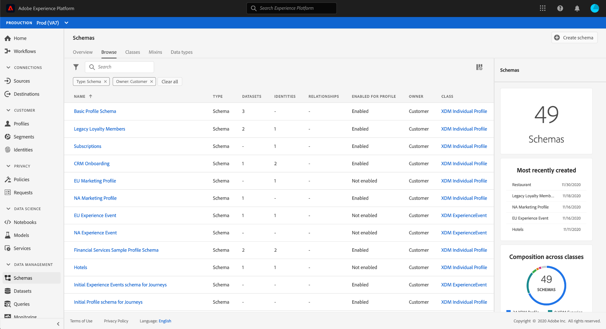

# [!UICONTROL Schemas] Panoramica dell’interfaccia utente

L&#39;area di lavoro [!UICONTROL Schemas] nell&#39;interfaccia utente di Adobe Experience Platform consente di gestire le risorse Experience Data Model (XDM), inclusi schemi, classi, gruppi di campi di schema e tipi di dati. Puoi visualizzare ed esplorare le risorse di base fornite da Adobe e creare risorse e schemi personalizzati per la tua organizzazione.

Per accedere all&#39;area di lavoro nell&#39;interfaccia utente di Experience Platform, seleziona **[!UICONTROL Schemas]** nella barra a sinistra.

## Introduzione

Se utilizzi l&#39;area di lavoro per la prima volta, inizia con la guida su [esplorazione delle risorse esistenti nell&#39;interfaccia utente](./explore.md) per acquisire familiarità con le diverse schede e l&#39;area di lavoro dello schema.

È inoltre consigliabile seguire l&#39;esercitazione [per la creazione dello schema](../tutorials/create-schema-ui.md) per creare uno schema di esempio e ottenere una panoramica completa delle funzionalità di [!DNL Schema Editor] nel processo.

## Creazione e gestione di risorse XDM

>[!NOTE]
>
>Le azioni XDM sono disponibili nella tabella di inventario e nella visualizzazione dei dettagli della risorsa (**[!UICONTROL More]**). Le azioni complete si applicano solo alle risorse personalizzate (definite dal tenant); le risorse standard hanno opzioni limitate. Vedi [Gestione di schemi, classi, gruppi di campi e tipi di dati: azioni ed eliminazione](./explore.md#xdm-resource-actions).

L&#39;area di lavoro [!UICONTROL Schemas] fornisce potenti strumenti per la creazione e la personalizzazione delle risorse XDM dell&#39;organizzazione. Per informazioni su come creare e modificare ciascun tipo di risorsa nell’interfaccia utente, consulta la seguente documentazione:

* [Schemi](./resources/schemas.md)
* [Classi](./resources/classes.md)
* [Gruppi di campi](./resources/field-groups.md)
* [Tipi di dati](./resources/data-types.md)

## Definizione dei campi XDM

Classi, gruppi di campi e tipi di dati sono tutti campi che contribuiscono a uno schema. È possibile scegliere da un elenco di tipi di campi standard quando si aggiungono campi a queste risorse e definire campi specializzati per determinati casi d’uso. Per ulteriori informazioni, consulta la guida su [definizione dei campi XDM nell&#39;interfaccia utente](./fields/overview.md).

## Passaggi successivi

Questo documento fornisce un&#39;introduzione all&#39;area di lavoro [!UICONTROL Schemas] nell&#39;interfaccia utente di Experience Platform. Per ulteriori informazioni su come gestire gli schemi e altre risorse XDM, consulta la documentazione disponibile in questa panoramica.
