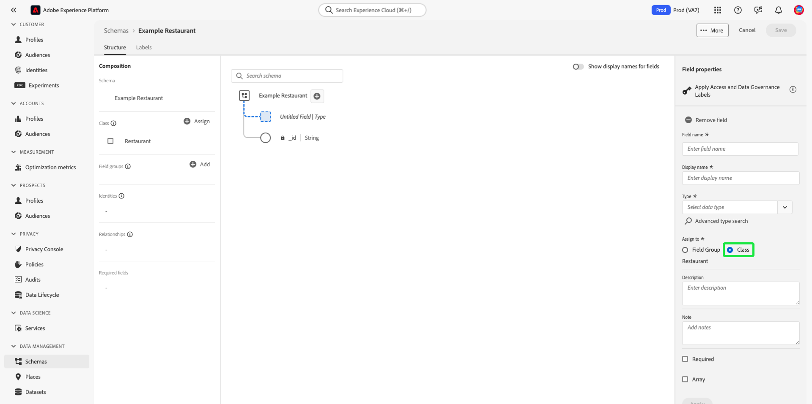

# Creare e modificare le classi nell’interfaccia utente {#ui-create-and-edit}

>[!CONTEXTUALHELP]
>id="platform_schemas_class_filter"
>title="Filtro di classe personalizzato o standard"
>abstract="L’elenco delle classi disponibili viene prefiltrato in base alla modalità di creazione. Selezionare il pulsante di opzione per scegliere tra le opzioni Standard e Personalizzato. L’opzione Standard mostra le entità create da Adobe e include sia le classi Profilo individuale XDM che Evento esperienza XDM. L’opzione Personalizzato consente di visualizzare le entità create all’interno dell’organizzazione. Per ulteriori informazioni sulla creazione e la modifica delle classi, consulta la documentazione."

In Adobe Experience Platform, la classe di uno schema definisce gli aspetti comportamentali dei dati che lo schema conterrà (record o serie temporali). Inoltre, le classi descrivono il minor numero di proprietà comuni che tutti gli schemi basati su tale classe dovrebbero includere e forniscono un modo per unire più set di dati compatibili.

Adobe fornisce diverse classi standard (&quot;core&quot;) di Experience Data Model (XDM), tra cui [!DNL XDM Individual Profile] e [!DNL XDM ExperienceEvent]. Oltre a queste classi principali, puoi anche creare classi personalizzate per descrivere casi d’uso più specifici per la tua organizzazione.

Questo documento fornisce una panoramica su come creare, modificare e gestire le classi personalizzate nell’interfaccia utente di Experienci Platform.

## Prerequisiti

Questa guida richiede una buona conoscenza del sistema XDM. Consulta la sezione [Panoramica di XDM](../../home.md) per un’introduzione al ruolo di XDM nell’ecosistema Experience Platform e [nozioni di base sulla composizione dello schema](../../schema/composition.md) per scoprire come le classi contribuiscono agli schemi XDM.

Sebbene non sia necessario per questa guida, si consiglia di seguire l’esercitazione anche su [composizione di uno schema nell’interfaccia utente](../../tutorials/create-schema-ui.md) per acquisire familiarità con le varie funzionalità del [!DNL Schema Editor].

## Introduzione

Nell’interfaccia utente di Platform, seleziona **[!UICONTROL Schemi]** nel menu di navigazione a sinistra per aprire [!UICONTROL Schemi] , quindi seleziona la **[!UICONTROL Classi]** scheda. Viene visualizzato un elenco delle classi disponibili.

## Filtra classi {#filter}

L’elenco delle classi viene filtrato automaticamente in base alla modalità di creazione. L&#39;impostazione predefinita visualizza le classi definite dall&#39;Adobe. Puoi anche filtrare l’elenco per visualizzare quelli creati dall’organizzazione. Seleziona il pulsante di opzione per scegliere tra [!UICONTROL Standard] e [!UICONTROL Personalizzato] opzioni. Il [!UICONTROL Standard] mostra le entità create da Adobe e [!UICONTROL Personalizzato] Questa opzione consente di visualizzare le entità create all’interno dell’organizzazione.

![Il [!UICONTROL Classi] scheda di [!UICONTROL Schemi] workspace con [!UICONTROL Standard] e [!UICONTROL Personalizzato] evidenziato.](../../images/ui/resources/classes/standard-and-custom-classes.png)

>[!TIP]
>
>Puoi utilizzare le funzionalità di ricerca dell’area di lavoro per trovare più facilmente lo schema. Consulta la guida su [esplorazione delle risorse XDM](../explore.md) per ulteriori informazioni.

## Crea una nuova classe {#create}

Nell’interfaccia utente di Platform sono disponibili due metodi per creare una classe. Da qualsiasi scheda in **[!UICONTROL Schemi]** workspace, seleziona **[!UICONTROL Crea schema]**, o dall&#39; [!UICONTROL Classi] selezione scheda **[!UICONTROL Crea classe]**.

![Il [!UICONTROL Classi] scheda di [!UICONTROL Schemi] workspace con [!UICONTROL Crea schema] e [!UICONTROL Crea classe] evidenziato](../../images/ui/resources/classes/create-class-methods.png)

Se si seleziona **[!UICONTROL Crea classe]**, il [!UICONTROL Crea classe] viene visualizzata. Immetti un [!UICONTROL Nome] e [!UICONTROL Descrizione] per la classe e scegliere il comportamento desiderato della classe con i pulsanti di scelta. Le classi possono essere serie di record o serie temporali. Seleziona **[!UICONTROL Crea]** per confermare le scelte effettuate.

![Il [!UICONTROL Crea classe] dialogo con [!UICONTROL Crea] evidenziato.](../../images/ui/resources/classes/create-class-dialog.png)

Il [!DNL Schema Editor] viene visualizzato un nuovo schema nell’area di lavoro basato sulla classe personalizzata appena creata. Poiché non sono ancora stati aggiunti campi alla classe, lo schema contiene solo un `_id` , che rappresenta l&#39;identificatore univoco generato dal sistema e applicato automaticamente a tutte le risorse nel [!DNL Schema Registry].

>[!IMPORTANT]
>
>Quando crei uno schema che implementa una classe definita dall’organizzazione, ricorda che i gruppi di campi di schema sono disponibili per l’utilizzo solo con classi compatibili. Poiché la classe definita è nuova, non sono elencati gruppi di campi compatibili in **[!UICONTROL Aggiungi gruppo di campi]** . Sarà invece necessario [creare nuovi gruppi di campi](./field-groups.md#create) da utilizzare con tale classe. La prossima volta che componi uno schema che implementa la nuova classe, i gruppi di campi definiti verranno elencati e saranno disponibili per l’uso.

### Creare o modificare una classe {#create-or-edit}

Se si seleziona **[!UICONTROL Crea schema]**, il [!UICONTROL Crea schema] viene visualizzato workflow. In [!UICONTROL Dettagli schema] sezione, seleziona **[!UICONTROL Altro]**. Viene visualizzato un elenco delle classi disponibili. Da qui puoi sfogliare e filtrare le classi preesistenti su cui basare la nuova classe.

>[!NOTE]
>
>Solo le classi personalizzate definite dall&#39;organizzazione possono essere completamente modificate e personalizzate. Per le classi principali definite da Adobe, è possibile modificare solo i nomi visualizzati dei relativi campi nel contesto dei singoli schemi. Consulta la sezione su [modifica dei nomi visualizzati per i campi schema](./schemas.md#display-names) per i dettagli.
>
>Dopo aver salvato e utilizzato una classe personalizzata nell’acquisizione dei dati, è possibile apportarvi solo modifiche aggiuntive. Consulta la [regole di evoluzione dello schema](../../schema/composition.md#evolution) per ulteriori informazioni.

![Il [!UICONTROL Crea schema] workflow con [!UICONTROL Altro] evidenziato in [!UICONTROL Dettagli schema] sezione.](../../images/ui/resources/classes/other-schema-details.png)

Selezionare un pulsante di opzione per filtrare le classi in base al fatto che si tratti di classi personalizzate o standard. Puoi anche filtrare i risultati disponibili in base al settore o cercare una classe specifica utilizzando il campo di ricerca.

![Il [!UICONTROL Crea schema] workflow con la barra di ricerca, [!UICONTROL Personalizzato], e [!UICONTROL Settori] evidenziato.](../../images/ui/resources/classes/filter-and-search.png)

Per aiutarti a decidere la classe appropriata, sono disponibili informazioni () e anteprima () per ciascuna classe. L’icona info apre una finestra di dialogo che fornisce una descrizione della classe e del settore a cui è associata. L&#39;icona di anteprima apre una finestra di dialogo di anteprima per la classe che contiene un diagramma schema e le relative proprietà.

Seleziona una riga per scegliere una classe, quindi seleziona **[!UICONTROL Successivo]** per confermare la scelta.

![Il [!UICONTROL Crea schema] flusso di lavoro con una classe selezionata dalla tabella delle classi disponibili e [!UICONTROL Successivo] evidenziato.](../../images/ui/resources/classes/select-class.png)

Il [!UICONTROL Nome e descrizione] viene visualizzata la sezione. In questa sezione, fornisci un nome e una descrizione per identificare lo schema. &#x200B;La struttura di base dello schema (fornita dalla classe) viene visualizzata nell’area di lavoro per rivedere e verificare la struttura di classe e schema selezionata.

Immetti un nome breve, descrittivo, univoco e descrittivo per la classe nella [!UICONTROL Nome visualizzato schema] campo di testo. Quindi, immetti una descrizione adatta per identificare il comportamento dei dati definiti dallo schema. Dopo aver rivisto la struttura dello schema e aver impostato correttamente le impostazioni, seleziona **[!UICONTROL Fine]** per creare lo schema.

![Il [!UICONTROL Nome e recensione] sezione del [!UICONTROL Crea schema] workflow con [!UICONTROL Nome visualizzato schema], [!UICONTROL Descrizione], e [!UICONTROL Fine] evidenziato.](../../images/ui/resources/classes/name-and-review-class.png)

Il [!DNL Schema Editor] viene visualizzata, con la struttura dello schema visualizzata nell’area di lavoro. Ora puoi iniziare [aggiunta di campi alla classe](#add-fields).

## Aggiungere campi a una classe {#add-fields}

Una volta che si dispone di uno schema che utilizza una classe personalizzata aperta in [!UICONTROL Editor schema], puoi iniziare ad aggiungere campi alla classe. Per aggiungere un nuovo campo, selezionare **più (+)** accanto al nome dello schema.

>[!IMPORTANT]
>
>Tenere presente che tutti i campi aggiunti a una classe verranno utilizzati in tutti gli schemi che utilizzano tale classe. Pertanto, è necessario considerare attentamente quali campi saranno utili in tutti i casi di utilizzo degli schemi. Se stai pensando di aggiungere un campo che potrebbe essere utilizzato solo in alcuni schemi di questa classe, puoi provare ad aggiungerlo a tali schemi [creazione di un gruppo di campi](./field-groups.md#create) invece.

Un **[!UICONTROL Campo senza titolo]** il segnaposto viene visualizzato nell’area di lavoro e la barra a destra si aggiorna per mostrare i controlli per configurare le proprietà del campo. Sotto **[!UICONTROL Assegna a]**, seleziona **[!UICONTROL Classe]**.

Consulta la guida su [definizione dei campi nell’interfaccia utente](../fields/overview.md#define) per passaggi specifici su come configurare e aggiungere il campo alla classe. Continua ad aggiungere alla classe tutti i campi necessari. Al termine, seleziona **[!UICONTROL Salva]** per salvare sia lo schema che la classe.

Se in precedenza sono stati creati schemi che utilizzano questa classe, i campi appena aggiunti verranno visualizzati automaticamente in tali schemi.

## Modificare la classe di uno schema {#schema}

È possibile modificare la classe dello schema in qualsiasi momento durante il processo di creazione iniziale prima che sia stato salvato. Consulta la guida su [creazione e modifica di schemi](./schemas.md#change-class) per ulteriori informazioni.

## Passaggi successivi

Questo documento illustra come creare e modificare le classi utilizzando l’interfaccia utente di Platform. Per ulteriori informazioni sulle funzionalità di [!UICONTROL Schemi] Workspace, consulta la sezione [[!UICONTROL Schemi] panoramica di workspace](../overview.md).

Per informazioni su come gestire le classi utilizzando [!DNL Schema Registry] API, consulta [guida dell’endpoint &quot;classes&quot;](../../api/classes.md).
