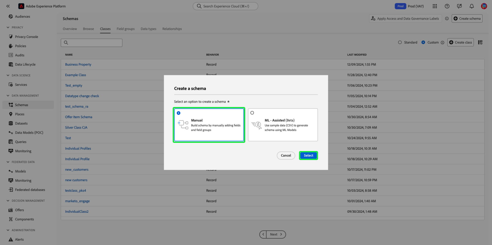

# Creare e modificare le classi nell’interfaccia utente {#ui-create-and-edit}

>[!CONTEXTUALHELP]
>id="platform_schemas_class_filter"
>title="Filtro di classe personalizzato o standard"
>abstract="L’elenco delle classi disponibili viene prefiltrato in base alla modalità di creazione. Selezionare il pulsante di opzione per scegliere tra le opzioni Standard e Personalizzato. L’opzione Standard mostra le entità create da Adobe e include sia le classi Profilo individuale XDM che Evento esperienza XDM. L’opzione Personalizzato consente di visualizzare le entità create all’interno dell’organizzazione. Per ulteriori informazioni sulla creazione e la modifica delle classi, consulta la documentazione."

In Adobe Experience Platform, la classe di uno schema definisce gli aspetti comportamentali dei dati che lo schema conterrà (record o serie temporali). Inoltre, le classi descrivono il minor numero di proprietà comuni che tutti gli schemi basati su tale classe dovrebbero includere e forniscono un modo per unire più set di dati compatibili.

Adobe fornisce diverse classi standard (&quot;core&quot;) di Experience Data Model (XDM), tra cui XDM Individual Profile e XDM ExperienceEvent. Oltre a queste classi principali, puoi anche creare classi personalizzate per descrivere casi d’uso più specifici per la tua organizzazione.

Questo documento fornisce una panoramica su come creare, modificare e gestire le classi personalizzate nell’interfaccia utente di Experience Platform.

## Prerequisiti {#prerequisites}

Questa guida richiede una buona conoscenza del sistema XDM. Per un&#39;introduzione al ruolo di XDM all&#39;interno dell&#39;ecosistema Experience Platform e alle [nozioni di base sulla composizione dello schema](../../schema/composition.md), consulta la [panoramica di XDM](../../home.md) per scoprire come le classi contribuiscono agli schemi XDM.

Sebbene non sia necessario per questa guida, è consigliabile seguire anche l&#39;esercitazione su [composizione di uno schema nell&#39;interfaccia utente](../../tutorials/create-schema-ui.md) per acquisire familiarità con le varie funzionalità dell&#39;Editor di schema.

## Introduzione {#getting-started}

Nell&#39;interfaccia utente di Platform, seleziona **[!UICONTROL Schemi]** nell&#39;area di navigazione a sinistra per aprire l&#39;area di lavoro [!UICONTROL Schemi], quindi seleziona la scheda **[!UICONTROL Classi]**. Viene visualizzato un elenco delle classi disponibili.

## Filtra classi {#filter}

L’elenco delle classi viene filtrato automaticamente in base alla modalità di creazione. L&#39;impostazione predefinita visualizza le classi definite dall&#39;Adobe. Puoi anche filtrare l’elenco per visualizzare quelli creati dall’organizzazione. Selezionare il pulsante di opzione per scegliere tra le opzioni [!UICONTROL Standard] e [!UICONTROL Personalizzato]. L&#39;opzione [!UICONTROL Standard] mostra le entità create da Adobe e l&#39;opzione [!UICONTROL Custom] mostra le entità create all&#39;interno dell&#39;organizzazione.

![Scheda [!UICONTROL Classi] dell&#39;area di lavoro [!UICONTROL Schemi] con [!UICONTROL Standard] e [!UICONTROL Personalizzato] evidenziati.](../../images/ui/resources/classes/standard-and-custom-classes.png)

>[!TIP]
>
>Utilizza le funzionalità di ricerca per filtrare o trovare una classe in base al suo nome. Per ulteriori informazioni, consulta la guida sull&#39;[esplorazione delle risorse XDM](../explore.md).

## Crea una nuova classe {#create}

Nell’interfaccia utente di Platform sono disponibili due metodi per creare una classe. Da qualsiasi scheda nell&#39;area di lavoro [!UICONTROL Schemi], selezionare **[!UICONTROL Crea schema]** oppure dalla scheda [!UICONTROL Classi] selezionare **[!UICONTROL Crea classe]**.

![Scheda [!UICONTROL Classi] dell&#39;area di lavoro [!UICONTROL Schemi] con [!UICONTROL Crea schema] e [!UICONTROL Crea classe] evidenziati](../../images/ui/resources/classes/create-class-methods.png)

Se si seleziona **[!UICONTROL Crea classe]**, viene visualizzata la finestra di dialogo [!UICONTROL Crea classe]. Immetti un [!UICONTROL Nome visualizzato] e una [!UICONTROL Descrizione] per la classe e scegli il comportamento previsto della classe con i pulsanti di scelta. Le classi possono essere di tipo, serie di record o serie temporali. Seleziona **[!UICONTROL Crea]** per confermare le scelte e tornare alla scheda [!UICONTROL Classi].

![La finestra di dialogo [!UICONTROL Crea classe] con [!UICONTROL Crea] evidenziata.](../../images/ui/resources/classes/create-class-dialog.png)

La classe creata è disponibile ed elencata nella visualizzazione [!UICONTROL Classi].

![Scheda [!UICONTROL Classi] dell&#39;area di lavoro [!UICONTROL Schemi] con la classe creata di recente evidenziata.](../../images/ui/resources/classes/new-class-listing.png)

### Creare o modificare una classe {#create-or-edit}

In alternativa, se si sceglie di creare manualmente uno schema, è possibile creare o modificare una classe esistente come parte di tale flusso di lavoro. Selezionare **[!UICONTROL Crea schema]** seguito da **[!UICONTROL Manuale]** nella finestra di dialogo [!UICONTROL Crea schema] visualizzata.

>[!NOTE]
>
>Se utilizzi il flusso di lavoro per la creazione di schemi assistiti da apprendimento automatico, puoi caricare un file e utilizzare gli algoritmi ML per generare uno schema consigliato. Nel flusso di lavoro di creazione dello schema non è necessario specificare la classe base per lo schema. Per informazioni su come ML può consigliare una struttura di schema basata su un file csv, consulta la [guida alla creazione di schemi assistiti da apprendimento automatico](../ml-assisted-schema-creation.md).

Viene visualizzato il flusso di lavoro per la creazione dello schema. Nella sezione [!UICONTROL Dettagli schema], seleziona **[!UICONTROL Altro]**. Viene visualizzato un elenco delle classi disponibili. Da qui puoi sfogliare e filtrare le classi preesistenti su cui basare la nuova classe.

>[!NOTE]
>
>Solo le classi personalizzate definite dall&#39;organizzazione possono essere completamente modificate e personalizzate. Per le classi principali definite da Adobe, è possibile modificare solo i nomi visualizzati dei relativi campi nel contesto dei singoli schemi. Per ulteriori informazioni, consulta la sezione sulla [modifica dei nomi visualizzati per i campi dello schema](./schemas.md#display-names).
>
>Dopo aver salvato e utilizzato una classe personalizzata nell’acquisizione dei dati, è possibile apportarvi solo modifiche aggiuntive. Per ulteriori informazioni, consulta le [regole dell&#39;evoluzione dello schema](../../schema/composition.md#evolution).

![Il flusso di lavoro [!UICONTROL Crea schema] con [!UICONTROL Altro] evidenziato nella sezione [!UICONTROL Dettagli schema].](../../images/ui/resources/classes/other-schema-details.png)

Selezionare un pulsante di opzione per filtrare le classi in base al fatto che si tratti di classi personalizzate o standard. Puoi anche filtrare i risultati disponibili in base al settore o cercare una classe specifica utilizzando il campo di ricerca.

![Il flusso di lavoro [!UICONTROL Crea schema] con la barra di ricerca [!UICONTROL Personalizzato] e [!UICONTROL Industrie] evidenziati.](../../images/ui/resources/classes/filter-and-search.png)

Per aiutarti a decidere la classe appropriata, sono disponibili informazioni () e anteprima () per ogni classe. L’icona info apre una finestra di dialogo che fornisce una descrizione della classe e del settore a cui è associata. L&#39;icona di anteprima apre una finestra di dialogo di anteprima per la classe che contiene un diagramma schema e le relative proprietà.

Seleziona una riga per scegliere una classe, quindi seleziona **[!UICONTROL Successivo]** per confermare la scelta.

![Il flusso di lavoro [!UICONTROL Crea schema] con una classe selezionata dalla tabella delle classi disponibili ed evidenziato [!UICONTROL Avanti].](../../images/ui/resources/classes/select-class.png)

Viene visualizzata la sezione [!UICONTROL Name and review] del flusso di lavoro. In questa sezione, fornisci un nome e una descrizione per identificare lo schema. &#x200B;La struttura di base dello schema (fornita dalla classe) viene visualizzata nell’area di lavoro per rivedere e verificare la struttura di classe e schema selezionata.

Immettere un nome breve, descrittivo, univoco e descrittivo per la classe nel campo di testo [!UICONTROL Nome visualizzato schema]. Quindi, immetti una descrizione adatta per identificare il comportamento dei dati definiti dallo schema. Dopo aver rivisto la struttura dello schema e aver impostato correttamente le impostazioni, seleziona **[!UICONTROL Fine]** per creare lo schema.

![La sezione [!UICONTROL Name and review] del flusso di lavoro [!UICONTROL Create schema] con [!UICONTROL Schema display name], [!UICONTROL Description], e [!UICONTROL Finish] evidenziato.](../../images/ui/resources/classes/name-and-review-class.png)

Viene visualizzato l’Editor di schema, con la struttura dello schema visualizzata nell’area di lavoro. Ora puoi iniziare ad aggiungere [campi alla classe](#add-fields).

## Aggiungere campi a una classe {#add-fields}

Dopo aver aperto uno schema che utilizza una classe personalizzata nell&#39;[!UICONTROL Editor schema], puoi iniziare ad aggiungere campi alla classe. Per aggiungere un nuovo campo, seleziona l&#39;icona **più (+)** accanto al nome dello schema.

>[!IMPORTANT]
>
>Quando crei uno schema che implementa una classe definita dall’organizzazione, ricorda che i gruppi di campi di schema sono disponibili per l’utilizzo solo con classi compatibili. Poiché la classe definita è nuova, nella finestra di dialogo **[!UICONTROL Aggiungi gruppo di campi]** non sono elencati gruppi di campi compatibili. Sarà invece necessario [creare nuovi gruppi di campi](./field-groups.md#create) da utilizzare con tale classe. La prossima volta che componi uno schema che implementa la nuova classe, i gruppi di campi definiti verranno elencati e saranno disponibili per l’uso.

>[!IMPORTANT]
>
>Tenere presente che tutti i campi aggiunti a una classe verranno utilizzati in tutti gli schemi che utilizzano tale classe. Pertanto, è necessario considerare attentamente quali campi saranno utili in tutti i casi di utilizzo degli schemi. Se stai pensando di aggiungere un campo che potrebbe essere utilizzato solo in alcuni schemi di questa classe, puoi provare ad aggiungerlo a tali schemi [creando un gruppo di campi](./field-groups.md#create).

Nell&#39;area di lavoro viene visualizzato un segnaposto per **[!UICONTROL Campo senza titolo]** e la barra a destra si aggiorna per mostrare i controlli per configurare le proprietà del campo. In **[!UICONTROL Assegna a]**, seleziona **[!UICONTROL Classe]**.

Consulta la guida su [definizione dei campi nell&#39;interfaccia utente](../fields/overview.md#define) per i passaggi specifici su come configurare e aggiungere il campo alla classe. Continua ad aggiungere alla classe tutti i campi necessari. Al termine, selezionare **[!UICONTROL Salva]** per salvare sia lo schema che la classe.

![Lo schema appena creato nell&#39;area di lavoro dell&#39;Editor di schema, con [!UICONTROL Salva] evidenziato.](../../images/ui/resources/classes/save.png)

Se in precedenza sono stati creati schemi che utilizzano questa classe, i campi appena aggiunti verranno visualizzati automaticamente in tali schemi.

## Modificare la classe di uno schema {#schema}

È possibile modificare la classe dello schema in qualsiasi momento durante il processo di creazione iniziale prima che sia stato salvato. Tuttavia, questo deve essere fatto con cautela, in quanto i gruppi di campi sono compatibili solo con determinate classi. La modifica della classe ripristina l’area di lavoro e tutti i campi aggiunti.
Per ulteriori informazioni, consulta la guida su [creazione e modifica di schemi](./schemas.md#change-class).

## Passaggi successivi {#next-steps}

Questo documento illustra come creare e modificare le classi utilizzando l’interfaccia utente di Platform. Per ulteriori informazioni sulle funzionalità dell&#39;area di lavoro [!UICONTROL Schemi], vedere la panoramica dell&#39;area di lavoro [[!UICONTROL Schemi]](../overview.md).

Per informazioni su come gestire le classi utilizzando l&#39;API Schema Registry, vedere la [guida dell&#39;endpoint delle classi](../../api/classes.md).
