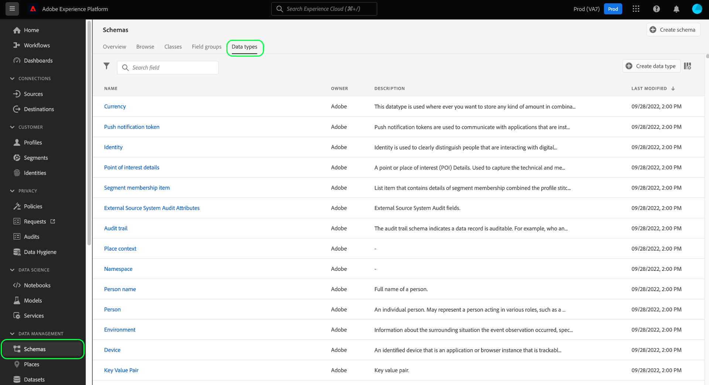
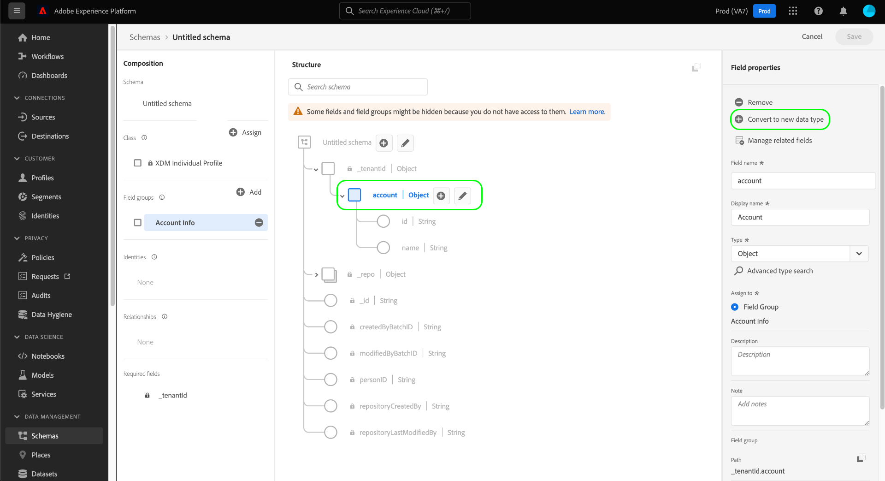

# Creare e modificare i tipi di dati tramite l’interfaccia utente

In Experience Data Model (XDM), i tipi di dati sono campi riutilizzabili che contengono più campi secondari. Sebbene siano simili ai gruppi di campi dello schema, in quanto consentono un uso coerente di una struttura a più campi, i tipi di dati sono più flessibili perché possono essere inclusi in qualsiasi punto della struttura dello schema, mentre i gruppi di campi possono essere aggiunti solo a livello principale.

Adobe Experience Platform fornisce molti tipi di dati standard che possono essere utilizzati per coprire un’ampia varietà di casi d’uso comuni per la gestione dell’esperienza. Tuttavia, puoi anche definire tipi di dati personalizzati per soddisfare le tue esigenze aziendali specifiche.

Questa esercitazione descrive i passaggi per la creazione e la modifica di tipi di dati personalizzati nell’interfaccia utente di Platform.

## Prerequisiti

Questa guida richiede una buona comprensione del sistema XDM. Fai riferimento a [Panoramica di XDM](../../home.md) introduzione al ruolo di XDM nell&#39;ecosistema Experience Platform e [nozioni di base sulla composizione dello schema](../../schema/composition.md) per sapere come i tipi di dati contribuiscono agli schemi XDM.

Sebbene non sia richiesto per questa guida, è consigliabile seguire anche l’esercitazione su [composizione di uno schema nell’interfaccia utente](../../tutorials/create-schema-ui.md) per acquisire familiarità con le varie funzionalità del [!DNL Schema Editor].

## Apri [!DNL Schema Editor] per un tipo di dati

Nell’interfaccia utente di Platform, seleziona **[!UICONTROL Schemi]** nel menu di navigazione a sinistra per aprire [!UICONTROL Schemi] area di lavoro, quindi seleziona la **[!UICONTROL Tipi di dati]** scheda . Viene visualizzato un elenco dei tipi di dati disponibili, compresi quelli definiti dall’Adobe e quelli creati dall’organizzazione.

Da qui puoi scegliere tra due opzioni:

- [Creare un nuovo tipo di dati](#create)
- [Selezionare un tipo di dati esistente da modificare](#edit)

### Creare un nuovo tipo di dati {#create}

Da **[!UICONTROL Tipi di dati]** scheda , seleziona **[!UICONTROL Crea tipo di dati]**.

La [!DNL Schema Editor] viene visualizzata la struttura corrente del nuovo tipo di dati nell’area di lavoro. Sul lato destro dell’editor, puoi fornire un nome visualizzato e una descrizione facoltativa per il tipo di dati. Assicurati di fornire un nome univoco e conciso per il tipo di dati, così come verrà identificato quando lo aggiungi a uno schema.

Questa esercitazione crea un tipo di dati che descrive una proprietà del ristorante, in modo che al tipo di dati venga assegnato il nome visualizzato &quot;Ristorante&quot;.

Da qui puoi saltare in avanti al [sezione successiva](#add-fields) per iniziare ad aggiungere campi al nuovo tipo di dati.

### Modificare un tipo di dati esistente

>[!NOTE]
>
>Una volta utilizzato un tipo di dati esistente in uno schema abilitato per l’utilizzo in Profilo cliente in tempo reale, è possibile apportare solo modifiche non distruttive a tale tipo di dati in seguito. Consulta la sezione [regole di evoluzione dello schema](../../schema/composition.md#evolution) per ulteriori informazioni.

È possibile modificare solo i tipi di dati personalizzati definiti dall’organizzazione. Per limitare l’elenco visualizzato, seleziona l’icona del filtro () per visualizzare i controlli per il filtraggio basato su [!UICONTROL Proprietario]. Seleziona **[!UICONTROL Cliente]** per mostrare solo i tipi di dati personalizzati di proprietà dell’organizzazione.

Seleziona il tipo di dati da modificare dall’elenco per aprire la barra a destra e visualizzare i dettagli del tipo di dati. Seleziona il nome del tipo di dati nella barra a destra per aprirne la struttura nel [!DNL Schema Editor].

## Aggiungi campi al tipo di dati {#add-fields}

Per iniziare ad aggiungere campi al tipo di dati, seleziona la **più (+)** accanto al campo principale nell’area di lavoro. Di seguito viene visualizzato un nuovo campo e la barra a destra viene aggiornata per visualizzare i controlli per il nuovo campo.

Utilizza i controlli nella barra a destra per configurare i dettagli del nuovo campo. Consulta la guida su [definizione dei campi nell’interfaccia utente](../fields/overview.md#define) per passaggi specifici su come configurare e aggiungere il campo al tipo di dati.

Il tipo di dati Ristorante richiede un campo stringa per rappresentare il nome del ristorante. Di conseguenza, il [!UICONTROL Nome campo] è impostato come &quot;name&quot; e [!UICONTROL Tipo] è impostato come &quot;[!UICONTROL Stringa]&quot;. Seleziona **[!UICONTROL Applica]** per applicare le modifiche al campo.

Se necessario, aggiungi altri campi al tipo di dati. Il tipo di dati Ristorante di esempio ora dispone di campi aggiuntivi per il marchio, la capacità dei posti a sedere e lo spazio sul pavimento.

Oltre ai campi di base, puoi nidificare altri tipi di dati all’interno del tipo di dati personalizzato. Ad esempio, il tipo di dati Ristorante richiede un campo che rappresenti l’indirizzo fisico della proprietà. In questo scenario, puoi aggiungere un nuovo campo &quot;address&quot; a cui è assegnato il tipo di dati standard &quot;[!UICONTROL Indirizzo postale]&quot;.

Questo dimostra come i tipi di dati flessibili possono essere in termini di descrizione dei dati: i tipi di dati possono utilizzare campi che sono anche tipi di dati, che possono a loro volta contenere ulteriori tipi di dati e così via. Questo consente di astrarre e riutilizzare pattern di dati comuni in tutti gli schemi XDM, facilitando la rappresentazione di strutture di dati complesse.

Dopo aver aggiunto i campi al tipo di dati, seleziona **[!UICONTROL Salva]** per salvare le modifiche e aggiungere il tipo di dati al [!DNL Schema Library].

## Aggiungere il tipo di dati a uno schema

Dopo aver creato un tipo di dati, puoi iniziare a utilizzarlo negli schemi. Poiché gli schemi XDM sono composti da una classe e da zero o più gruppi di campi, i campi forniti da un tipo di dati non possono essere aggiunti direttamente a uno schema. Devono invece essere inclusi in una classe o in un gruppo di campi.

Inizia seguendo i passaggi descritti in [aggiunta di un campo a una classe](./classes.md#add-fields) o [aggiunta di un campo a un gruppo di campi](./field-groups.md#add-fields). In alternativa, puoi iniziare [aggiunta di un campo direttamente a uno schema](./schemas.md#add-individual-fields) e scegliere la classe o il gruppo di campi padre da lì. Quando scegli la **[!UICONTROL Tipo]** per il nuovo campo, seleziona il nome del tipo di dati dal menu a discesa.

## Convertire un oggetto con più campi in un tipo di dati {#convert}

Quando si crea un campo di tipo oggetto con più campi secondari nella variabile [!DNL Schema Editor], è possibile convertire tale campo in un tipo di dati in modo da utilizzare la stessa struttura di campo in una classe o un gruppo di campi diversi.

Per convertire un campo di tipo oggetto in un tipo di dati, selezionare il campo nell’area di lavoro. Prima di convertire il campo, assicurati che la **[!UICONTROL Nome visualizzato]** è descrittivo dei dati che l&#39;oggetto conterrà, in quanto diventerà il nome del tipo di dati. Quando sei pronto per convertire il campo, seleziona **[!UICONTROL Converti in nuovo tipo di dati]** nella barra a destra.

L’area di lavoro aggiorna il tipo di dati del campo da &quot;[!UICONTROL Oggetto]&quot; al nuovo tipo di dati. Questa struttura può ora essere riutilizzata in altre classi e gruppi di campi selezionando questo tipo di dati dal **[!UICONTROL Tipo]** menu a discesa durante la definizione di un nuovo campo.

## Passaggi successivi

Questa guida illustra come creare e modificare i tipi di dati tramite l’interfaccia utente di Platform. Per ulteriori informazioni sulle funzionalità del [!UICONTROL Schemi] area di lavoro, vedi [[!UICONTROL Schemi] panoramica dell&#39;area di lavoro](../overview.md).

Per scoprire come gestire i tipi di dati utilizzando [!DNL Schema Registry] API, vedi [guida all’endpoint dei tipi di dati](../../api/data-types.md).
