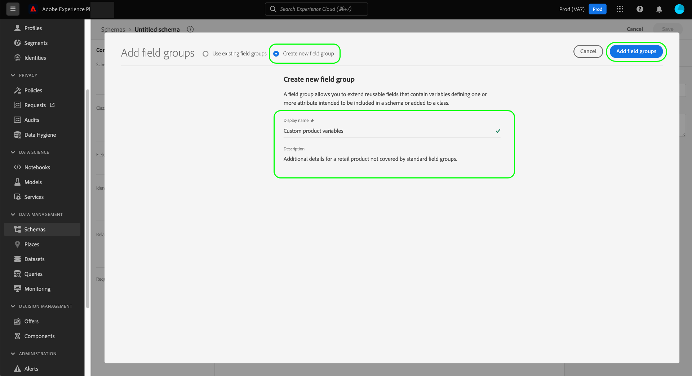

# Creare e modificare gruppi di campi schema nell’interfaccia utente {#ui-create-and-edit}

>[!CONTEXTUALHELP]
>id="platform_schemas_fieldgroup_filter"
>title="Filtro gruppo di campi personalizzato o standard"
>abstract="L’elenco dei gruppi di campi disponibili viene prefiltrato in base alla modalità di creazione. Selezionare il pulsante di opzione per scegliere tra le opzioni Standard e Personalizzato. L’opzione Standard mostra le entità create da Adobe, mentre l’opzione Personalizzato mostra le entità create all’interno dell’organizzazione. Per ulteriori informazioni sulla creazione e la modifica di gruppi di campi, consulta la documentazione."

In Experience Data Model (XDM), i gruppi di campi di schema sono componenti riutilizzabili che definiscono uno o più campi che implementano determinate funzioni come dati personali, preferenze di hotel o indirizzo. I gruppi di campi sono destinati a essere inclusi come parte di uno schema che implementa una classe compatibile.

Un gruppo di campi definisce le classi con cui è compatibile, in base al comportamento dei dati che il gruppo di campi rappresenta (record o serie temporali). Ciò significa che non tutti i gruppi di campi sono disponibili per l&#39;utilizzo con tutte le classi.

Adobe Experience Platform fornisce molti gruppi di campi standard che coprono un&#39;ampia gamma di casi d&#39;uso di marketing. Tuttavia, puoi anche creare e modificare i tuoi gruppi di campi personalizzati per definire concetti aggiuntivi relativi alla tua attività all’interno degli schemi XDM. Questa guida fornisce una panoramica su come creare, modificare e gestire gruppi di campi personalizzati per la tua organizzazione nell’interfaccia utente di Platform.

## Prerequisiti

Questa guida richiede una buona conoscenza del sistema XDM. Consulta la sezione [Panoramica di XDM](../../home.md) per un’introduzione al ruolo di XDM nell’ecosistema Experience Platform e [nozioni di base sulla composizione dello schema](../../schema/composition.md) come i gruppi di campi contribuiscono agli schemi XDM.

Sebbene non sia necessario per questa guida, si consiglia di seguire l’esercitazione anche su [composizione di uno schema nell’interfaccia utente](../../tutorials/create-schema-ui.md) per acquisire familiarità con le varie funzionalità del [!DNL Schema Editor].

## Crea un nuovo gruppo di campi {#create}

Per creare un nuovo gruppo di campi, devi innanzitutto selezionare uno schema a cui aggiungere il gruppo di campi. Puoi scegliere di [crea un nuovo schema](./schemas.md#create) o [seleziona uno schema esistente da modificare](./schemas.md#edit).

Dopo aver aperto lo schema in [!DNL Schema Editor], seleziona **[!UICONTROL Aggiungi]** accanto al [!UICONTROL Gruppi di campi] nella barra a sinistra.

Nella finestra di dialogo visualizzata, seleziona **[!UICONTROL Crea nuovo gruppo di campi]**. Qui puoi fornire una **[!UICONTROL Nome visualizzato]** e **[!UICONTROL Descrizione]** per il gruppo di campi. Al termine, seleziona **[!UICONTROL Aggiungi gruppi di campi]**.

Il [!DNL Schema Editor] viene nuovamente visualizzato, con il nuovo gruppo di campi elencato nella barra a sinistra. Poiché si tratta di un gruppo di campi nuovo di zecca, al momento non fornisce alcun campo allo schema, e pertanto l’area di lavoro rimane invariata. Ora puoi iniziare [aggiungere campi al gruppo di campi](#add-fields).

## Filtra gruppi di campi {#filter}

L’elenco dei gruppi di campi disponibili viene prefiltrato in base alla modalità di creazione. Per impostazione predefinita vengono visualizzati i gruppi di campi definiti dall&#39;Adobe. Tuttavia, puoi anche filtrare l’elenco per mostrare quelli creati dalla tua organizzazione. Seleziona il pulsante di opzione per scegliere tra [!UICONTROL Standard] e [!UICONTROL Personalizzato] opzioni. Il [!UICONTROL Standard] mostra le entità create da Adobe e [!UICONTROL Personalizzato] Questa opzione consente di visualizzare le entità create all’interno dell’organizzazione.

![Il [!UICONTROL Gruppi di campi] scheda di [!UICONTROL Schemi] workspace con [!UICONTROL Standard] e [!UICONTROL Personalizzato] evidenziato.](../../images/ui/resources/field-groups/standard-and-custom-field-groups.png)

## Modificare un gruppo di campi esistente {#edit}

>[!NOTE]
>
>Solo i gruppi di campi personalizzati definiti dall’organizzazione possono essere completamente modificati e personalizzati. Per i gruppi di campi principali definiti da Adobe, è possibile modificare solo i nomi visualizzati dei relativi campi nel contesto dei singoli schemi. Consulta la sezione su [modifica dei nomi visualizzati per i campi schema](./schemas.md#display-names) per i dettagli.
>
>Dopo aver salvato e utilizzato un gruppo di campi personalizzato in uno schema per l’acquisizione dei dati, è possibile apportare al gruppo di campi solo modifiche aggiuntive. Consulta la [regole di evoluzione dello schema](../../schema/composition.md#evolution) per ulteriori informazioni.

Per modificare un gruppo di campi esistente, devi prima aprire uno schema che utilizza il gruppo di campi all’interno del [!DNL Schema Editor]. È possibile [seleziona uno schema esistente da modificare](./schemas.md#edit), oppure puoi [crea un nuovo schema](./schemas.md#create) e aggiungere il gruppo di campi in questione.

Una volta aperto lo schema nell’editor, puoi iniziare [aggiungere campi al gruppo di campi](#add-fields).

## Aggiungere campi a un gruppo di campi {#add-fields}

>[!NOTE]
>
>Questa sezione si concentra sull’aggiunta di campi ai gruppi di campi personalizzati. Per informazioni su come aggiungere campi personalizzati ai gruppi di campi standard, consulta [guida all’interfaccia utente degli schemi](./schemas.md#custom-fields-for-standard-groups).

Per aggiungere campi a un gruppo di campi personalizzato, inizia selezionando il **più (+)** accanto al nome dello schema nell’area di lavoro.

Un **[!UICONTROL Campo senza titolo]** il segnaposto viene visualizzato nell’area di lavoro e la barra a destra si aggiorna per mostrare i controlli per configurare le proprietà del campo. Consulta la guida su [definizione dei campi nell’interfaccia utente](../fields/overview.md#define) per passaggi specifici su come configurare diversi tipi di campi.

Sotto **[!UICONTROL Assegna a]**, seleziona la **[!UICONTROL Gruppo di campi]** , quindi utilizza il menu a discesa per selezionare il gruppo di campi desiderato dall’elenco. Per limitare i risultati, puoi iniziare a digitare il nome del gruppo di campi.

Sotto **[!UICONTROL Assegna a]**, seleziona la **[!UICONTROL Gruppo di campi]** , quindi utilizza il menu a discesa per selezionare il gruppo di campi desiderato dall’elenco. Per limitare i risultati, puoi iniziare a digitare il nome del gruppo di campi.

Una volta aggiunto allo schema, il campo viene assegnato al gruppo di campi selezionato. Continua ad aggiungere al gruppo di campi tutti i campi necessari. Al termine, seleziona **[!UICONTROL Salva]** per salvare sia lo schema che il gruppo di campi.

Se lo stesso gruppo di campi è già utilizzato in altri schemi, i campi appena aggiunti verranno visualizzati automaticamente in tali schemi.

## Passaggi successivi

Questa guida illustra come creare e modificare i gruppi di campi utilizzando l’interfaccia utente di Platform. Per ulteriori informazioni sulle funzionalità di [!UICONTROL Schemi] Workspace, consulta la sezione [[!UICONTROL Schemi] panoramica di workspace](../overview.md).

Per informazioni su come gestire i gruppi di campi utilizzando [!DNL Schema Registry] API, consulta [guida dell’endpoint &quot;field groups&quot;](../../api/field-groups.md).
