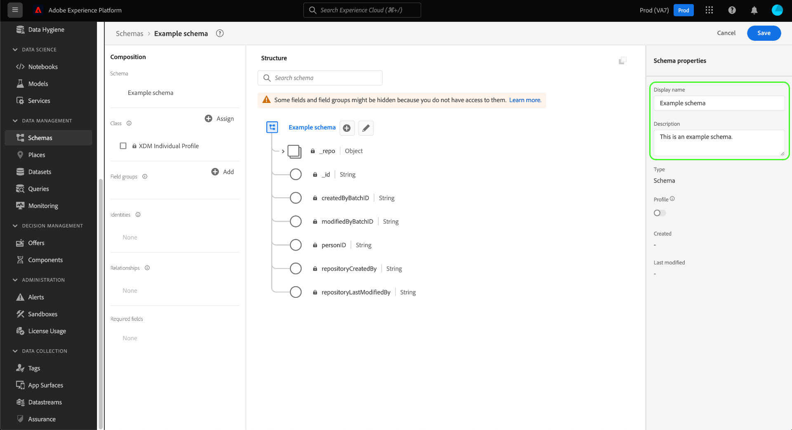

# Creare e modificare schemi nell’interfaccia utente

Questa guida fornisce una panoramica su come creare, modificare e gestire gli schemi Experience Data Model (XDM) per la tua organizzazione nell’interfaccia utente di Adobe Experience Platform.

>[!IMPORTANT]
>
>Gli schemi XDM sono estremamente personalizzabili e pertanto i passaggi necessari per creare uno schema possono variare a seconda del tipo di dati che si desidera acquisire dallo schema. Di conseguenza, questo documento copre solo le interazioni di base che è possibile eseguire con gli schemi nell’interfaccia utente ed esclude i passaggi correlati come la personalizzazione di classi, gruppi di campi dello schema, tipi di dati e campi.
>
>Per una panoramica completa del processo di creazione dello schema, segui insieme alla [esercitazione sulla creazione dello schema](../../tutorials/create-schema-ui.md) per creare uno schema di esempio completo e acquisire familiarità con le numerose funzionalità di [!DNL Schema Editor].

## Prerequisiti

Questa guida richiede una buona comprensione del sistema XDM. Fai riferimento a [Panoramica di XDM](../../home.md) introduzione al ruolo di XDM nell&#39;ecosistema Experience Platform e [nozioni di base sulla composizione dello schema](../../schema/composition.md) per una panoramica della creazione degli schemi.

## Creare un nuovo schema {#create}

In [!UICONTROL Schemi] area di lavoro, seleziona **[!UICONTROL Creare uno schema]** nell&#39;angolo in alto a destra. Nel menu a discesa visualizzato, puoi scegliere tra **[!UICONTROL Profilo individuale XDM]** e **[!UICONTROL ExperienceEvent XDM]** come classe base per lo schema. In alternativa, è possibile selezionare **[!UICONTROL Sfoglia]** per selezionare dall’elenco completo delle classi disponibili, oppure [creare una nuova classe personalizzata](./classes.md#create) invece.

Dopo aver selezionato una classe, la [!DNL Schema Editor] e la struttura di base dello schema (fornita dalla classe) viene visualizzata nell&#39;area di lavoro. Da qui, puoi utilizzare la barra a destra per aggiungere un **[!UICONTROL Nome visualizzato]** e **[!UICONTROL Descrizione]** per lo schema.

Ora puoi iniziare a creare la struttura dello schema tramite [aggiunta di gruppi di campi schema](#add-field-groups).

## Modificare uno schema esistente {#edit}

>[!NOTE]
>
>Una volta salvato e utilizzato lo schema nell’inserimento dei dati, è possibile apportare solo modifiche aggiuntive. Consulta la sezione [regole di evoluzione dello schema](../../schema/composition.md#evolution) per ulteriori informazioni.

Per modificare uno schema esistente, seleziona **[!UICONTROL Sfoglia]** quindi selezionare il nome dello schema da modificare.

>[!TIP]
>
>È possibile utilizzare le funzionalità di ricerca e filtro dell&#39;area di lavoro per facilitare lo schema. Consulta la guida su [esplorazione delle risorse XDM](../explore.md) per ulteriori informazioni.

Una volta selezionato uno schema, la [!DNL Schema Editor] viene visualizzata con la struttura dello schema mostrata nell&#39;area di lavoro. Ora puoi [aggiungere gruppi di campi](#add-field-groups) allo schema (o [aggiungere campi singoli](#add-individual-fields) da tali gruppi), [modificare i nomi visualizzati dei campi](#display-names)oppure [modifica gruppi di campi personalizzati esistenti](./field-groups.md#edit) se lo schema ne utilizza uno.

## Aggiunta di gruppi di campi a uno schema {#add-field-groups}

>[!NOTE]
>
>Questa sezione illustra come aggiungere gruppi di campi esistenti a uno schema. Per creare un nuovo gruppo di campi personalizzato, consulta la guida [creazione e modifica di gruppi di campi](./field-groups.md#create) invece.

Una volta aperto uno schema all&#39;interno di [!DNL Schema Editor], è possibile aggiungere campi allo schema utilizzando gruppi di campi. Per iniziare, seleziona **[!UICONTROL Aggiungi]** accanto a **[!UICONTROL Gruppi di campi]** nella barra a sinistra.

Viene visualizzata una finestra di dialogo in cui viene visualizzato un elenco di gruppi di campi selezionabili per lo schema. Poiché i gruppi di campi sono compatibili solo con una classe, verranno elencati solo i gruppi di campi associati alla classe selezionata dello schema. Per impostazione predefinita, i gruppi di campi elencati sono ordinati in base alla loro popolarità d’uso all’interno dell’organizzazione.

Se si conosce l’attività o l’area business generale dei campi che si desidera aggiungere, selezionare una o più categorie settore-verticale nella barra a sinistra per filtrare l’elenco visualizzato dei gruppi di campi.

>[!NOTE]
>
>Per ulteriori informazioni sulle best practice per la modellazione di dati specifici per il settore in XDM, consulta la documentazione su [modelli di dati del settore](../../schema/industries/overview.md).

Puoi anche utilizzare la barra di ricerca per individuare il gruppo di campi desiderato. I gruppi di campi il cui nome corrisponde alla query vengono visualizzati nella parte superiore dell’elenco. Sotto **[!UICONTROL Campi standard]**, vengono visualizzati i gruppi di campi contenenti i campi che descrivono gli attributi di dati desiderati.

Selezionare la casella di controllo accanto al nome del gruppo di campi che si desidera aggiungere allo schema. È possibile selezionare più gruppi di campi dall’elenco, ciascuno dei quali è visualizzato nella barra a destra.

>[!TIP]
>
>Per qualsiasi gruppo di campi elencato, puoi passare il cursore sull’icona delle informazioni () per visualizzare una breve descrizione del tipo di dati acquisiti dal gruppo di campi. Puoi anche selezionare l’icona di anteprima () per visualizzare la struttura dei campi forniti dal gruppo di campi prima di decidere di aggiungerlo allo schema.

Dopo aver selezionato i gruppi di campi, seleziona **[!UICONTROL Aggiungi gruppi di campi]** per aggiungerli allo schema.

La [!DNL Schema Editor] viene visualizzata nuovamente con i campi forniti dal gruppo di campi rappresentati nell’area di lavoro.

Dopo aver aggiunto un gruppo di campi a uno schema, puoi facoltativamente [rimuovere i campi esistenti](#remove-fields) o [aggiungi nuovi campi personalizzati](#add-fields) a tali gruppi, a seconda delle tue esigenze.

### Rimuovi campi aggiunti dai gruppi di campi {#remove-fields}

Dopo aver aggiunto un gruppo di campi a uno schema, è possibile rimuovere tutti i campi non necessari.

>[!NOTE]
>
>La rimozione dei campi da un gruppo di campi influisce solo sullo schema su cui si lavora e non influisce sul gruppo di campi stesso. Se rimuovi i campi in uno schema, tali campi sono ancora disponibili in tutti gli altri schemi che utilizzano lo stesso gruppo di campi.

Nell’esempio seguente, il gruppo di campi standard **[!UICONTROL Dettagli demografici]** è stato aggiunto a uno schema. Per rimuovere un singolo campo, ad esempio `taxId`, seleziona il campo nell’area di lavoro, quindi seleziona **[!UICONTROL Rimuovi]** nella barra a destra.

Se si desidera rimuovere più campi, è possibile gestire il gruppo di campi nel suo complesso. Seleziona un campo appartenente al gruppo nell’area di lavoro, quindi seleziona **[!UICONTROL Gestire i campi correlati]** nella barra a destra.

Viene visualizzata una finestra di dialogo che mostra la struttura del gruppo di campi in questione. Da qui è possibile utilizzare le caselle di controllo fornite per selezionare o deselezionare i campi necessari. Quando sei soddisfatto, seleziona **[!UICONTROL Conferma]**.

L&#39;area di lavoro viene visualizzata nuovamente con solo i campi selezionati presenti nella struttura dello schema.

### Aggiungi campi personalizzati ai gruppi di campi {#add-fields}

Dopo aver aggiunto un gruppo di campi a uno schema, puoi definire campi aggiuntivi per tale gruppo. Tuttavia, tutti i campi aggiunti a un gruppo di campi in uno schema verranno visualizzati anche in tutti gli altri schemi che utilizzano lo stesso gruppo di campi.

Inoltre, se un campo personalizzato viene aggiunto a un gruppo di campi standard, questo verrà convertito in un gruppo di campi personalizzato e il gruppo di campi standard originale non sarà più disponibile.

Se desideri aggiungere un campo personalizzato a un gruppo di campi standard, consulta [sezione sottostante](#custom-fields-for-standard-groups) per istruzioni specifiche. Se si aggiungono campi a un gruppo di campi personalizzato, fare riferimento alla sezione [modifica di gruppi di campi personalizzati](./field-groups.md) nella guida dell’interfaccia utente dei gruppi di campi.

Se non desideri modificare gruppi di campi esistenti, puoi [creare un nuovo gruppo di campi personalizzato](./field-groups.md#create) per definire campi aggiuntivi.

## Aggiunta di singoli campi a uno schema {#add-individual-fields}

L’Editor schema consente di aggiungere singoli campi direttamente a uno schema, se si desidera evitare di aggiungere un intero gruppo di campi per un caso d’uso specifico. È possibile [aggiungere singoli campi dai gruppi di campi standard](#add-standard-fields) o [aggiungere campi personalizzati](#add-custom-fields) invece.

>[!IMPORTANT]
>
>Anche se l’Editor di schema consente di aggiungere i singoli campi direttamente a uno schema, questo non cambia il fatto che tutti i campi di uno schema XDM devono essere forniti dalla relativa classe o da un gruppo di campi compatibile con tale classe. Come spiegato nelle sezioni seguenti, tutti i singoli campi sono ancora associati a una classe o a un gruppo di campi come passaggio chiave quando vengono aggiunti a uno schema.

### Aggiungi campi standard {#add-standard-fields}

È possibile aggiungere campi dai gruppi di campi standard direttamente a uno schema senza dover prima conoscere il gruppo di campi corrispondente. Per aggiungere un campo standard a uno schema, seleziona il segno più (**+**) accanto al nome dello schema nell’area di lavoro. Un **[!UICONTROL Campo senza titolo]** il segnaposto viene visualizzato nella struttura dello schema e nella barra a destra viene aggiornato per visualizzare i controlli per configurare il campo.

Sotto **[!UICONTROL Nome campo]**, inizia a digitare il nome del campo da aggiungere. Il sistema cerca automaticamente i campi standard corrispondenti alla query e li elenca in **[!UICONTROL Campi standard consigliati]**, compresi i gruppi di campi a cui appartengono.

Anche se alcuni campi standard condividono lo stesso nome, la loro struttura può variare a seconda del gruppo di campi da cui provengono. Se un campo standard è nidificato all’interno di un oggetto principale nella struttura del gruppo di campi, anche il campo principale verrà incluso nello schema se viene aggiunto il campo figlio.

Seleziona l’icona di anteprima () accanto a un campo standard per visualizzare la struttura del relativo gruppo di campi e comprendere meglio come potrebbe essere nidificato. Per aggiungere il campo standard allo schema, seleziona l’icona più ().

L’area di lavoro viene aggiornata per mostrare il campo standard aggiunto allo schema, compresi tutti i campi principali nidificati all’interno della struttura del gruppo di campi. Il nome del gruppo di campi è inoltre elencato in **[!UICONTROL Gruppi di campi]** nella barra a sinistra. Se si desidera aggiungere altri campi dallo stesso gruppo di campi, selezionare **[!UICONTROL Gestire i campi correlati]** nella barra a destra.

### Aggiungere campi personalizzati {#add-custom-fields}

Analogamente al flusso di lavoro per i campi standard, puoi anche aggiungere campi personalizzati direttamente a uno schema.

Per aggiungere campi al livello principale di uno schema, seleziona il segno più (**+**) accanto al nome dello schema nell’area di lavoro. Un **[!UICONTROL Campo senza titolo]** il segnaposto viene visualizzato nella struttura dello schema e nella barra a destra viene aggiornato per visualizzare i controlli per configurare il campo.

Inizia a digitare il nome del campo che desideri aggiungere e il sistema inizia automaticamente a cercare i campi standard corrispondenti. Per creare un nuovo campo personalizzato, seleziona l’opzione superiore con aggiunta di **([!UICONTROL Nuovo campo])**.

Dopo aver fornito un nome visualizzato e un tipo di dati per il campo, il passaggio successivo consiste nell’assegnare il campo a una risorsa XDM principale. Se lo schema utilizza una classe personalizzata, è possibile scegliere di [aggiungi il campo alla classe assegnata](#add-to-class) o [gruppo di campi](#add-to-field-group) invece. Tuttavia, se lo schema utilizza una classe standard, è possibile assegnare il campo personalizzato solo a un gruppo di campi.

#### Assegnare il campo a un gruppo di campi personalizzato {#add-to-field-group}

>[!NOTE]
>
>Questa sezione descrive solo come assegnare il campo a un gruppo di campi personalizzato. Se invece desideri estendere un gruppo di campi standard con il nuovo campo personalizzato, consulta la sezione [aggiunta di campi personalizzati ai gruppi di campi standard](#custom-fields-for-standard-groups).

Sotto **[!UICONTROL Assegna a]**, seleziona **[!UICONTROL Gruppo di campi]**. Se lo schema utilizza una classe standard, questa è l’unica opzione disponibile ed è selezionata per impostazione predefinita.

Successivamente, è necessario selezionare un gruppo di campi a cui associare il nuovo campo. Inizia a digitare il nome del gruppo di campi nell’input di testo fornito. Se sono presenti gruppi di campi personalizzati che corrispondono all’input, questi verranno visualizzati nell’elenco a discesa. In alternativa, è possibile digitare un nome univoco per creare un nuovo gruppo di campi.

>[!WARNING]
>
>Se selezioni un gruppo di campi personalizzato esistente, anche gli altri schemi che utilizzano quel gruppo di campi erediteranno il campo appena aggiunto dopo il salvataggio delle modifiche. Per questo motivo, selezionare un gruppo di campi esistente solo se si desidera questo tipo di propagazione. In caso contrario, dovresti scegliere di creare un nuovo gruppo di campi personalizzato.

Dopo aver selezionato il gruppo di campi dall’elenco, seleziona **[!UICONTROL Applica]**.

Il nuovo campo viene aggiunto all’area di lavoro e viene aggiunto con un namespace sotto la [ID tenant](../../api/getting-started.md#know-your-tenant_id) per evitare conflitti con i campi XDM standard. In viene visualizzato anche il gruppo di campi a cui è stato associato il nuovo campo. **[!UICONTROL Gruppi di campi]** nella barra a sinistra.

>[!NOTE]
>
>Gli altri campi forniti dal gruppo di campi personalizzati selezionato vengono rimossi dallo schema per impostazione predefinita. Se si desidera aggiungere alcuni di questi campi allo schema, selezionare un campo appartenente al gruppo, quindi selezionare **[!UICONTROL Gestire i campi correlati]** nella barra a destra.

#### Assegnare il campo a una classe personalizzata {#add-to-class}

Sotto **[!UICONTROL Assegna a]**, seleziona **[!UICONTROL Classe]**. Il campo di input seguente viene sostituito con il nome della classe personalizzata dello schema corrente, a indicare che il nuovo campo verrà assegnato a questa classe.

![La [!UICONTROL Classe] opzione selezionata per la nuova assegnazione di campi.](../../images/ui/resources/schemas/assign-field-to-class.png)

Continua a configurare il campo come desiderato e seleziona **[!UICONTROL Applica]** una volta finito.

![[!UICONTROL Applica] selezionato per il nuovo campo.](../../images/ui/resources/schemas/assign-field-to-class-apply.png)

Il nuovo campo viene aggiunto all’area di lavoro e viene aggiunto con un namespace sotto la [ID tenant](../../api/getting-started.md#know-your-tenant_id) per evitare conflitti con i campi XDM standard. Quando si seleziona il nome della classe nella barra a sinistra, il nuovo campo viene visualizzato come parte della struttura della classe.

### Aggiungere campi personalizzati alla struttura dei gruppi di campi standard {#custom-fields-for-standard-groups}

Se lo schema su cui si sta lavorando dispone di un campo di tipo oggetto fornito da un gruppo di campi standard, è possibile aggiungere campi personalizzati a tale oggetto standard.

>[!WARNING]
>
>Tutti i campi aggiunti a un gruppo di campi in uno schema verranno visualizzati anche in tutti gli altri schemi che utilizzano lo stesso gruppo di campi. Inoltre, se un campo personalizzato viene aggiunto a un gruppo di campi standard, questo verrà convertito in un gruppo di campi personalizzato e il gruppo di campi standard originale non sarà più disponibile.
>
>Se hai partecipato alla versione beta per questa funzione, riceverai una finestra di dialogo che ti informa sui gruppi di campi standard che hai precedentemente personalizzato. Dopo aver selezionato **[!UICONTROL Riconoscere]**, le risorse elencate vengono convertite in gruppi di campi personalizzati.
>
>

Per iniziare, seleziona il segno più (**+**) accanto alla radice dell’oggetto fornito dal gruppo di campi standard.

Viene visualizzato un messaggio di avviso che richiede di confermare se si desidera convertire il gruppo di campi standard. Seleziona **[!UICONTROL Continua a creare un gruppo di campi]** per procedere.

L’area di lavoro viene visualizzata nuovamente con un segnaposto senza titolo per il nuovo campo. Si noti che al nome del gruppo di campi standard è stato aggiunto &quot;([!UICONTROL Esteso])&quot; per indicare che è stato modificato dalla versione originale. Da qui, utilizza i controlli nella barra a destra per definire le proprietà del campo.

Dopo aver applicato le modifiche, il nuovo campo viene visualizzato nello spazio dei nomi dell’ID tenant all’interno dell’oggetto standard. Questo spazio dei nomi nidificato evita conflitti tra nomi di campo all’interno del gruppo di campi stesso per evitare l’interruzione delle modifiche in altri schemi che utilizzano lo stesso gruppo di campi.

## Abilitare uno schema per il profilo cliente in tempo reale {#profile}

>[!CONTEXTUALHELP]
>id="platform_schemas_enableforprofile"
>title="Abilitare uno schema per il profilo"
>abstract="Quando uno schema è abilitato per Profilo, tutti i set di dati creati da questo schema partecipano a Profilo cliente in tempo reale, che unisce i dati provenienti da origini diverse per creare una visualizzazione completa di ciascun cliente. Una volta utilizzato uno schema per acquisire dati in Profilo, non può essere disabilitato. Per ulteriori informazioni, consulta la documentazione dello strumento."

[Profilo cliente in tempo reale](../../../profile/home.md) unisce i dati provenienti da fonti diverse per creare una visione completa di ogni singolo cliente. Se si desidera che i dati acquisiti da uno schema partecipino a questo processo, è necessario abilitare lo schema da utilizzare in [!DNL Profile].

>[!IMPORTANT]
>
>Per abilitare uno schema per [!DNL Profile], deve avere un campo di identità principale definito. Consulta la guida su [definizione dei campi di identità](../fields/identity.md) per ulteriori informazioni.

Per abilitare lo schema, inizia selezionando il nome dello schema nella barra a sinistra, quindi seleziona la **[!UICONTROL Profilo]** attiva la barra a destra.

Viene visualizzato un puntatore che avvisa che, una volta abilitato e salvato uno schema, non può essere disabilitato. Seleziona **[!UICONTROL Abilita]** per continuare.

L&#39;area di lavoro viene visualizzata nuovamente con la [!UICONTROL Profilo] attiva/disattiva.

>[!IMPORTANT]
>
>Poiché lo schema non è ancora stato salvato, questo è il punto di non ritorno se cambi idea di consentire allo schema di partecipare al Profilo cliente in tempo reale: una volta salvato uno schema abilitato, non è più possibile disattivarlo. Seleziona la **[!UICONTROL Profilo]** per disattivare lo schema, seleziona di nuovo l’opzione .

Per completare il processo, seleziona **[!UICONTROL Salva]** per salvare lo schema.

Lo schema è ora abilitato per l’utilizzo in Profilo cliente in tempo reale. Quando Platform acquisisce dati in set di dati basati su questo schema, questi verranno incorporati nei dati del profilo amalgamato.

## Modifica dei nomi visualizzati per i campi dello schema {#display-names}

Dopo aver assegnato una classe e aggiunto gruppi di campi a uno schema, è possibile modificare i nomi visualizzati di qualsiasi campo dello schema, indipendentemente dal fatto che tali campi siano stati forniti da risorse XDM standard o personalizzate.

>[!NOTE]
>
>Tenere presente che i nomi visualizzati dei campi appartenenti a classi o gruppi di campi standard possono essere modificati solo nel contesto di uno schema specifico. In altre parole, la modifica del nome visualizzato di un campo standard in uno schema non influisce sugli altri schemi che utilizzano la stessa classe o gruppo di campi associati.
>
>Una volta apportate le modifiche ai nomi visualizzati dei campi di uno schema, tali modifiche vengono immediatamente applicate a tutti i set di dati esistenti in base a tale schema.

Per modificare il nome visualizzato di un campo schema, selezionare il campo nell’area di lavoro. Nella barra a destra, inserisci il nuovo nome in **[!UICONTROL Nome visualizzato]**.

Seleziona **[!UICONTROL Applica]** nella barra a destra e l’area di lavoro viene aggiornata per mostrare il nuovo nome visualizzato del campo. Seleziona **[!UICONTROL Salva]** per applicare le modifiche allo schema.

## Modificare la classe di uno schema {#change-class}

È possibile modificare la classe di uno schema in qualsiasi punto durante il processo di composizione iniziale prima che lo schema sia stato salvato.

>[!WARNING]
>
>La riassegnazione della classe per uno schema deve essere eseguita con estrema cautela. I gruppi di campi sono compatibili solo con determinate classi e pertanto la modifica della classe reimposterà l’area di lavoro e gli eventuali campi aggiunti.

Per riassegnare una classe, selezionare **[!UICONTROL Assegna]** sul lato sinistro del quadro.

Viene visualizzata una finestra di dialogo in cui viene visualizzato l’elenco di tutte le classi disponibili, incluse quelle definite dall’organizzazione (il proprietario è &quot;[!UICONTROL Cliente]&quot;) nonché le classi standard definite dall&#39;Adobe.

Selezionare una classe dall’elenco per visualizzarne la descrizione sul lato destro della finestra di dialogo. Puoi anche selezionare **[!UICONTROL Struttura della classe di anteprima]** per visualizzare i campi e i metadati associati alla classe. Seleziona **[!UICONTROL Assegna classe]** per continuare.

Viene visualizzata una nuova finestra di dialogo in cui viene richiesto di confermare l’assegnazione di una nuova classe. Seleziona **[!UICONTROL Assegna]** per confermare.

Dopo aver confermato la modifica della classe, l&#39;area di lavoro verrà reimpostata e tutti i progressi della composizione andranno persi.

## Passaggi successivi

Questo documento illustra le nozioni di base per la creazione e la modifica degli schemi nell’interfaccia utente di Platform. Si consiglia vivamente di rivedere il [esercitazione sulla creazione dello schema](../../tutorials/create-schema-ui.md) per un flusso di lavoro completo per la creazione di uno schema completo nell’interfaccia utente, inclusa la creazione di gruppi di campi personalizzati e tipi di dati per casi d’uso univoci.

Per ulteriori informazioni sulle funzionalità del [!UICONTROL Schemi] area di lavoro, vedi [[!UICONTROL Schemi] panoramica dell&#39;area di lavoro](../overview.md).

Per scoprire come gestire gli schemi nella [!DNL Schema Registry] API, vedi [guida all’endpoint degli schemi](../../api/schemas.md).
