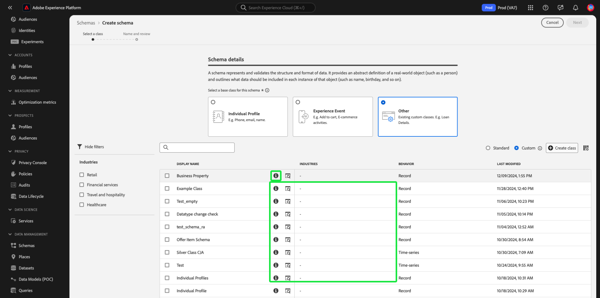
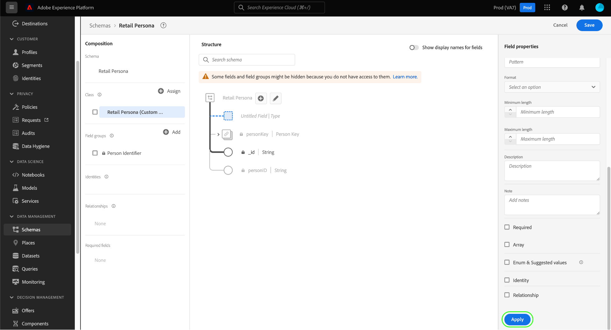

# Creare e modificare gli schemi nell’interfaccia utente {#create-edit-schemas-in-ui}

Questa guida fornisce una panoramica su come creare, modificare e gestire schemi XDM (Experience Data Model) per la tua organizzazione nel Adobe Experience Platform interfaccia.

>[!IMPORTANT]
>
>Gli schemi XDM sono estremamente personalizzabili, pertanto i passaggi necessari per la creazione di uno schema possono variare a seconda del tipo di dati che desideri che lo schema acquisisca. Di conseguenza, questo documento descrive solo le interazioni di base che è possibile eseguire con gli schemi nell’interfaccia utente ed esclude i passaggi correlati, come la personalizzazione di classi, gruppi di campi di schema, tipi di dati e campi.
>
>Per una panoramica completa del processo di creazione dello schema, seguire l&#39;esercitazione [sulla creazione dello schema](../../tutorials/create-schema-ui.md) per creare uno schema di esempio completo e acquisire familiarità con le numerose funzionalità di [!DNL Schema Editor].

## Prerequisiti {#prerequisites}

Questa guida richiede una buona conoscenza del sistema XDM. Fare riferimento alla [panoramica](../../home.md) di XDM per un&#39;introduzione al ruolo di XDM all&#39;interno dell&#39;ecosistema Experience Platform e alle [nozioni di base sulla composizione](../../schema/composition.md) dello schema per una panoramica di come vengono costruiti gli schemi.

## Crea un nuovo schema {#create}

>[!NOTE]
>
>Questa sezione illustra come creare manualmente un nuovo schema nell’interfaccia utente. Se si acquisiscono dati CSV in Experience Platform, è possibile utilizzare gli algoritmi di Machine Learning (ML) per **generare uno schema dai dati CSV di esempio**. Questo flusso di lavoro corrisponde al formato dei dati e crea automaticamente un nuovo schema basato sulla struttura e sul contenuto del file CSV. Per ulteriori informazioni su questo flusso di lavoro, consulta la [Guida alla creazione di schemi assistiti da ML](../ml-assisted-schema-creation.md).

Nell&#39;area di lavoro [!UICONTROL Schemi], seleziona **[!UICONTROL Crea schema]** nell&#39;angolo in alto a destra.

![L&#39;area di lavoro Schemi con [!UICONTROL Crea schema] evidenziato.](../../images/ui/resources/schemas/create-schema.png)

Viene visualizzata la [!UICONTROL finestra di dialogo Crea uno schema] . In questa finestra di dialogo, puoi scegliere di creare manualmente uno schema aggiungendo campi e gruppi di campi oppure caricare un file CSV e utilizzare algoritmi ML per generare uno schema. Seleziona un workflow per la creazione di uno schema dalla finestra di dialogo.

### [!BADGE ]{type=Informative} Beta Creazione manuale o assistita da ML di schemi {#manual-or-assisted}

Per informazioni su come usare un algoritmo ML per consigliare una struttura di schema basata su un file CSV, vedi la guida](../ml-assisted-schema-creation.md) alla creazione di schemi assistita da [Machine Learning. Questa guida dell’interfaccia utente si concentra sul flusso di lavoro di creazione manuale.

### Creazione manuale dello schema {#manual-creation}

Viene visualizzato il [!UICONTROL workflow dello schema] Crea. Puoi scegliere una classe base per lo schema selezionando **[!UICONTROL Profilo]** individuale, **[!UICONTROL Evento]** esperienza o **[!UICONTROL Altro]**, seguito da **[!UICONTROL Successivo]** per confermare la scelta. Per ulteriori informazioni su queste classi, consulta il [[!UICONTROL profilo]](../../classes/individual-profile.md) individuale XDM e [[!UICONTROL la documentazione di XDM ExperienceEvent]](../../classes/experienceevent.md) .

![Lo [!UICONTROL schema] Crea workflow con le tre opzioni di classe ed [!UICONTROL Successivo] evidenziato.](../../images/ui/resources/schemas/schema-class-options.png)

Quando si sceglie **[!UICONTROL Altro]**, viene visualizzato un elenco delle classi disponibili. Da qui è possibile sfogliare e filtrare le classi preesistenti.

![Lo [!UICONTROL schema] Crea workflow con [!UICONTROL Altro] evidenziato nella sezione Dettagli schema.](../../images/ui/resources/schemas/other-schema-details.png)

Selezionare un pulsante radio per filtrare le classi a seconda che si tratti di classi personalizzate o standard. È inoltre possibile filtrare i risultati disponibili in base al relativo settore o ricerca per una classe specifica utilizzando il campo ricerca.

![Lo [!UICONTROL schema] Crea workflow con la barra ricerca, [!UICONTROL Personalizzato] e [!UICONTROL Settori] evidenziati.](../../images/ui/resources/schemas/filter-and-search.png)

Per aiutarti a decidere la classe appropriata, ci sono icone di informazioni e anteprima per ogni classe. L&#39;icona info () apre una finestra di dialogo che fornisce una descrizione della classe e del settore a cui è associata.

L&#39;icona di anteprima () apre una finestra di dialogo di anteprima per la classe contenente un diagramma schema e le relative proprietà.

Seleziona una riga per scegliere una classe, quindi seleziona **[!UICONTROL Successivo]** per confermare la scelta.

![Il flusso di lavoro [!UICONTROL Crea schema] con una classe selezionata dalla tabella delle classi disponibili ed evidenziato [!UICONTROL Avanti].](../../images/ui/resources/schemas/select-class.png)

Dopo aver selezionato una classe, viene visualizzata la [!UICONTROL sezione Nome e revisione] . In questa sezione vengono forniti un nome e una descrizione per identificare lo schema.La struttura di base dello schema (fornita dalla classe) viene visualizzata nell&#39;area di lavoro per consentirti di rivedere e verificare la struttura della classe e dello schema selezionata.

Immettere un nome] visualizzato Schema intuitivo [!UICONTROL nel campo di testo. Successivo, immetti una descrizione appropriata che aiuti a identificare lo schema. Dopo aver esaminato la struttura dello schema e aver soddisfatto le impostazioni, selezionare **[!UICONTROL Fine]** per creare lo schema.

![La [!UICONTROL sezione Nome e revisione] dello schema] Crea workflow con il nome] visualizzato dello schema, [!UICONTROL l&#39;Descrizione e [!UICONTROL la [!UICONTROL fine] evidenziati.](../../images/ui/resources/schemas/name-and-review.png)

Viene visualizzato l&#39;Editor di schema, con la struttura dello schema visualizzata nell&#39;area di disegno. Se lo si desidera, è ora possibile iniziare [ad aggiungere campi alla classe](../../ui/resources/classes.md#add-fields).

## Modifica uno schema esistente {#edit}

>[!NOTE]
>
>Una volta che uno schema è stato salvato e utilizzato nell&#39;assimilazione dei dati, è possibile apportarvi solo modifiche aggiuntive. Per ulteriori informazioni, vedere le regole dell&#39;evoluzione  dello schema.

Per modificare uno schema esistente, selezionare il **[!UICONTROL scheda Sfoglia]** , quindi selezionare il nome dello schema che si desidera modificare. È inoltre possibile utilizzare la barra ricerca per restringere l&#39;elenco delle opzioni disponibili.

>[!TIP]
>
>È possibile utilizzare le funzionalità di filtro e ricerca dell&#39;area di lavoro per facilitare l&#39;individuazione dello schema. Per ulteriori informazioni, consulta la guida all&#39;esplorazione [delle risorse](../explore.md) XDM.

Una volta selezionato uno schema, viene visualizzato [!DNL Schema Editor] con la struttura dello schema mostrata nell&#39;area di disegno. È ora [possibile aggiungere gruppi](#add-field-groups) di campi allo schema (o [aggiungere singoli campi](#add-individual-fields) da tali gruppi), [modificare i nomi](#display-names) visualizzati dei campi o [modificare i gruppi](./field-groups.md#edit) di campi personalizzati esistenti, se lo schema ne utilizza.

## Altre azioni {#more}

Nell’Editor di schema è inoltre possibile eseguire azioni rapide per copiare la struttura JSON dello schema o eliminare lo schema, se non è stato abilitato per Real-Time Customer Profile o se a esso sono associati set di dati. Seleziona [!UICONTROL Altro] nella parte superiore della visualizzazione per visualizzare un elenco a discesa con azioni rapide.

La funzionalità di copia della struttura JSON consente di visualizzare l’aspetto di un payload di esempio durante la creazione dello schema e delle pipeline di dati. È particolarmente utile nelle situazioni in cui sono presenti strutture complesse di mappa oggetto nello schema, ad esempio una mappa di identità.

## Attiva/Disattiva nome visualizzato {#display-name-toggle}

Per comodità, l’Editor di schema fornisce un’opzione per passare dai nomi dei campi originali a quelli più leggibili dall’utente. Questa flessibilità consente di migliorare l&#39;individuazione dei campi e la modifica degli schemi. L&#39;interruttore si trova in alto a destra nella vista Editor schema.

>[!NOTE]
>
>Il passaggio dai nomi dei campi ai nomi visualizzati è puramente cosmetico e non modifica le risorse a valle.

![Nell&#39;Editor schema sono evidenziati i nomi [!UICONTROL visualizzati Mostra dei campi] .](../../images/ui/resources/schemas/display-name-toggle.png)

I nomi visualizzati per i gruppi di campi standard sono generati dal sistema ma possono essere personalizzati, come descritto nella sezione Nomi](#display-names) visualizzati[. I nomi visualizzati vengono riflessi in più viste interfaccia, incluse le mappe e le anteprime dei set di dati. L&#39;impostazione predefinita è disattivata e i nomi dei campi vengono visualizzati in base ai valori originali.

## Aggiungere gruppi di campi a uno schema {#add-field-groups}

>[!NOTE]
>
>Questa sezione spiega come aggiungere gruppi di campi esistenti a uno schema. Se desideri creare un nuovo gruppo di campi personalizzato, consulta invece la guida su [creazione e modifica di gruppi di campi](./field-groups.md#create).

Dopo aver aperto uno schema all&#39;interno di [!DNL Schema Editor], è possibile aggiungere campi allo schema tramite l&#39;utilizzo di gruppi di campi. Per iniziare, seleziona **[!UICONTROL Aggiungi]** accanto a **[!UICONTROL Gruppi di campi]** nella barra a sinistra.

![Nell&#39;Editor schema è evidenziata la [!UICONTROL sezione Aggiungi] dai gruppi] di [!UICONTROL campi.](../../images/ui/resources/schemas/add-field-group-button.png)

Viene visualizzata una finestra di dialogo contenente un elenco di gruppi di campi che è possibile selezionare per lo schema. Poiché i gruppi di campi sono compatibili solo con una classe, verranno elencati solo i gruppi di campi associati alla classe selezionata dello schema. Per impostazione predefinita, i gruppi di campi elencati sono ordinati in base alla popolarità di utilizzo all’interno dell’organizzazione.

![La finestra di dialogo [!UICONTROL Aggiungi gruppi di campi] è evidenziata con la colonna [!UICONTROL Popolarità] evidenziata.](../../images/ui/resources/schemas/field-group-popularity.png)

Se conosci l’attività generale o l’area aziendale dei campi che desideri aggiungere, seleziona una o più categorie verticali di settore nella barra a sinistra per filtrare l’elenco visualizzato dei gruppi di campi.

![La finestra di dialogo [!UICONTROL Aggiungi gruppi di campi] è evidenziata con i filtri [!UICONTROL Industria] e la colonna [!UICONTROL Industria].](../../images/ui/resources/schemas/industry-filter.png)

>[!NOTE]
>
>Per ulteriori informazioni sulle best practice per modellazione dati specifici del settore in XDM, consulta la documentazione sui modelli](../../schema/industries/overview.md) di [dati di settore.

È inoltre possibile utilizzare la barra dei ricerca per individuare il gruppo di campi desiderato. I gruppi di campi il cui nome corrisponde alla query vengono visualizzati in cima all&#39;elenco. In **[!UICONTROL Campi]** standard vengono visualizzati i gruppi di campi contenenti i campi che descrivono gli attributi di dati desiderati.

![La [!UICONTROL finestra di dialogo Aggiungi gruppi] di campi con la [!UICONTROL funzione ricerca campi] standard evidenziata.](../../images/ui/resources/schemas/field-group-search.png)

Selezionare la casella di controllo accanto al nome del gruppo di campi che si desidera aggiungere allo schema. Dall’elenco puoi selezionare più gruppi di campi, ciascuno dei quali viene visualizzato nella barra a destra.

![Finestra di dialogo [!UICONTROL Aggiungi gruppi di campi] con la caratteristica di selezione della casella di controllo evidenziata.](../../images/ui/resources/schemas/add-field-group.png)

>[!TIP]
>
>Per qualsiasi gruppo di campi elencato, è possibile passare il mouse o concentrarsi sull&#39;icona delle informazioni ( delle informazioni) per visualizzare una breve descrizione del tipo di dati acquisiti dal gruppo di campi. È inoltre possibile selezionare l&#39;icona di anteprima ( di anteprima) per visualizzare la struttura dei campi fornita dal gruppo di campi prima di decidere di aggiungerlo allo schema.

Dopo aver scelto i gruppi di campi, selezionare **[!UICONTROL Aggiungi gruppi]** di campi per aggiungerli allo schema.

![La [!UICONTROL finestra di dialogo Aggiungi gruppi] di campi con gruppi di campi selezionati e [!UICONTROL Aggiungi gruppi] di campi evidenziati.](../../images/ui/resources/schemas/add-field-group-finish.png)

Viene [!DNL Schema Editor] rivisualizzato con i campi specificati dal gruppo di campi rappresentati nell&#39;area di disegno.

![Il [!DNL Schema Editor] con uno schema di esempio visualizzato.](../../images/ui/resources/schemas/field-groups-added.png)

>[!NOTE]
>
>Nell&#39;Editor schema, le classi e i gruppi di campi standard (generati da Adobe Systems) sono indicati con l&#39;icona a forma . Il lucchetto viene visualizzato nel barra sinistro accanto al nome della classe o del gruppo di campi, nonché accanto a qualsiasi campo del diagramma dello schema che fa parte di una risorsa generata dal sistema.
>
>

Dopo aver aggiunto un gruppo di campi a uno schema, è possibile rimuovere facoltativamente [i campi](#remove-fields) esistenti o [aggiungere nuovi campi](#add-fields) personalizzati a tali gruppi, a seconda delle esigenze.

### Rimuovi campi aggiunti dai gruppi di campi {#remove-fields}

Dopo aver aggiunto un gruppo di campi a uno schema, è possibile rimuovere tutti i campi non necessari.

>[!NOTE]
>
>La rimozione di campi da un gruppo di campi influisce solo sullo schema su cui si sta lavorando e non sul gruppo di campi stesso. Se si rimuovono campi in uno schema, tali campi sono ancora disponibili in tutti gli altri schemi che utilizzano lo stesso gruppo di campi.

Nell&#39;esempio seguente, il gruppo **[!UICONTROL di campi standard Dettagli demografici]** è stato aggiunto a uno schema. Per rimuovere un singolo campo, ad esempio `taxId`, selezionare il campo nell&#39;area di lavoro, quindi selezionare **[!UICONTROL Rimuovi]** nella barra a destra.

![Il [!DNL Schema Editor] con [!UICONTROL Rimuovi] evidenziato. Questa azione rimuove un singolo campo.](../../images/ui/resources/schemas/remove-single-field.png)

Se si desidera rimuovere più campi, è possibile gestire il gruppo di campi nel suo complesso. Seleziona un campo appartenente al gruppo nell&#39;area di disegno, quindi seleziona **[!UICONTROL Gestisci campi]** correlati nel barra destro.

![Elementi [!DNL Schema Editor] con [!UICONTROL Gestisci campi] correlati evidenziati.](../../images/ui/resources/schemas/manage-related-fields.png)

Viene visualizzata una finestra di dialogo che mostra la struttura del gruppo di campi in questione. Da qui è possibile utilizzare le caselle di controllo fornite per selezionare o deselezionare i campi richiesti. Al termine, selezionare **[!UICONTROL Conferma]**.

![Finestra di dialogo [!UICONTROL Gestisci campi correlati] con campi selezionati ed evidenziata [!UICONTROL Conferma].](../../images/ui/resources/schemas/select-fields.png)

L’area di lavoro viene nuovamente visualizzata con solo i campi selezionati presenti nella struttura dello schema.

### Aggiunta di campi personalizzati a gruppi di campi {#add-fields}

Dopo aver aggiunto un gruppo di campi a uno schema, è possibile definire campi aggiuntivi per tale gruppo. Tuttavia, tutti i campi aggiunti a un gruppo di campi in uno schema verranno visualizzati anche in tutti gli altri schemi che utilizzano lo stesso gruppo di campi.

Inoltre, se un campo personalizzato viene aggiunto a un gruppo di campi standard, tale gruppo di campi verrà convertito in un gruppo di campi personalizzato e il gruppo di campi standard originale non sarà più disponibile.

Se si desidera aggiungere un campo personalizzato a un gruppo di campi standard, fare riferimento alla [sezione seguente](#custom-fields-for-standard-groups) per istruzioni specifiche. Se stai aggiungendo campi a un gruppo di campi personalizzato, consulta la sezione su [modifica di gruppi di campi personalizzati](./field-groups.md) nella guida dell&#39;interfaccia utente dei gruppi di campi.

Se non si desidera modificare gruppi di campi esistenti, è possibile [creare un nuovo gruppo](./field-groups.md#create) di campi personalizzato per definire campi aggiuntivi.

## Aggiunta di singoli campi a uno schema {#add-individual-fields}

L&#39;Editor schema consente di aggiungere singoli campi direttamente a uno schema se si desidera evitare di aggiungere un intero gruppo di campi per un caso d&#39;uso specifico. È possibile [aggiungere singoli campi da gruppi](#add-standard-fields) di campi standard o [aggiungere campi](#add-custom-fields) personalizzati.

>[!IMPORTANT]
>
>Anche se l&#39;Editor schema consente funzionalmente di aggiungere singoli campi direttamente a uno schema, ciò non cambia il fatto che tutti i campi in uno schema XDM devono essere forniti dalla relativa classe o da un gruppo di campi compatibile con tale classe. Come illustrato nelle sezioni seguenti, tutti i singoli campi sono ancora associati a una classe o a un gruppo di campi come passaggio chiave quando vengono aggiunti a uno schema.

### Aggiungi campi standard {#add-standard-fields}

Puoi aggiungere campi da gruppi di campi standard direttamente a uno schema, senza dover conoscere in anticipo il gruppo di campi corrispondente. Per aggiungere un campo standard a uno schema, selezionare l&#39;icona più (**+**) accanto al nome dello schema nell&#39;area di lavoro. Nella struttura dello schema viene visualizzato un segnaposto per **[!UICONTROL Campo senza titolo]** e la barra a destra viene aggiornata per visualizzare i controlli per la configurazione del campo.

In **[!UICONTROL Nome campo]**, inizia a digitare il nome del campo che desideri aggiungere. Il sistema cerca automaticamente i campi standard corrispondenti alla query e li elenca in **[!UICONTROL Campi standard consigliati]**, inclusi i gruppi di campi a cui appartengono.

Sebbene alcuni campi standard condividano lo stesso nome, la loro struttura può variare a seconda del gruppo di campi da cui provengono. Se un campo standard è nidificato all&#39;interno di un oggetto principale nella struttura del gruppo di campi, anche il campo principale verrà incluso nello schema se viene aggiunto il campo figlio.

Selezionare l&#39;icona di anteprima () accanto a un campo standard per visualizzare la struttura del relativo gruppo di campi e capire meglio come potrebbe essere nidificato. Per aggiungere il campo standard allo schema, selezionare l&#39;icona più ().

L’area di lavoro viene aggiornata per mostrare il campo standard aggiunto allo schema, inclusi eventuali campi principali nidificati all’interno della struttura del gruppo di campi. Il nome del gruppo di campi è anche elencato in **[!UICONTROL Gruppi di campi]** nella barra a sinistra. Se desideri aggiungere altri campi dallo stesso gruppo di campi, seleziona **[!UICONTROL Gestisci campi correlati]** nella barra a destra.

### Aggiungere campi personalizzati {#add-custom-fields}

Analogamente alla workflow per i campi standard, è anche possibile aggiungere campi personalizzati direttamente a uno schema.

Per aggiungere campi al livello principale di uno schema, seleziona l&#39;icona più (**+**) accanto al nome dello schema nell&#39;area di disegno. Nella struttura dello schema viene visualizzato un segnaposto per **[!UICONTROL Campo senza titolo]** e la barra a destra viene aggiornata per visualizzare i controlli per la configurazione del campo.

Iniziare a digitare il nome del campo che si desidera aggiungere e il sistema avvia automaticamente la ricerca dei campi standard corrispondenti. Per creare un nuovo campo personalizzato, seleziona l&#39;opzione superiore aggiunta con **([!UICONTROL Nuovo campo])**.

Dopo aver fornito un nome visualizzato e un tipo di dati per il campo, il passaggio successivo consiste nell&#39;assegnare il campo a una risorsa XDM padre. Se lo schema utilizza una classe personalizzata, è possibile scegliere di [aggiungere il campo alla classe](#add-to-class) assegnata o a un [gruppo](#add-to-field-group) di campi. Se lo schema utilizza una classe standard, tuttavia, è possibile assegnare il campo personalizzato solo a un gruppo di campi.

#### Assegnare il campo a un gruppo di campi personalizzato {#add-to-field-group}

>[!NOTE]
>
>Questa sezione spiega solo come assegnare il campo a un gruppo di campi personalizzato. Se invece si desidera estendere un gruppo di campi standard con il nuovo campo personalizzato, vedere la sezione relativa [all&#39;aggiunta di campi personalizzati a gruppi](#custom-fields-for-standard-groups) di campi standard.

In **[!UICONTROL Assegna a]**, seleziona **[!UICONTROL Gruppo di campi]**. Se lo schema utilizza una classe standard, questa è l&#39;unica opzione disponibile ed è selezionata per impostazione predefinita.

Successivamente, è necessario selezionare un gruppo di campi al quale associare il nuovo campo. Inizia digitare il nome del gruppo di campi nell&#39;input di testo fornito. Se esistono gruppi di campi personalizzati che corrispondono all&#39;input, questi verranno visualizzati nell&#39;elenco a discesa. In alternativa, è possibile digitare un nome univoco per creare un nuovo gruppo di campi.

>[!WARNING]
>
>Se si seleziona un gruppo di campi personalizzato esistente, anche tutti gli altri schemi che utilizzano tale gruppo di campi erediteranno anche il campo appena aggiunto dopo aver salvato le modifiche. Per questo motivo, selezionare un gruppo di campi esistente solo se si desidera questo tipo di propagazione. In caso contrario, è necessario scegliere di creare un nuovo gruppo di campi personalizzato.

Dopo aver selezionato il gruppo di campi dall&#39;elenco, selezionare **[!UICONTROL Applica]**.

Il nuovo campo viene aggiunto al canvas e viene assegnato uno spazio dei nomi all&#39;ID](../../api/getting-started.md#know-your-tenant_id) tenant [per evitare conflitti con i campi XDM standard. Il gruppo di campi a cui è stato associato il nuovo campo viene visualizzato anche in **[!UICONTROL Gruppi]** di campi nella barra sinistra.

>[!NOTE]
>
>Per impostazione predefinita, gli altri campi forniti dal gruppo di campi personalizzati selezionato vengono rimossi dallo schema. Se si desidera aggiungere alcuni di questi campi allo schema, selezionare un campo appartenente al gruppo e quindi selezionare **[!UICONTROL Gestisci campi]** correlati nel barra destro.

#### Assegna il campo a una classe personalizzata {#add-to-class}

In **[!UICONTROL Assegna a]**, selezionare **[!UICONTROL Classe]**. Il campo di input sottostante viene sostituito con il nome della classe personalizzata dello schema corrente, indicando che il nuovo campo verrà assegnato a questa classe.

![Opzione [!UICONTROL Classe] selezionata per la nuova assegnazione di campo.](../../images/ui/resources/schemas/assign-field-to-class.png)

Continua configurando il campo come desiderato e selezionate **[!UICONTROL Applica]** al termine.

Il nuovo campo viene aggiunto al canvas e viene assegnato uno spazio dei nomi all&#39;ID](../../api/getting-started.md#know-your-tenant_id) tenant [per evitare conflitti con i campi XDM standard. Selezionando il nome della classe nel barra sinistro si apre il nuovo campo come parte della struttura della classe.

### Aggiungere campi personalizzati alla struttura dei gruppi di campi standard {#custom-fields-for-standard-groups}

Se lo schema su cui stai lavorando dispone di un campo di tipo oggetto fornito da un gruppo di campi standard, puoi aggiungere campi personalizzati a tale oggetto standard.

>[!WARNING]
>
>Tutti i campi aggiunti a un gruppo di campi in uno schema verranno visualizzati anche in tutti gli altri schemi che utilizzano lo stesso gruppo di campi. Inoltre, se un campo personalizzato viene aggiunto a un gruppo di campi standard, tale gruppo verrà convertito in un gruppo di campi personalizzato e il gruppo di campi standard originale non sarà più disponibile.
>
>Se hai partecipato alla versione beta di questa funzione, riceverai una finestra di dialogo che informa sui gruppi di campi standard che hai personalizzato in precedenza. Dopo aver selezionato **[!UICONTROL Riconosci]**, le risorse elencate vengono convertite in gruppi di campi personalizzati.
>
>

Per iniziare, selezionare l&#39;icona più (**+**) accanto alla directory principale dell&#39;oggetto fornita dal gruppo di campi standard.

Viene visualizzato un messaggio di avviso che richiede di confermare se si desidera convertire il gruppo di campi standard. Selezionare **[!UICONTROL Continua a creare il gruppo di campi]** per continuare.

L&#39;area di disegno viene rivisualizzata con un segnaposto senza titolo per il nuovo campo. Si noti che al nome del gruppo di campi standard è stato aggiunto &quot;([!UICONTROL Extended])&quot; per indicare che è stato modificato dalla versione originale. Da qui, utilizzare i controlli nel barra destro per definire le proprietà del campo.

Dopo aver applicato le modifiche, il nuovo campo viene visualizzato sotto lo spazio dei nomi ID tenant all&#39;interno dell&#39;oggetto standard. Questo spazio dei nomi nidificato evita conflitti di nomi di campo all’interno del gruppo di campi stesso, al fine di evitare di interrompere le modifiche in altri schemi che utilizzano lo stesso gruppo di campi.

## Abilitare uno schema per il profilo cliente in tempo reale {#profile}

>[!CONTEXTUALHELP]
>id="platform_schemas_enableforprofile"
>title="Abilitare uno schema per il profilo"
>abstract="Quando uno schema è abilitato per il profilo, tutti i set di dati creati da questo schema partecipano a Real-Time Customer Profile, che unisce i dati provenienti da origini diverse per creare una visualizzazione completa di ciascun cliente. Una volta che uno schema viene utilizzato per acquisire dati nel profilo, non può essere disabilitato. Per ulteriori informazioni, consulta la documentazione."

[Il profilo](../../../profile/home.md) cliente in tempo reale unisce dati provenienti da fonti diverse per creare una visione completa di ogni singolo cliente. Se si desidera che i dati acquisiti da uno schema partecipino a questo processo, è necessario abilitare lo schema per l&#39;utilizzo in [!DNL Profile].

>[!IMPORTANT]
>
>Per abilitare uno schema per [!DNL Profile], è necessario che sia definito un campo di identità primario. Per ulteriori informazioni, consulta la guida alla definizione dei [campi](../fields/identity.md) di identità.

Per abilitare lo schema, inizia selezionando il nome dello schema nella barra sinistra, quindi seleziona l&#39;interruttore **[!UICONTROL Profilo]** in barra destra.

Viene visualizzato un popover che avverte che, una volta abilitato e salvato, uno schema non può essere disabilitato. Seleziona **[!UICONTROL Abilita]** per continuare.

L&#39;area di lavoro viene nuovamente visualizzata con l&#39;opzione [!UICONTROL Profilo] abilitata.

>[!IMPORTANT]
>
>Poiché lo schema non è ancora stato salvato, questo è il punto di non ritorno se cambi idea su come consentire allo schema di partecipare a Real-Time Customer Profile: una volta salvato uno schema abilitato, non può più essere disabilitato. Seleziona di nuovo il profilo **[!UICONTROL Profile]** per disabilitare lo schema.

Per completare il processo, selezionare **[!UICONTROL Salva]** per salvare lo schema.

Lo schema è ora abilitato per l&#39;utilizzo in Real-Time Customer Profile. Quando Experience Platform inserisce dati in set di dati basati su questo schema, tali dati verranno incorporati nei dati del profilo amalgamati.

## Modifica dei nomi visualizzati per i campi schema {#display-names}

Dopo aver assegnato una classe e aggiunto gruppi di campi a uno schema, puoi modificare i nomi visualizzati di qualsiasi campo dello schema, indipendentemente dal fatto che tali campi siano stati forniti da risorse XDM standard o personalizzate.

>[!NOTE]
>
>Tieni presente che i nomi visualizzati dei campi che appartengono a classi o gruppi di campi standard possono essere modificati solo nel contesto di uno schema specifico. In altre parole, la modifica del nome visualizzato di un campo standard in uno schema non influisce sugli altri schemi che utilizzano la stessa classe o lo stesso gruppo di campi associato.
>
>Una volta apportati cambiamenti ai nomi visualizzati per i campi di uno schema, tali modifiche vengono immediatamente riflesse in tutti i set di dati esistenti basati su tale schema.

Modificare i nomi dei campi con i nomi visualizzati attivando **[!UICONTROL Mostra nomi visualizzati per i campi]**. Per modificare il nome visualizzato di un campo schema, selezionare il campo nell&#39;area di disegno. Nel barra a destra, immetti il nuovo nome in **[!UICONTROL Nome visualizzato]**.

Seleziona **[!UICONTROL Applica]** nel barra a destra e l&#39;area di disegno si aggiorna per mostrare il nuovo nome visualizzato del campo. Selezionare **[!UICONTROL Salva]** per applicare le modifiche allo schema.

## Modificare la classe di uno schema {#change-class}

È possibile modificare la classe di uno schema in qualsiasi momento del processo di composizione iniziale prima che lo schema sia stato salvato.

>[!WARNING]
>
>La riassegnazione della classe per uno schema deve essere eseguita con estrema cautela. I gruppi di campi sono compatibili solo con determinate classi e pertanto la modifica della classe ripristinerà l&#39;area di disegno e tutti i campi aggiunti.

Per riassegnare una classe, seleziona **[!UICONTROL Assegna]** nella parte sinistra dell&#39;area di disegno.

Viene visualizzata una finestra di dialogo in cui viene visualizzato un elenco di tutte le classi disponibili, incluse quelle definite dall&#39;organizzazione (la proprietario è &quot;[!UICONTROL Cliente]&quot;) e le classi standard definite dall Adobe Systems.

Selezionare una classe dall&#39;elenco per visualizzarne la descrizione sul lato destro della finestra di dialogo. È inoltre possibile selezionare **[!UICONTROL Anteprima struttura]** di classe per visualizzare i campi e i metadati associati alla classe. Seleziona **[!UICONTROL Assegna classe]** per continuare.

Viene visualizzata una nuova finestra di dialogo in cui viene richiesto di confermare l&#39;assegnazione di una nuova classe. Seleziona **[!UICONTROL Assegna]** per confermare.

Dopo aver confermato il cambio di classe, la tela verrà ripristinata e tutti i progressi della composizione andranno persi.

## Passaggi successivi {#next-steps}

Questo documento ha trattato le nozioni di base per la creazione e la modifica di schemi nel interfaccia Experience Platform. Si consiglia vivamente di esaminare la esercitazione](../../tutorials/create-schema-ui.md) di creazione dello [schema per ottenere una workflow completa per la creazione di uno schema completo nel interfaccia, inclusa la creazione di gruppi di campi e tipi di dati personalizzati per casi di utilizzo specifici.

Per ulteriori informazioni sulle funzionalità dell&#39;area [!UICONTROL di lavoro Schemi], vedere Cenni preliminari](../overview.md) sull&#39;area [[!UICONTROL di lavoro Schemi].

Per informazioni su come gestire gli schemi nell&#39;API [!DNL Schema Registry] , consulta la [guida](../../api/schemas.md) agli endpoint degli schemi.
