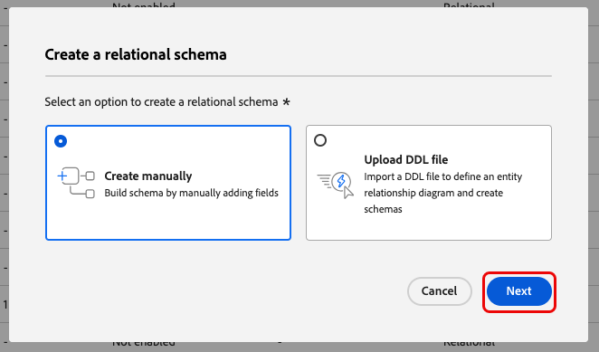

# Creare e modificare gli schemi nell’interfaccia utente {#create-edit-schemas-in-ui}

Questa guida fornisce una panoramica su come creare, modificare e gestire gli schemi Experience Data Model (XDM) per la tua organizzazione nell’interfaccia utente di Adobe Experience Platform.

>[!IMPORTANT]
>
>Gli schemi XDM sono estremamente personalizzabili, pertanto i passaggi necessari per la creazione di uno schema possono variare a seconda del tipo di dati che desideri che lo schema acquisisca. Di conseguenza, questo documento descrive solo le interazioni di base che è possibile eseguire con gli schemi nell’interfaccia utente ed esclude i passaggi correlati, come la personalizzazione di classi, gruppi di campi di schema, tipi di dati e campi.
>
>Per una panoramica completa del processo di creazione dello schema, seguire l&#39;esercitazione [sulla creazione dello schema](../../tutorials/create-schema-ui.md) per creare uno schema di esempio completo e acquisire familiarità con le numerose funzionalità di [!DNL Schema Editor].

## Prerequisiti {#prerequisites}

Questa guida richiede una buona conoscenza del sistema XDM. Per un&#39;introduzione al ruolo di XDM nell&#39;ecosistema Experience Platform, consulta la [panoramica di XDM](../../home.md) e le [nozioni di base sulla composizione dello schema](../../schema/composition.md) per una panoramica sulla costruzione degli schemi.

## Crea un nuovo schema {#create}

Nell&#39;area di lavoro [!UICONTROL Schemas], seleziona **[!UICONTROL Create schema]** nell&#39;angolo in alto a destra. Viene visualizzato il menu a discesa &#39;Seleziona tipo di schema&#39; con le opzioni per gli schemi [!UICONTROL Standard] o [!UICONTROL Relational].

![L&#39;area di lavoro Schemi con [!UICONTROL Create Schema] evidenziato e il menu a discesa &#39;Seleziona tipo di schema&#39; visualizzato](../../images/ui/resources/schemas/create-schema.png).

## Crea uno schema relazionale {#create-relational-schema}

>[!AVAILABILITY]
>
>Data Mirror e gli schemi relazionali sono disponibili per i titolari di licenze di **Campagne orchestrate** Adobe Journey Optimizer. Sono disponibili anche come **versione limitata** per gli utenti di Customer Journey Analytics, a seconda della licenza e dell&#39;abilitazione della funzione. Contatta il tuo rappresentante Adobe per accedere.

>[!NOTE]
>
>Nelle versioni precedenti della documentazione di Adobe Experience Platform, gli schemi relazionali erano precedentemente denominati schemi basati su modelli.

Selezionare **[!UICONTROL Relational]** per definire schemi strutturati di tipo relazionale con un controllo granulare sui record. Gli schemi relazionali supportano l&#39;applicazione della chiave primaria, il controllo delle versioni a livello di record e le relazioni a livello di schema tramite chiavi primarie ed esterne. Sono ottimizzati anche per l’acquisizione incrementale tramite l’acquisizione di dati di modifica e supportano più modelli di dati utilizzati nelle implementazioni di Orchestrazione di Campaign, Data Distiller e B2B.

Per ulteriori informazioni, consulta la panoramica dello [Data Mirror](../../data-mirror/overview.md) o dello [schema relazionale](../../schema/relational.md).

### Crea manualmente {#create-manually}

>[!AVAILABILITY]
>
>Il caricamento di file DDL è disponibile solo per i titolari di licenze di Adobe Journey Optimizer Orchestrated Campaign. L’interfaccia utente potrebbe apparire in modo diverso.

Viene visualizzata la finestra di dialogo **[!UICONTROL Create a relational schema]**. È possibile scegliere **[!UICONTROL Create manually]** o [**[!UICONTROL Upload DDL file]**](#upload-ddl-file) per definire la struttura dello schema.

Nella finestra di dialogo **[!UICONTROL Create a relational schema]**, seleziona **[!UICONTROL Create manually]**, quindi **[!UICONTROL Next]**.

Viene visualizzata la pagina **[!UICONTROL Relational schema details]**. Immettere il nome visualizzato dello schema e una descrizione facoltativa, quindi selezionare **[!UICONTROL Finish]** per creare lo schema.

![Visualizzazione dei dettagli dello schema relazionale con [!UICONTROL Schema display name], [!UICONTROL Description] e [!UICONTROL Finish] evidenziati.](../../images/ui/resources/schemas/relational-details.png)

Viene aperto l’Editor schema con un’area di lavoro vuota per definire la struttura dello schema. Puoi aggiungere i campi come di consueto.

#### Aggiungi un campo di identificazione della versione {#add-version-identifier}

Per abilitare il tracciamento delle versioni e supportare l’acquisizione dei dati di modifica, devi designare un campo di identificazione della versione nello schema. Nell&#39;Editor schema selezionare l&#39;icona più () accanto al nome dello schema per aggiungere un nuovo campo.

Immettere un nome di campo come `updateSequence` e scegliere un tipo di dati **[!UICONTROL DateTime]** o **[!UICONTROL Number]**.

Nella barra a destra, abilita la casella di controllo **[!UICONTROL Version Identifier]**, quindi seleziona **[!UICONTROL Apply]** per confermare il campo.

>[!IMPORTANT]
>
>Uno schema relazionale deve includere un campo di identificazione della versione per supportare gli aggiornamenti a livello di record e modificare l’acquisizione dei dati.

Per definire le relazioni, selezionare **[!UICONTROL Add Relationship]** nell&#39;Editor schema per creare relazioni chiave primaria/esterna a livello di schema. Per ulteriori informazioni, consulta il tutorial su [aggiunta di relazioni a livello di schema](../../tutorials/relationship-ui.md#relationship-field).

Quindi, passare a [definire le chiavi primarie](../fields/identity.md#define-a-identity-field) e [aggiungere campi aggiuntivi](#add-field-groups) in base alle esigenze. Per istruzioni su come abilitare l&#39;acquisizione dei dati di modifica nelle origini di Experience Platform, consulta la [guida all&#39;acquisizione dei dati di modifica](../../../sources/tutorials/api/change-data-capture.md).

>[!NOTE]
>
>Una volta salvato, il campo [!UICONTROL Type] nella barra laterale [!UICONTROL  Schema properties] indica che si tratta di uno schema [!UICONTROL Relational]. Questo è indicato anche nella barra laterale dei dettagli nella vista inventario schema.
>

### Carica un file DDL {#upload-ddl-file}

>[!AVAILABILITY]
>
>Il caricamento di file DDL è disponibile solo per i titolari di licenze di Adobe Journey Optimizer Orchestrated Campaign.

Utilizza questo flusso di lavoro per definire lo schema caricando un file DDL. Nella finestra di dialogo **[!UICONTROL Create a relational schema]**, seleziona **[!UICONTROL Upload DDL file]**, quindi trascina un file DDL locale dal sistema o seleziona **[!UICONTROL Choose files]**. Experience Platform convalida lo schema e visualizza un segno di spunta verde se il caricamento del file ha esito positivo. Selezionare **[!UICONTROL Next]** per confermare il caricamento.

![Finestra di dialogo Crea schema relazionale con [!UICONTROL Upload DDL file] selezionato ed evidenziato [!UICONTROL Next].](../../images/ui/resources/schemas/upload-ddl-file.png)

Viene visualizzata la finestra di dialogo [!UICONTROL Select entities and fields to import], che consente di visualizzare l&#39;anteprima dello schema. Rivedi la struttura dello schema e utilizza i pulsanti di scelta e le caselle di controllo per garantire che ogni entità abbia una chiave primaria e un identificatore di versione specificati.

>[!IMPORTANT]
>
>La struttura della tabella deve contenere una **chiave primaria** e un **identificatore di versione**, ad esempio un campo `updateSequence` di tipo datetime o number.
>
>Per modificare l&#39;acquisizione dei dati, è necessaria anche una colonna speciale denominata `_change_request_type` di tipo String per abilitare l&#39;elaborazione incrementale. Questo campo indica il tipo di modifica dei dati, ad esempio `u` (upsert) o `d` (delete).

Sebbene sia necessario durante l&#39;acquisizione, le colonne di controllo come `_change_request_type` non vengono memorizzate nello schema e non vengono visualizzate nella struttura dello schema finale. Se tutto sembra corretto, selezionare **[!UICONTROL Done]** per creare lo schema.

>[!NOTE]
>
>La dimensione massima supportata per un caricamento DDL è 10 MB.

![Visualizzazione di revisione dello schema relazionale con campi importati visualizzati ed evidenziati [!UICONTROL Finish].](../../images/ui/resources/schemas/entities-and-files-to-inport.png)

Lo schema viene aperto nell’Editor di schema, dove è possibile regolare la struttura prima di salvare.

Quindi, procedi a [aggiungi ulteriori campi](#add-field-groups) e [aggiungi ulteriori relazioni a livello di schema](../../tutorials/relationship-ui.md#relationship-field) secondo necessità.

Per istruzioni su come abilitare l&#39;acquisizione dei dati di modifica nelle origini di Experience Platform, consulta la [guida all&#39;acquisizione dei dati di modifica](../../../sources/tutorials/api/change-data-capture.md).

## Creazione schema standard {#standard-based-creation}

Se si seleziona Tipo di schema standard dal menu a discesa &#39;Seleziona tipo di schema&#39;, viene visualizzata la finestra di dialogo [!UICONTROL Create a schema]. In questa finestra di dialogo, puoi scegliere di creare manualmente uno schema aggiungendo campi e gruppi di campi, oppure puoi caricare un file CSV e utilizzare algoritmi ML per generare uno schema. Seleziona un flusso di lavoro per la creazione di uno schema dalla finestra di dialogo.

### [!BADGE Beta]{type=Informative} Creazione manuale o assistita da ML dello schema {#manual-or-assisted}

Per informazioni su come utilizzare un algoritmo ML per consigliare una struttura di schema basata su un file csv, consulta la [guida alla creazione di schemi assistiti da apprendimento automatico](../ml-assisted-schema-creation.md). Questa guida dell’interfaccia utente si concentra sul flusso di lavoro di creazione manuale.

### Creazione manuale dello schema {#manual-creation}

Verrà visualizzato il flusso di lavoro [!UICONTROL Create schema]. È possibile scegliere una classe base per lo schema selezionando **[!UICONTROL Individual Profile]**, **[!UICONTROL Experience Event]** o **[!UICONTROL Other]**, seguito da **[!UICONTROL Next]** per confermare la scelta. Per ulteriori informazioni su queste classi, vedere la documentazione di [[!UICONTROL XDM individual profile]](../../classes/individual-profile.md) e [[!UICONTROL XDM ExperienceEvent]](../../classes/experienceevent.md).

![Il flusso di lavoro [!UICONTROL Create schema] con le tre opzioni di classe e [!UICONTROL Next] evidenziato.](../../images/ui/resources/schemas/schema-class-options.png)

Quando si sceglie **[!UICONTROL Other]**, viene visualizzato un elenco delle classi disponibili. Da qui puoi sfogliare e filtrare le classi preesistenti.

![Il flusso di lavoro [!UICONTROL Create schema] con [!UICONTROL Other] evidenziato nella sezione [!UICONTROL Schema details].](../../images/ui/resources/schemas/other-schema-details.png)

Selezionare un pulsante di opzione per filtrare le classi in base al fatto che si tratti di classi personalizzate o standard. Puoi anche filtrare i risultati disponibili in base al settore o cercare una classe specifica utilizzando il campo di ricerca.

![Il flusso di lavoro [!UICONTROL Create schema] con la barra di ricerca, [!UICONTROL Custom] e [!UICONTROL Industries] evidenziati.](../../images/ui/resources/schemas/filter-and-search.png)

Per aiutarti a decidere la classe appropriata, ci sono icone di informazioni e anteprima per ogni classe. Icona info () apre una finestra di dialogo che fornisce una descrizione della classe e del settore a cui è associata.

Icona di anteprima () apre una finestra di dialogo di anteprima per la classe che contiene un diagramma schema e le relative proprietà.

Selezionare una riga qualsiasi per scegliere una classe, quindi selezionare **[!UICONTROL Next]** per confermare la scelta.

![Il flusso di lavoro [!UICONTROL Create schema] con una classe selezionata dalla tabella delle classi disponibili ed evidenziati [!UICONTROL Next].](../../images/ui/resources/schemas/select-class.png)

Dopo aver selezionato una classe, viene visualizzata la sezione [!UICONTROL Name and review]. In questa sezione, fornisci un nome e una descrizione per identificare lo schema. &#x200B;La struttura di base dello schema (fornita dalla classe) viene visualizzata nell’area di lavoro per rivedere e verificare la struttura di classe e schema selezionata.

Immetti un [!UICONTROL Schema display name] descrittivo nel campo di testo. Quindi, inserisci una descrizione adatta per identificare lo schema. Dopo aver rivisto la struttura dello schema e aver impostato correttamente le impostazioni, selezionare **[!UICONTROL Finish]** per creare lo schema.

![La sezione [!UICONTROL Name and review] del flusso di lavoro [!UICONTROL Create schema] con [!UICONTROL Schema display name], [!UICONTROL Description] e [!UICONTROL Finish] evidenziati.](../../images/ui/resources/schemas/name-and-review.png)

Viene visualizzato l’Editor di schema, con la struttura dello schema visualizzata nell’area di lavoro. Se lo desideri, ora puoi iniziare ad aggiungere [campi alla classe](../../ui/resources/classes.md#add-fields).

## Modificare uno schema esistente {#edit}

>[!NOTE]
>
>Una volta che uno schema è stato salvato e utilizzato nell’acquisizione dei dati, è possibile apportarvi solo modifiche aggiuntive. Per ulteriori informazioni, consulta le [regole dell&#39;evoluzione dello schema](../../schema/composition.md#evolution).

Per modificare uno schema esistente, selezionare la scheda **[!UICONTROL Browse]**, quindi selezionare il nome dello schema che si desidera modificare. È inoltre possibile utilizzare la barra di ricerca per limitare l&#39;elenco delle opzioni disponibili.

>[!TIP]
>
>Puoi utilizzare le funzionalità di ricerca e filtro dell’area di lavoro per trovare più facilmente lo schema. Per ulteriori informazioni, consulta la guida sull&#39;[esplorazione delle risorse XDM](../explore.md).

Dopo aver selezionato uno schema, [!DNL Schema Editor] viene visualizzato con la struttura dello schema mostrata nell&#39;area di lavoro. Ora puoi [aggiungere gruppi di campi](#add-field-groups) allo schema (o [aggiungere singoli campi](#add-individual-fields) da tali gruppi), [modificare i nomi visualizzati dei campi](#display-names) o [modificare i gruppi di campi personalizzati esistenti](./field-groups.md#edit) se lo schema ne utilizza uno.

## Altre azioni {#more}

Nell’Editor di schema è inoltre possibile eseguire azioni rapide per copiare la struttura JSON dello schema o eliminare lo schema, se non è stato abilitato per Real-Time Customer Profile o se a esso sono associati set di dati. Seleziona [!UICONTROL More] nella parte superiore della visualizzazione per visualizzare un elenco a discesa con azioni rapide.

La funzionalità di copia della struttura JSON consente di visualizzare l’aspetto di un payload di esempio durante la creazione dello schema e delle pipeline di dati. È particolarmente utile nelle situazioni in cui sono presenti strutture complesse di mappa oggetto nello schema, ad esempio una mappa di identità.

## Attiva/Disattiva nome visualizzato {#display-name-toggle}

Per comodità, l’Editor di schema fornisce un’opzione per passare dai nomi dei campi originali a quelli più leggibili dall’utente. Questa flessibilità consente di migliorare la reperibilità sul campo e la modifica degli schemi. L’interruttore si trova in alto a destra nella vista Editor di schema.

>[!NOTE]
>
>Il passaggio dai nomi dei campi ai nomi visualizzati è puramente cosmetico e non modifica le risorse a valle.

![Editor di schema con [!UICONTROL Show display names for fields] evidenziato.](../../images/ui/resources/schemas/display-name-toggle.png)

I nomi visualizzati per i gruppi di campi standard sono generati dal sistema ma possono essere personalizzati, come descritto nella sezione [nomi visualizzati](#display-names). I nomi visualizzati si riflettono tra più visualizzazioni dell’interfaccia utente, incluse le anteprime di mappature e set di dati. L&#39;impostazione predefinita è disattivata e mostra i nomi dei campi in base ai valori originali.

## Aggiungere gruppi di campi a uno schema {#add-field-groups}

>[!NOTE]
>
>Questa sezione spiega come aggiungere gruppi di campi esistenti a uno schema. Se desideri creare un nuovo gruppo di campi personalizzato, consulta invece la guida su [creazione e modifica di gruppi di campi](./field-groups.md#create).

Dopo aver aperto uno schema all&#39;interno di [!DNL Schema Editor], è possibile aggiungere campi allo schema tramite l&#39;utilizzo di gruppi di campi. Per iniziare, seleziona **[!UICONTROL Add]** accanto a **[!UICONTROL Field groups]** nella barra a sinistra.

![Editor di schema con [!UICONTROL Add] evidenziato nella sezione [!UICONTROL Field groups].](../../images/ui/resources/schemas/add-field-group-button.png)

Viene visualizzata una finestra di dialogo con l’elenco dei gruppi di campi che è possibile selezionare per lo schema. Poiché i gruppi di campi sono compatibili solo con una classe, verranno elencati solo i gruppi di campi associati alla classe selezionata dello schema. Per impostazione predefinita, i gruppi di campi elencati sono ordinati in base alla popolarità di utilizzo all’interno dell’organizzazione.

![La finestra di dialogo [!UICONTROL Add field groups] è evidenziata con la colonna [!UICONTROL Popularity] evidenziata.](../../images/ui/resources/schemas/field-group-popularity.png)

Se conosci l’attività generale o l’area aziendale dei campi che desideri aggiungere, seleziona una o più categorie verticali di settore nella barra a sinistra per filtrare l’elenco visualizzato dei gruppi di campi.

![La finestra di dialogo [!UICONTROL Add field groups] è evidenziata con i filtri [!UICONTROL Industry] e la colonna [!UICONTROL Industry] è evidenziata.](../../images/ui/resources/schemas/industry-filter.png)

>[!NOTE]
>
>Per ulteriori informazioni sulle best practice per la modellazione dati specifica del settore in XDM, consulta la documentazione su [modelli dati del settore](../../schema/industries/overview.md).

È inoltre possibile utilizzare la barra di ricerca per individuare facilmente il gruppo di campi desiderato. I gruppi di campi il cui nome corrisponde alla query vengono visualizzati nella parte superiore dell’elenco. In **[!UICONTROL Standard Fields]** vengono visualizzati i gruppi di campi contenenti i campi che descrivono gli attributi di dati desiderati.

![La finestra di dialogo [!UICONTROL Add field groups] con la funzione di ricerca [!UICONTROL Standard fields] è evidenziata.](../../images/ui/resources/schemas/field-group-search.png)

Seleziona la casella di controllo accanto al nome del gruppo di campi che desideri aggiungere allo schema. Dall’elenco puoi selezionare più gruppi di campi, ciascuno dei quali viene visualizzato nella barra a destra.

![La finestra di dialogo [!UICONTROL Add field groups] con la caratteristica di selezione della casella di controllo evidenziata.](../../images/ui/resources/schemas/add-field-group.png)

>[!TIP]
>
>Per qualsiasi gruppo di campi elencato, puoi passare il cursore sull&#39;icona delle informazioni () per visualizzare una breve descrizione del tipo di dati acquisiti dal gruppo di campi. È inoltre possibile selezionare l&#39;icona di anteprima () per visualizzare la struttura dei campi forniti dal gruppo di campi prima di decidere di aggiungerlo allo schema.

Dopo aver scelto i gruppi di campi, seleziona **[!UICONTROL Add field groups]** per aggiungerli allo schema.

![Finestra di dialogo [!UICONTROL Add field groups] con gruppi di campi selezionati ed evidenziati [!UICONTROL Add field groups].](../../images/ui/resources/schemas/add-field-group-finish.png)

[!DNL Schema Editor] viene nuovamente visualizzato con i campi forniti dal gruppo di campi rappresentati nell&#39;area di lavoro.

![Il [!DNL Schema Editor] con uno schema di esempio visualizzato.](../../images/ui/resources/schemas/field-groups-added.png)

>[!NOTE]
>
>Nell&#39;Editor schema, le classi e i gruppi di campi standard (generati da Adobe) sono indicati con l&#39;icona a forma di lucchetto . Il lucchetto viene visualizzato nella barra a sinistra accanto al nome della classe o del gruppo di campi, nonché accanto a qualsiasi campo nel diagramma dello schema che fa parte di una risorsa generata dal sistema.
>
>

Dopo aver aggiunto un gruppo di campi a uno schema, puoi [rimuovere i campi esistenti](#remove-fields) o [aggiungere nuovi campi personalizzati](#add-fields) a tali gruppi, a seconda delle tue esigenze.

### Rimuovi campi aggiunti dai gruppi di campi {#remove-fields}

Dopo aver aggiunto un gruppo di campi a uno schema, puoi rimuovere i campi globalmente dal gruppo di campi o nasconderli localmente dallo schema corrente. Comprendere la differenza tra queste azioni è fondamentale per evitare modifiche non desiderate allo schema.

>[!IMPORTANT]
>
>Se si seleziona **[!UICONTROL Remove]**, il campo verrà eliminato dal gruppo di campi stesso, con effetti su *tutti* gli schemi che utilizzano tale gruppo di campi.
>Non utilizzare questa opzione a meno che non si desideri **rimuovere il campo da ogni schema che include il gruppo di campi**.

Per eliminare un campo dal gruppo di campi, selezionarlo nell&#39;area di lavoro e selezionare **[!UICONTROL Remove]** nella barra a destra. Questo esempio mostra il campo `taxId` dal gruppo **[!UICONTROL Demographic Details]**.

![Il [!DNL Schema Editor] con [!UICONTROL Remove] evidenziato. Questa azione rimuove un singolo campo.](../../images/ui/resources/schemas/remove-single-field.png)

Per nascondere più campi da uno schema senza rimuoverli dal gruppo di campi stesso, utilizzare l&#39;opzione **[!UICONTROL Manage related fields]**. Seleziona un campo dal gruppo nell&#39;area di lavoro, quindi seleziona **[!UICONTROL Manage related fields]** nella barra a destra.

![Il [!DNL Schema Editor] con [!UICONTROL Manage related fields] evidenziato.](../../images/ui/resources/schemas/manage-related-fields.png)

Viene visualizzata una finestra di dialogo che mostra la struttura del gruppo di campi. Utilizzare le caselle di controllo per selezionare o deselezionare i campi che si desidera includere.

![La finestra di dialogo [!UICONTROL Manage related fields] con i campi selezionati e [!UICONTROL Confirm] evidenziati.](../../images/ui/resources/schemas/select-fields.png)

Seleziona **[!UICONTROL Confirm]** per aggiornare l&#39;area di lavoro e riflettere i campi selezionati.

### Comportamento del campo durante la rimozione o la deprecazione dei campi {#field-removal-deprecation-behavior}

Utilizza la tabella seguente per comprendere l’ambito di ogni azione.

| Azione | Si applica solo allo schema corrente | Modifica il gruppo di campi | Interessa altri schemi | Descrizione |
|--------------------------|--------------------------------|----------------------|-----------------------|-------------|
| **Rimuovi campo** | No | Sì | Sì | Elimina il campo dal gruppo. Questo lo rimuove da tutti gli schemi che utilizzano quel gruppo. |
| **Gestisci campi correlati** | Sì | No | No | Nasconde i campi solo dallo schema corrente. Il gruppo di campi rimane invariato. |
| **Campo obsoleto** | No | Sì | Sì | Contrassegna il campo come obsoleto nel gruppo di campi. Non è più disponibile per l’utilizzo in nessuno schema. |

>[!NOTE]
>
>Questo comportamento è coerente sia tra gli schemi basati su record che tra quelli basati su eventi.

### Aggiungere campi personalizzati ai gruppi di campi {#add-fields}

Dopo aver aggiunto un gruppo di campi a uno schema, puoi definire campi aggiuntivi per tale gruppo. Tuttavia, tutti i campi aggiunti a un gruppo di campi in uno schema verranno visualizzati anche in tutti gli altri schemi che utilizzano lo stesso gruppo di campi.

Inoltre, se un campo personalizzato viene aggiunto a un gruppo di campi standard, tale gruppo verrà convertito in un gruppo di campi personalizzato e il gruppo di campi standard originale non sarà più disponibile.

Se desideri aggiungere un campo personalizzato a un gruppo di campi standard, consulta la [sezione seguente](#custom-fields-for-standard-groups) per istruzioni specifiche. Se stai aggiungendo campi a un gruppo di campi personalizzato, consulta la sezione su [modifica di gruppi di campi personalizzati](./field-groups.md) nella guida dell&#39;interfaccia utente dei gruppi di campi.

Se non si desidera modificare i gruppi di campi esistenti, è possibile [creare un nuovo gruppo di campi personalizzato](./field-groups.md#create) per definire campi aggiuntivi.

## Aggiungere singoli campi a uno schema {#add-individual-fields}

L’Editor di schema consente di aggiungere singoli campi direttamente a uno schema, per evitare di aggiungere un intero gruppo di campi per un caso d’uso specifico. Puoi [aggiungere singoli campi da gruppi di campi standard](#add-standard-fields) o [aggiungere campi personalizzati](#add-custom-fields).

>[!IMPORTANT]
>
>Anche se l’Editor di schema consente di aggiungere singoli campi direttamente a uno schema, questo non cambia il fatto che tutti i campi in uno schema XDM devono essere forniti dalla sua classe o da un gruppo di campi compatibile con tale classe. Come spiegato nelle sezioni seguenti, tutti i singoli campi sono ancora associati a una classe o a un gruppo di campi come passaggio chiave quando vengono aggiunti a uno schema.

### Aggiungi campi standard {#add-standard-fields}

Puoi aggiungere campi da gruppi di campi standard direttamente a uno schema, senza dover conoscere in anticipo il gruppo di campi corrispondente. Per aggiungere un campo standard a uno schema, selezionare l&#39;icona più (**+**) accanto al nome dello schema nell&#39;area di lavoro. Nella struttura dello schema viene visualizzato un segnaposto **[!UICONTROL Untitled Field]** e la barra a destra viene aggiornata per visualizzare i controlli per configurare il campo.

In **[!UICONTROL Field name]** iniziare a digitare il nome del campo che si desidera aggiungere. Il sistema cerca automaticamente i campi standard corrispondenti alla query e li elenca in **[!UICONTROL Recommended Standard Fields]**, inclusi i gruppi di campi a cui appartengono.

Mentre alcuni campi standard condividono lo stesso nome, la loro struttura può variare a seconda del gruppo di campi da cui provengono. Se un campo standard è nidificato all’interno di un oggetto principale nella struttura del gruppo di campi, anche il campo principale verrà incluso nello schema se viene aggiunto il campo secondario.

Selezionare l&#39;icona di anteprima () accanto a un campo standard per visualizzare la struttura del relativo gruppo di campi e capire meglio come potrebbe essere nidificato. Per aggiungere il campo standard allo schema, seleziona l&#39;icona più ().

L’area di lavoro viene aggiornata per mostrare il campo standard aggiunto allo schema, inclusi eventuali campi principali nidificati all’interno della struttura del gruppo di campi. Il nome del gruppo di campi è anche elencato in **[!UICONTROL Field groups]** nella barra a sinistra. Se desideri aggiungere altri campi dallo stesso gruppo di campi, seleziona **[!UICONTROL Manage related fields]** nella barra a destra.

### Aggiungere campi personalizzati {#add-custom-fields}

Analogamente al flusso di lavoro per i campi standard, puoi anche aggiungere campi personalizzati direttamente a uno schema.

Per aggiungere campi al livello principale di uno schema, seleziona l&#39;icona più (**+**) accanto al nome dello schema nell&#39;area di lavoro. Nella struttura dello schema viene visualizzato un segnaposto **[!UICONTROL Untitled Field]** e la barra a destra viene aggiornata per visualizzare i controlli per configurare il campo.

Iniziare a digitare il nome del campo che si desidera aggiungere e il sistema avvia automaticamente la ricerca dei campi standard corrispondenti. Per creare un nuovo campo personalizzato, selezionare l&#39;opzione superiore aggiunta con **([!UICONTROL New Field])**.

Dopo aver fornito un nome visualizzato e un tipo di dati per il campo, il passaggio successivo consiste nell’assegnare il campo a una risorsa XDM principale. Se lo schema utilizza una classe personalizzata, puoi scegliere di [aggiungere il campo alla classe assegnata](#add-to-class) o a un [gruppo di campi](#add-to-field-group). Tuttavia, se lo schema utilizza una classe standard, puoi assegnare il campo personalizzato solo a un gruppo di campi.

#### Assegnare il campo a un gruppo di campi personalizzato {#add-to-field-group}

>[!NOTE]
>
>In questa sezione viene descritto solo come assegnare il campo a un gruppo di campi personalizzato. Se invece desideri estendere un gruppo di campi standard con il nuovo campo personalizzato, consulta la sezione su [aggiunta di campi personalizzati a gruppi di campi standard](#custom-fields-for-standard-groups).

In **[!UICONTROL Assign to]**, selezionare **[!UICONTROL Field Group]**. Se lo schema utilizza una classe standard, questa è l’unica opzione disponibile ed è selezionata per impostazione predefinita.

Successivamente, è necessario selezionare un gruppo di campi al quale associare il nuovo campo. Inizia a digitare il nome del gruppo di campi nell’input di testo fornito. Se esistono gruppi di campi personalizzati corrispondenti all’input, questi verranno visualizzati nell’elenco a discesa. In alternativa, è possibile digitare un nome univoco per creare un nuovo gruppo di campi.

>[!WARNING]
>
>Se si seleziona un gruppo di campi personalizzato esistente, anche gli altri schemi che utilizzano tale gruppo di campi ereditano il campo appena aggiunto dopo il salvataggio delle modifiche. Per questo motivo, selezionare un gruppo di campi esistente solo se si desidera questo tipo di propagazione. In caso contrario, è consigliabile creare un nuovo gruppo di campi personalizzato.

Dopo aver selezionato il gruppo di campi dall&#39;elenco, selezionare **[!UICONTROL Apply]**.

Il nuovo campo viene aggiunto all&#39;area di lavoro e viene namespace sotto il tuo [ID tenant](../../api/getting-started.md#know-your-tenant_id) per evitare conflitti con i campi XDM standard. Il gruppo di campi a cui hai associato il nuovo campo viene visualizzato anche in **[!UICONTROL Field groups]** nella barra a sinistra.

>[!NOTE]
>
>Gli altri campi forniti dal gruppo di campi personalizzato selezionato vengono rimossi dallo schema per impostazione predefinita. Se desideri aggiungere alcuni di questi campi allo schema, seleziona un campo appartenente al gruppo, quindi seleziona **[!UICONTROL Manage related fields]** nella barra a destra.

#### Assegnare il campo a una classe personalizzata {#add-to-class}

In **[!UICONTROL Assign to]**, selezionare **[!UICONTROL Class]**. Il campo di input seguente viene sostituito con il nome della classe personalizzata dello schema corrente, che indica che il nuovo campo verrà assegnato a questa classe.

![Opzione [!UICONTROL Class] selezionata per la nuova assegnazione di campi.](../../images/ui/resources/schemas/assign-field-to-class.png)

Continuare a configurare il campo come desiderato e selezionare **[!UICONTROL Apply]** al termine.

![[!UICONTROL Apply] selezionato per il nuovo campo.](../../images/ui/resources/schemas/assign-field-to-class-apply.png)

Il nuovo campo viene aggiunto all&#39;area di lavoro e viene namespace sotto il tuo [ID tenant](../../api/getting-started.md#know-your-tenant_id) per evitare conflitti con i campi XDM standard. Selezionando il nome della classe nella barra a sinistra, il nuovo campo viene visualizzato come parte della struttura della classe.

### Aggiungere campi personalizzati alla struttura dei gruppi di campi standard {#custom-fields-for-standard-groups}

Se lo schema su cui stai lavorando dispone di un campo di tipo oggetto fornito da un gruppo di campi standard, puoi aggiungere campi personalizzati a tale oggetto standard.

>[!WARNING]
>
>Tutti i campi aggiunti a un gruppo di campi in uno schema verranno visualizzati anche in tutti gli altri schemi che utilizzano lo stesso gruppo di campi. Inoltre, se un campo personalizzato viene aggiunto a un gruppo di campi standard, tale gruppo verrà convertito in un gruppo di campi personalizzato e il gruppo di campi standard originale non sarà più disponibile.
>
>Se hai partecipato alla versione beta di questa funzione, riceverai una finestra di dialogo che ti informa sui gruppi di campi standard che hai personalizzato in precedenza. Dopo aver selezionato **[!UICONTROL Acknowledge]**, le risorse elencate vengono convertite in gruppi di campi personalizzati.
>
>

Per iniziare, seleziona l&#39;icona più (**+**) accanto alla radice dell&#39;oggetto fornito dal gruppo di campi standard.

Viene visualizzato un messaggio di avviso che richiede di confermare se si desidera convertire il gruppo di campi standard. Selezionare **[!UICONTROL Continue creating field group]** per continuare.

L’area di lavoro viene nuovamente visualizzata con un segnaposto senza titolo per il nuovo campo. Si noti che al nome del gruppo di campi standard è stato aggiunto &quot;([!UICONTROL Extended])&quot; per indicare che è stato modificato rispetto alla versione originale. Da qui, utilizza i controlli nella barra a destra per definire le proprietà del campo.

Dopo aver applicato le modifiche, il nuovo campo viene visualizzato sotto lo spazio dei nomi dell’ID tenant all’interno dell’oggetto standard. Questo spazio dei nomi nidificato evita conflitti di nomi di campo all’interno del gruppo di campi stesso, al fine di evitare di interrompere le modifiche in altri schemi che utilizzano lo stesso gruppo di campi.

## Abilitare uno schema per il profilo cliente in tempo reale {#profile}

>[!CONTEXTUALHELP]
>id="platform_schemas_enableforprofile"
>title="Abilitare uno schema per il profilo"
>abstract="Quando uno schema è abilitato per il profilo, tutti i set di dati creati da questo schema partecipano a Real-Time Customer Profile, che unisce i dati provenienti da origini diverse per creare una visualizzazione completa di ciascun cliente. Una volta che uno schema viene utilizzato per acquisire dati nel profilo, non può essere disabilitato. Per ulteriori informazioni, consulta la documentazione."

[Real-Time Customer Profile](../../../profile/home.md) unisce dati provenienti da origini diverse per creare una visualizzazione completa di ogni singolo cliente. Se si desidera che i dati acquisiti da uno schema partecipino a questo processo, è necessario abilitare lo schema per l&#39;utilizzo in [!DNL Profile].

>[!IMPORTANT]
>
>Per abilitare uno schema per [!DNL Profile], è necessario che sia stato definito un campo di identità principale. Per ulteriori informazioni, consulta la guida su [definizione dei campi di identità](../fields/identity.md).

Per abilitare lo schema, inizia selezionando il nome dello schema nella barra a sinistra, quindi seleziona l&#39;opzione **[!UICONTROL Profile]** nella barra a destra.

Viene visualizzato un popover che avvisa che uno schema, una volta attivato e salvato, non può essere disattivato. Selezionare **[!UICONTROL Enable]** per continuare.

L&#39;area di lavoro viene nuovamente visualizzata con l&#39;interruttore [!UICONTROL Profile] abilitato.

>[!IMPORTANT]
>
>Poiché lo schema non è ancora stato salvato, questo è il punto di non ritorno se cambi idea su come consentire allo schema di partecipare a Real-Time Customer Profile: una volta salvato uno schema abilitato, non può più essere disabilitato. Selezionare di nuovo l&#39;interruttore **[!UICONTROL Profile]** per disabilitare lo schema.

Per completare il processo, selezionare **[!UICONTROL Save]** per salvare lo schema.

Lo schema è ora abilitato per l’utilizzo in Real-Time Customer Profile. Quando Experience Platform acquisisce i dati in set di dati basati su questo schema, questi verranno incorporati nei dati del profilo amalgamati.

## Modifica dei nomi visualizzati per i campi schema {#display-names}

Dopo aver assegnato una classe e aggiunto gruppi di campi a uno schema, puoi modificare i nomi visualizzati di qualsiasi campo dello schema, indipendentemente dal fatto che tali campi siano stati forniti da risorse XDM standard o personalizzate.

>[!NOTE]
>
>Tieni presente che i nomi visualizzati dei campi che appartengono a classi o gruppi di campi standard possono essere modificati solo nel contesto di uno schema specifico. In altre parole, la modifica del nome visualizzato di un campo standard in uno schema non influisce sugli altri schemi che utilizzano la stessa classe o lo stesso gruppo di campi associato.
>
>Dopo aver apportato modifiche ai nomi visualizzati dei campi di uno schema, tali modifiche vengono immediatamente applicate a tutti i set di dati esistenti basati su tale schema.

Modificare i nomi dei campi in nomi visualizzati attivando **[!UICONTROL Show display names for fields]**. Per modificare il nome visualizzato di un campo schema, seleziona il campo nell’area di lavoro. Nella barra a destra, fornisci il nuovo nome in **[!UICONTROL Display name]**.

Seleziona **[!UICONTROL Apply]** nella barra a destra e l&#39;area di lavoro viene aggiornata per mostrare il nuovo nome visualizzato del campo. Selezionare **[!UICONTROL Save]** per applicare le modifiche allo schema.

## Modificare la classe di uno schema {#change-class}

È possibile modificare la classe di uno schema in qualsiasi momento durante il processo di composizione iniziale prima che lo schema sia stato salvato.

>[!WARNING]
>
>La riassegnazione della classe per uno schema deve essere eseguita con estrema cautela. I gruppi di campi sono compatibili solo con determinate classi, pertanto la modifica della classe reimposterà l’area di lavoro e tutti i campi aggiunti.

Per riassegnare una classe, selezionare **[!UICONTROL Assign]** nel lato sinistro dell&#39;area di lavoro.

Viene visualizzata una finestra di dialogo in cui viene visualizzato un elenco di tutte le classi disponibili, incluse quelle definite dall&#39;organizzazione (il proprietario è &quot;[!UICONTROL Customer]&quot;) e le classi standard definite da Adobe.

Selezionare una classe dall&#39;elenco per visualizzarne la descrizione sul lato destro della finestra di dialogo. È inoltre possibile selezionare **[!UICONTROL Preview class structure]** per visualizzare i campi e i metadati associati alla classe. Selezionare **[!UICONTROL Assign class]** per continuare.

Viene visualizzata una nuova finestra di dialogo che richiede di confermare l&#39;assegnazione di una nuova classe. Selezionare **[!UICONTROL Assign]** per confermare.

Dopo aver confermato la modifica della classe, l’area di lavoro verrà reimpostata e tutti gli avanzamenti della composizione andranno persi.

## Passaggi successivi {#next-steps}

Questo documento illustra le nozioni di base sulla creazione e la modifica di schemi nell’interfaccia utente di Experience Platform. Si consiglia vivamente di rivedere l&#39;[esercitazione per la creazione di schemi](../../tutorials/create-schema-ui.md) per un flusso di lavoro completo per la creazione di uno schema completo nell&#39;interfaccia utente, inclusa la creazione di gruppi di campi personalizzati e tipi di dati per casi d&#39;uso univoci.

Per ulteriori informazioni sulle funzionalità dell&#39;area di lavoro [!UICONTROL Schemas], vedere la panoramica dell&#39;area di lavoro [[!UICONTROL Schemas]](../overview.md).

Per informazioni su come gestire gli schemi nell&#39;API [!DNL Schema Registry], consulta la [guida dell&#39;endpoint degli schemi](../../api/schemas.md).
