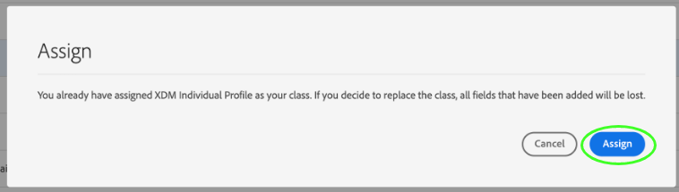

# Creare e modificare gli schemi nell’interfaccia utente {#create-edit-schemas-in-ui}

Questa guida fornisce una panoramica su come creare, modificare e gestire gli schemi Experience Data Model (XDM) per la tua organizzazione nell’interfaccia utente di Adobe Experience Platform.

>[!IMPORTANT]
>
>Gli schemi XDM sono estremamente personalizzabili, pertanto i passaggi necessari per la creazione di uno schema possono variare a seconda del tipo di dati che desideri che lo schema acquisisca. Di conseguenza, questo documento descrive solo le interazioni di base che è possibile eseguire con gli schemi nell’interfaccia utente ed esclude i passaggi correlati, come la personalizzazione di classi, gruppi di campi di schema, tipi di dati e campi.
>
>Per una panoramica completa del processo di creazione dello schema, seguire l&#39;esercitazione [sulla creazione dello schema](../../tutorials/create-schema-ui.md) per creare uno schema di esempio completo e acquisire familiarità con le numerose funzionalità di [!DNL Schema Editor].

## Prerequisiti {#prerequisites}

Questa guida richiede una buona conoscenza del sistema XDM. Per un&#39;introduzione al ruolo di XDM all&#39;interno dell&#39;ecosistema Experience Platform, fare riferimento alla [panoramica di XDM](../../home.md) e alle [nozioni di base sulla composizione dello schema](../../schema/composition.md) per una panoramica sulla costruzione degli schemi.

## Crea un nuovo schema {#create}

>[!NOTE]
>
>Questa sezione illustra come creare manualmente un nuovo schema nell’interfaccia utente. Se acquisisci dati CSV in Platform, puoi scegliere di [mappare tali dati su uno schema XDM creato dai consigli generati dall&#39;intelligenza artificiale](../../../ingestion/tutorials/map-csv/recommendations.md) (attualmente in versione beta) senza dover creare manualmente lo schema.

Nell&#39;area di lavoro [!UICONTROL Schemi], seleziona **[!UICONTROL Crea schema]** nell&#39;angolo in alto a destra.

![Area di lavoro Schemi con [!UICONTROL Crea schema] evidenziato.](../../images/ui/resources/schemas/create-schema.png)

Viene visualizzato il flusso di lavoro [!UICONTROL Crea schema]. Puoi scegliere una classe base per lo schema selezionando **[!UICONTROL Profilo individuale]**, **[!UICONTROL Evento esperienza]** o **[!UICONTROL Altro]**, seguito da **[!UICONTROL Successivo]** per confermare la scelta. Per ulteriori informazioni su queste classi, consulta la documentazione [Profilo individuale XDM](../../classes/individual-profile.md) e [XDM ExperienceEvent](../../classes/experienceevent.md).

![Il flusso di lavoro [!UICONTROL Crea schema] con le tre opzioni di classe e [!UICONTROL Successivo] evidenziato.](../../images/ui/resources/schemas/schema-class-options.png)

Dopo aver selezionato una classe, viene visualizzata la sezione [!UICONTROL Name and review]. In questa sezione, fornisci un nome e una descrizione per identificare lo schema. &#x200B;La struttura di base dello schema (fornita dalla classe) viene visualizzata nell’area di lavoro per rivedere e verificare la struttura di classe e schema selezionata.

Immetti un nome visualizzato dello schema [!UICONTROL descrittivo] nel campo di testo. Quindi, inserisci una descrizione adatta per identificare lo schema. Dopo aver rivisto la struttura dello schema e aver impostato correttamente le impostazioni, seleziona **[!UICONTROL Fine]** per creare lo schema.

![La sezione [!UICONTROL Name and review] del flusso di lavoro [!UICONTROL Create schema] con [!UICONTROL Schema display name], [!UICONTROL Description], e [!UICONTROL Finish] evidenziato.](../../images/ui/resources/schemas/name-and-review.png)

Viene visualizzata la scheda [!UICONTROL Schema] [!UICONTROL Sfoglia]. Lo schema creato di recente è ora elencato nella Raccolta schemi e disponibile per la modifica in [!DNL Schema Editor].

## Modificare uno schema esistente {#edit}

>[!NOTE]
>
>Una volta che uno schema è stato salvato e utilizzato nell’acquisizione dei dati, è possibile apportarvi solo modifiche aggiuntive. Per ulteriori informazioni, consulta le [regole dell&#39;evoluzione dello schema](../../schema/composition.md#evolution).

Per modificare uno schema esistente, selezionare la scheda **[!UICONTROL Sfoglia]**, quindi selezionare il nome dello schema che si desidera modificare. È inoltre possibile utilizzare la barra di ricerca per limitare l&#39;elenco delle opzioni disponibili.

>[!TIP]
>
>Puoi utilizzare le funzionalità di ricerca e filtro dell’area di lavoro per trovare più facilmente lo schema. Per ulteriori informazioni, consulta la guida sull&#39;[esplorazione delle risorse XDM](../explore.md).

Dopo aver selezionato uno schema, [!DNL Schema Editor] viene visualizzato con la struttura dello schema mostrata nell&#39;area di lavoro. Ora puoi [aggiungere gruppi di campi](#add-field-groups) allo schema (o [aggiungere singoli campi](#add-individual-fields) da tali gruppi), [modificare i nomi visualizzati dei campi](#display-names) o [modificare i gruppi di campi personalizzati esistenti](./field-groups.md#edit) se lo schema ne utilizza uno.

## Altre azioni {#more}

Nell’Editor di schema è inoltre possibile eseguire azioni rapide per copiare la struttura JSON dello schema o eliminare lo schema, se non è stato abilitato per Real-Time Customer Profile o se a esso sono associati set di dati. Seleziona [!UICONTROL Altro] nella parte superiore della visualizzazione per visualizzare un elenco a discesa con azioni rapide.

La funzionalità di copia della struttura JSON consente di visualizzare l’aspetto di un payload di esempio durante la creazione dello schema e delle pipeline di dati. È particolarmente utile nelle situazioni in cui sono presenti strutture complesse di mappa oggetto nello schema, ad esempio una mappa di identità.

## Attiva/Disattiva nome visualizzato {#display-name-toggle}

Per comodità, l’Editor di schema fornisce un’opzione per passare dai nomi dei campi originali a quelli più leggibili dall’utente. Questa flessibilità consente di migliorare la reperibilità sul campo e la modifica degli schemi. L’interruttore si trova in alto a destra nella vista Editor di schema.

>[!NOTE]
>
>Il passaggio dai nomi dei campi ai nomi visualizzati è puramente cosmetico e non modifica le risorse a valle.

![Editor schema con [!UICONTROL Mostra nomi visualizzati per i campi] evidenziati.](../../images/ui/resources/schemas/display-name-toggle.png)

I nomi visualizzati per i gruppi di campi standard sono generati dal sistema ma possono essere personalizzati, come descritto nella sezione [nomi visualizzati](#display-names). I nomi visualizzati si riflettono tra più visualizzazioni dell’interfaccia utente, incluse le anteprime di mappature e set di dati. L&#39;impostazione predefinita è disattivata e mostra i nomi dei campi in base ai valori originali.

## Aggiungere gruppi di campi a uno schema {#add-field-groups}

>[!NOTE]
>
>Questa sezione spiega come aggiungere gruppi di campi esistenti a uno schema. Se desideri creare un nuovo gruppo di campi personalizzato, consulta invece la guida su [creazione e modifica di gruppi di campi](./field-groups.md#create).

Dopo aver aperto uno schema all&#39;interno di [!DNL Schema Editor], è possibile aggiungere campi allo schema tramite l&#39;utilizzo di gruppi di campi. Per iniziare, seleziona **[!UICONTROL Aggiungi]** accanto a **[!UICONTROL Gruppi di campi]** nella barra a sinistra.

![Editor di schema con [!UICONTROL Aggiungi] dalla sezione [!UICONTROL Gruppi di campi] evidenziata.](../../images/ui/resources/schemas/add-field-group-button.png)

Viene visualizzata una finestra di dialogo con l’elenco dei gruppi di campi che è possibile selezionare per lo schema. Poiché i gruppi di campi sono compatibili solo con una classe, verranno elencati solo i gruppi di campi associati alla classe selezionata dello schema. Per impostazione predefinita, i gruppi di campi elencati sono ordinati in base alla popolarità di utilizzo all’interno dell’organizzazione.

![La finestra di dialogo [!UICONTROL Aggiungi gruppi di campi] è evidenziata con la colonna [!UICONTROL Popolarità] evidenziata.](../../images/ui/resources/schemas/field-group-popularity.png)

Se conosci l’attività generale o l’area aziendale dei campi che desideri aggiungere, seleziona una o più categorie verticali di settore nella barra a sinistra per filtrare l’elenco visualizzato dei gruppi di campi.

![La finestra di dialogo [!UICONTROL Aggiungi gruppi di campi] è evidenziata con i filtri [!UICONTROL Industria] e la colonna [!UICONTROL Industria].](../../images/ui/resources/schemas/industry-filter.png)

>[!NOTE]
>
>Per ulteriori informazioni sulle best practice per la modellazione dati specifica del settore in XDM, consulta la documentazione su [modelli dati del settore](../../schema/industries/overview.md).

È inoltre possibile utilizzare la barra di ricerca per individuare facilmente il gruppo di campi desiderato. I gruppi di campi il cui nome corrisponde alla query vengono visualizzati nella parte superiore dell’elenco. In **[!UICONTROL Campi standard]** vengono visualizzati gruppi di campi contenenti campi che descrivono gli attributi di dati desiderati.

![La finestra di dialogo [!UICONTROL Aggiungi gruppi di campi] con la funzione di ricerca [!UICONTROL Campi standard] evidenziata.](../../images/ui/resources/schemas/field-group-search.png)

Seleziona la casella di controllo accanto al nome del gruppo di campi che desideri aggiungere allo schema. Dall’elenco puoi selezionare più gruppi di campi, ciascuno dei quali viene visualizzato nella barra a destra.

![Finestra di dialogo [!UICONTROL Aggiungi gruppi di campi] con la caratteristica di selezione della casella di controllo evidenziata.](../../images/ui/resources/schemas/add-field-group.png)

>[!TIP]
>
>Per qualsiasi gruppo di campi elencato, è possibile passare il cursore sull&#39;icona delle informazioni () per visualizzare una breve descrizione del tipo di dati acquisiti dal gruppo di campi. È inoltre possibile selezionare l&#39;icona di anteprima () per visualizzare la struttura dei campi forniti dal gruppo di campi prima di decidere di aggiungerlo allo schema.

Dopo aver scelto i gruppi di campi, seleziona **[!UICONTROL Aggiungi gruppi di campi]** per aggiungerli allo schema.

![Finestra di dialogo [!UICONTROL Aggiungi gruppi di campi] con gruppi di campi selezionati e [!UICONTROL Aggiungi gruppi di campi] evidenziati.](../../images/ui/resources/schemas/add-field-group-finish.png)

[!DNL Schema Editor] viene nuovamente visualizzato con i campi forniti dal gruppo di campi rappresentati nell&#39;area di lavoro.

![Il [!DNL Schema Editor] con uno schema di esempio visualizzato.](../../images/ui/resources/schemas/field-groups-added.png)

>[!NOTE]
>
>Nell&#39;Editor schema, le classi e i gruppi di campi standard (generati da Adobi) sono indicati con l&#39;icona lucchetto (. Il lucchetto viene visualizzato nella barra a sinistra accanto al nome della classe o del gruppo di campi, nonché accanto a qualsiasi campo nel diagramma dello schema che fa parte di una risorsa generata dal sistema.
>
>

Dopo aver aggiunto un gruppo di campi a uno schema, puoi [rimuovere i campi esistenti](#remove-fields) o [aggiungere nuovi campi personalizzati](#add-fields) a tali gruppi, a seconda delle tue esigenze.

### Rimuovi campi aggiunti dai gruppi di campi {#remove-fields}

Dopo aver aggiunto un gruppo di campi a uno schema, puoi rimuovere tutti i campi non necessari.

>[!NOTE]
>
>La rimozione di campi da un gruppo di campi influisce solo sullo schema su cui si lavora e non sul gruppo di campi stesso. Se rimuovi i campi in uno schema, tali campi sono ancora disponibili in tutti gli altri schemi che utilizzano lo stesso gruppo di campi.

Nell&#39;esempio seguente, il gruppo di campi standard **[!UICONTROL Dettagli demografici]** è stato aggiunto a uno schema. Per rimuovere un singolo campo, ad esempio `taxId`, selezionare il campo nell&#39;area di lavoro, quindi selezionare **[!UICONTROL Rimuovi]** nella barra a destra.

![Il [!DNL Schema Editor] con [!UICONTROL Rimuovi] evidenziato. Questa azione rimuove un singolo campo.](../../images/ui/resources/schemas/remove-single-field.png)

Se si desidera rimuovere più campi, è possibile gestire il gruppo di campi nel suo complesso. Seleziona un campo appartenente al gruppo nell&#39;area di lavoro, quindi seleziona **[!UICONTROL Gestisci campi correlati]** nella barra a destra.

![Il [!DNL Schema Editor] con [!UICONTROL Gestisci campi correlati] evidenziati.](../../images/ui/resources/schemas/manage-related-fields.png)

Viene visualizzata una finestra di dialogo che mostra la struttura del gruppo di campi in questione. Da qui puoi utilizzare le caselle di controllo fornite per selezionare o deselezionare i campi necessari. Al termine, selezionare **[!UICONTROL Conferma]**.

![Finestra di dialogo [!UICONTROL Gestisci campi correlati] con campi selezionati ed evidenziata [!UICONTROL Conferma].](../../images/ui/resources/schemas/select-fields.png)

L’area di lavoro viene nuovamente visualizzata con solo i campi selezionati presenti nella struttura dello schema.

### Aggiungere campi personalizzati ai gruppi di campi {#add-fields}

Dopo aver aggiunto un gruppo di campi a uno schema, puoi definire campi aggiuntivi per tale gruppo. Tuttavia, tutti i campi aggiunti a un gruppo di campi in uno schema verranno visualizzati anche in tutti gli altri schemi che utilizzano lo stesso gruppo di campi.

Inoltre, se un campo personalizzato viene aggiunto a un gruppo di campi standard, tale gruppo verrà convertito in un gruppo di campi personalizzato e il gruppo di campi standard originale non sarà più disponibile.

Se desideri aggiungere un campo personalizzato a un gruppo di campi standard, consulta la [sezione seguente](#custom-fields-for-standard-groups) per istruzioni specifiche. Se stai aggiungendo campi a un gruppo di campi personalizzato, consulta la sezione su [modifica di gruppi di campi personalizzati](./field-groups.md) nella guida dell&#39;interfaccia utente dei gruppi di campi.

Se non si desidera modificare i gruppi di campi esistenti, è possibile [creare un nuovo gruppo di campi personalizzato](./field-groups.md#create) per definire campi aggiuntivi.

## Aggiungere singoli campi a uno schema {#add-individual-fields}

L’Editor di schema consente di aggiungere singoli campi direttamente a uno schema, per evitare di aggiungere un intero gruppo di campi per un caso d’uso specifico. Puoi [aggiungere singoli campi da gruppi di campi standard](#add-standard-fields) o [aggiungere campi personalizzati](#add-custom-fields).

>[!IMPORTANT]
>
>Anche se l’Editor di schema consente di aggiungere singoli campi direttamente a uno schema, questo non cambia il fatto che tutti i campi in uno schema XDM devono essere forniti dalla sua classe o da un gruppo di campi compatibile con tale classe. Come spiegato nelle sezioni seguenti, tutti i singoli campi sono ancora associati a una classe o a un gruppo di campi come passaggio chiave quando vengono aggiunti a uno schema.

### Aggiungi campi standard {#add-standard-fields}

Puoi aggiungere campi da gruppi di campi standard direttamente a uno schema, senza dover conoscere in anticipo il gruppo di campi corrispondente. Per aggiungere un campo standard a uno schema, selezionare l&#39;icona più (**+**) accanto al nome dello schema nell&#39;area di lavoro. Nella struttura dello schema viene visualizzato un segnaposto per **[!UICONTROL Campo senza titolo]** e la barra a destra viene aggiornata per visualizzare i controlli per la configurazione del campo.

In **[!UICONTROL Nome campo]**, inizia a digitare il nome del campo che desideri aggiungere. Il sistema cerca automaticamente i campi standard corrispondenti alla query e li elenca in **[!UICONTROL Campi standard consigliati]**, inclusi i gruppi di campi a cui appartengono.

Mentre alcuni campi standard condividono lo stesso nome, la loro struttura può variare a seconda del gruppo di campi da cui provengono. Se un campo standard è nidificato all’interno di un oggetto principale nella struttura del gruppo di campi, anche il campo principale verrà incluso nello schema se viene aggiunto il campo secondario.

Selezionare l&#39;icona di anteprima () accanto a un campo standard per visualizzare la struttura del relativo gruppo di campi e capire meglio come potrebbe essere nidificato. Per aggiungere il campo standard allo schema, seleziona l&#39;icona più ().

L’area di lavoro viene aggiornata per mostrare il campo standard aggiunto allo schema, inclusi eventuali campi principali nidificati all’interno della struttura del gruppo di campi. Il nome del gruppo di campi è anche elencato in **[!UICONTROL Gruppi di campi]** nella barra a sinistra. Se desideri aggiungere altri campi dallo stesso gruppo di campi, seleziona **[!UICONTROL Gestisci campi correlati]** nella barra a destra.

### Aggiungere campi personalizzati {#add-custom-fields}

Analogamente al flusso di lavoro per i campi standard, puoi anche aggiungere campi personalizzati direttamente a uno schema.

Per aggiungere campi al livello principale di uno schema, seleziona l&#39;icona più (**+**) accanto al nome dello schema nell&#39;area di lavoro. Nella struttura dello schema viene visualizzato un segnaposto per **[!UICONTROL Campo senza titolo]** e la barra a destra viene aggiornata per visualizzare i controlli per la configurazione del campo.

Iniziare a digitare il nome del campo che si desidera aggiungere e il sistema avvia automaticamente la ricerca dei campi standard corrispondenti. Per creare un nuovo campo personalizzato, seleziona l&#39;opzione superiore aggiunta con **([!UICONTROL Nuovo campo])**.

Dopo aver fornito un nome visualizzato e un tipo di dati per il campo, il passaggio successivo consiste nell’assegnare il campo a una risorsa XDM principale. Se lo schema utilizza una classe personalizzata, puoi scegliere di [aggiungere il campo alla classe assegnata](#add-to-class) o a un [gruppo di campi](#add-to-field-group). Tuttavia, se lo schema utilizza una classe standard, puoi assegnare il campo personalizzato solo a un gruppo di campi.

#### Assegnare il campo a un gruppo di campi personalizzato {#add-to-field-group}

>[!NOTE]
>
>In questa sezione viene descritto solo come assegnare il campo a un gruppo di campi personalizzato. Se invece desideri estendere un gruppo di campi standard con il nuovo campo personalizzato, consulta la sezione su [aggiunta di campi personalizzati a gruppi di campi standard](#custom-fields-for-standard-groups).

In **[!UICONTROL Assegna a]**, seleziona **[!UICONTROL Gruppo di campi]**. Se lo schema utilizza una classe standard, questa è l’unica opzione disponibile ed è selezionata per impostazione predefinita.

Successivamente, è necessario selezionare un gruppo di campi al quale associare il nuovo campo. Inizia a digitare il nome del gruppo di campi nell’input di testo fornito. Se esistono gruppi di campi personalizzati corrispondenti all’input, questi verranno visualizzati nell’elenco a discesa. In alternativa, è possibile digitare un nome univoco per creare un nuovo gruppo di campi.

>[!WARNING]
>
>Se si seleziona un gruppo di campi personalizzato esistente, anche gli altri schemi che utilizzano tale gruppo di campi ereditano il campo appena aggiunto dopo il salvataggio delle modifiche. Per questo motivo, selezionare un gruppo di campi esistente solo se si desidera questo tipo di propagazione. In caso contrario, è consigliabile creare un nuovo gruppo di campi personalizzato.

Dopo aver selezionato il gruppo di campi dall&#39;elenco, selezionare **[!UICONTROL Applica]**.

Il nuovo campo viene aggiunto all&#39;area di lavoro e viene namespace sotto il tuo [ID tenant](../../api/getting-started.md#know-your-tenant_id) per evitare conflitti con i campi XDM standard. Il gruppo di campi a cui hai associato il nuovo campo viene visualizzato anche in **[!UICONTROL Gruppi di campi]** nella barra a sinistra.

>[!NOTE]
>
>Gli altri campi forniti dal gruppo di campi personalizzato selezionato vengono rimossi dallo schema per impostazione predefinita. Se desideri aggiungere alcuni di questi campi allo schema, seleziona un campo appartenente al gruppo, quindi seleziona **[!UICONTROL Gestisci campi correlati]** nella barra a destra.

#### Assegnare il campo a una classe personalizzata {#add-to-class}

In **[!UICONTROL Assegna a]**, seleziona **[!UICONTROL Classe]**. Il campo di input seguente viene sostituito con il nome della classe personalizzata dello schema corrente, che indica che il nuovo campo verrà assegnato a questa classe.

![Opzione [!UICONTROL Classe] selezionata per la nuova assegnazione di campi.](../../images/ui/resources/schemas/assign-field-to-class.png)

Continua a configurare il campo come desiderato e al termine seleziona **[!UICONTROL Applica]**.

![[!UICONTROL Applica] selezionato per il nuovo campo.](../../images/ui/resources/schemas/assign-field-to-class-apply.png)

Il nuovo campo viene aggiunto all&#39;area di lavoro e viene namespace sotto il tuo [ID tenant](../../api/getting-started.md#know-your-tenant_id) per evitare conflitti con i campi XDM standard. Selezionando il nome della classe nella barra a sinistra, il nuovo campo viene visualizzato come parte della struttura della classe.

### Aggiungere campi personalizzati alla struttura dei gruppi di campi standard {#custom-fields-for-standard-groups}

Se lo schema su cui stai lavorando dispone di un campo di tipo oggetto fornito da un gruppo di campi standard, puoi aggiungere campi personalizzati a tale oggetto standard.

>[!WARNING]
>
>Tutti i campi aggiunti a un gruppo di campi in uno schema verranno visualizzati anche in tutti gli altri schemi che utilizzano lo stesso gruppo di campi. Inoltre, se un campo personalizzato viene aggiunto a un gruppo di campi standard, tale gruppo verrà convertito in un gruppo di campi personalizzato e il gruppo di campi standard originale non sarà più disponibile.
>
>Se hai partecipato alla versione beta di questa funzione, riceverai una finestra di dialogo che ti informa sui gruppi di campi standard che hai personalizzato in precedenza. Dopo aver selezionato **[!UICONTROL Conferma]**, le risorse elencate vengono convertite in gruppi di campi personalizzati.
>
>

Per iniziare, seleziona l&#39;icona più (**+**) accanto alla radice dell&#39;oggetto fornito dal gruppo di campi standard.

Viene visualizzato un messaggio di avviso che richiede di confermare se si desidera convertire il gruppo di campi standard. Selezionare **[!UICONTROL Continua a creare il gruppo di campi]** per continuare.

L’area di lavoro viene nuovamente visualizzata con un segnaposto senza titolo per il nuovo campo. Il nome del gruppo di campi standard è stato aggiunto con &quot;([!UICONTROL Extended])&quot; per indicare che è stato modificato rispetto alla versione originale. Da qui, utilizza i controlli nella barra a destra per definire le proprietà del campo.

Dopo aver applicato le modifiche, il nuovo campo viene visualizzato sotto lo spazio dei nomi dell’ID tenant all’interno dell’oggetto standard. Questo spazio dei nomi nidificato evita conflitti di nomi di campo all’interno del gruppo di campi stesso, al fine di evitare di interrompere le modifiche in altri schemi che utilizzano lo stesso gruppo di campi.

## Abilitare uno schema per il profilo cliente in tempo reale {#profile}

>[!CONTEXTUALHELP]
>id="platform_schemas_enableforprofile"
>title="Abilitare uno schema per il profilo"
>abstract="Quando uno schema è abilitato per il profilo, tutti i set di dati creati da questo schema partecipano a Real-Time Customer Profile, che unisce i dati provenienti da origini diverse per creare una visualizzazione completa di ciascun cliente. Una volta che uno schema viene utilizzato per acquisire dati nel profilo, non può essere disabilitato. Per ulteriori informazioni, consulta la documentazione."

[Real-Time Customer Profile](../../../profile/home.md) unisce dati provenienti da origini diverse per creare una visualizzazione completa di ogni singolo cliente. Se si desidera che i dati acquisiti da uno schema partecipino a questo processo, è necessario abilitare lo schema per l&#39;utilizzo in [!DNL Profile].

>[!IMPORTANT]
>
>Per abilitare uno schema per [!DNL Profile], è necessario che sia stato definito un campo di identità principale. Per ulteriori informazioni, consulta la guida su [definizione dei campi di identità](../fields/identity.md).

Per abilitare lo schema, inizia selezionando il nome dello schema nella barra a sinistra, quindi seleziona l&#39;opzione **[!UICONTROL Profilo]** nella barra a destra.

Viene visualizzato un popover che avvisa che uno schema, una volta attivato e salvato, non può essere disattivato. Seleziona **[!UICONTROL Abilita]** per continuare.

L&#39;area di lavoro viene nuovamente visualizzata con l&#39;opzione [!UICONTROL Profilo] abilitata.

>[!IMPORTANT]
>
>Poiché lo schema non è ancora stato salvato, questo è il punto di non ritorno se cambi idea su come consentire allo schema di partecipare a Real-Time Customer Profile: una volta salvato uno schema abilitato, non può più essere disabilitato. Seleziona di nuovo il profilo **[!UICONTROL Profile]** per disabilitare lo schema.

Per completare il processo, selezionare **[!UICONTROL Salva]** per salvare lo schema.

Lo schema è ora abilitato per l’utilizzo in Real-Time Customer Profile. Quando Platform acquisisce i dati in set di dati basati su questo schema, questi verranno incorporati nei dati del profilo amalgamati.

## Modifica dei nomi visualizzati per i campi schema {#display-names}

Dopo aver assegnato una classe e aggiunto gruppi di campi a uno schema, puoi modificare i nomi visualizzati di qualsiasi campo dello schema, indipendentemente dal fatto che tali campi siano stati forniti da risorse XDM standard o personalizzate.

>[!NOTE]
>
>Tieni presente che i nomi visualizzati dei campi che appartengono a classi o gruppi di campi standard possono essere modificati solo nel contesto di uno schema specifico. In altre parole, la modifica del nome visualizzato di un campo standard in uno schema non influisce sugli altri schemi che utilizzano la stessa classe o lo stesso gruppo di campi associato.
>
>Dopo aver apportato modifiche ai nomi visualizzati dei campi di uno schema, tali modifiche vengono immediatamente applicate a tutti i set di dati esistenti basati su tale schema.

Per modificare il nome visualizzato di un campo schema, seleziona il campo nell’area di lavoro. Nella barra a destra, specifica il nuovo nome in **[!UICONTROL Nome visualizzato]**.

Seleziona **[!UICONTROL Applica]** nella barra a destra e l&#39;area di lavoro viene aggiornata per mostrare il nuovo nome visualizzato del campo. Seleziona **[!UICONTROL Salva]** per applicare le modifiche allo schema.

## Modificare la classe di uno schema {#change-class}

È possibile modificare la classe di uno schema in qualsiasi momento durante il processo di composizione iniziale prima che lo schema sia stato salvato.

>[!WARNING]
>
>La riassegnazione della classe per uno schema deve essere eseguita con estrema cautela. I gruppi di campi sono compatibili solo con determinate classi, pertanto la modifica della classe reimposterà l’area di lavoro e tutti i campi aggiunti.

Per riassegnare una classe, selezionare **[!UICONTROL Assegna]** nella parte sinistra dell&#39;area di lavoro.

Viene visualizzata una finestra di dialogo in cui sono elencate tutte le classi disponibili, incluse quelle definite dall&#39;organizzazione (il proprietario è &quot;[!UICONTROL Cliente]&quot;) e le classi standard definite dall&#39;Adobe.

Selezionare una classe dall&#39;elenco per visualizzarne la descrizione sul lato destro della finestra di dialogo. È inoltre possibile selezionare **[!UICONTROL Anteprima struttura di classe]** per visualizzare i campi e i metadati associati alla classe. Seleziona **[!UICONTROL Assegna classe]** per continuare.

Viene visualizzata una nuova finestra di dialogo che richiede di confermare l&#39;assegnazione di una nuova classe. Seleziona **[!UICONTROL Assegna]** per confermare.

Dopo aver confermato la modifica della classe, l’area di lavoro verrà reimpostata e tutti gli avanzamenti della composizione andranno persi.

## Passaggi successivi {#next-steps}

Questo documento illustra le nozioni di base sulla creazione e la modifica di schemi nell’interfaccia utente di Platform. Si consiglia vivamente di rivedere l&#39;[esercitazione per la creazione di schemi](../../tutorials/create-schema-ui.md) per un flusso di lavoro completo per la creazione di uno schema completo nell&#39;interfaccia utente, inclusa la creazione di gruppi di campi personalizzati e tipi di dati per casi d&#39;uso univoci.

Per ulteriori informazioni sulle funzionalità dell&#39;area di lavoro [!UICONTROL Schemi], vedere la panoramica dell&#39;area di lavoro [[!UICONTROL Schemi]](../overview.md).

Per informazioni su come gestire gli schemi nell&#39;API [!DNL Schema Registry], consulta la [guida dell&#39;endpoint degli schemi](../../api/schemas.md).
